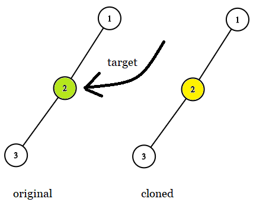

1379. Find a Corresponding Node of a Binary Tree in a Clone of That Tree

Given two binary trees `original` and `cloned` and given a reference to a node `target` in the `original` tree.

The `cloned` tree is a **copy of** the `original` tree.

Return a reference to the same node in the cloned tree.

**Note** that you are **not allowed** to change any of the two trees or the `target` node and the answer **must be** a reference to a node in the `cloned` tree.

**Follow up:** Solve the problem if repeated values on the tree are allowed.

 

**Example 1:**


```
Input: tree = [7,4,3,null,null,6,19], target = 3
Output: 3
Explanation: In all examples the original and cloned trees are shown. The target node is a green node from the original tree. The answer is the yellow node from the cloned tree.
```

**Example 2:**


```
Input: tree = [7], target =  7
Output: 7
```

**Example 3:**


```
Input: tree = [8,null,6,null,5,null,4,null,3,null,2,null,1], target = 4
Output: 4
```

**Example 4:**


```
Input: tree = [1,2,3,4,5,6,7,8,9,10], target = 5
Output: 5
```

**Example 5:**


```
Input: tree = [1,2,null,3], target = 2
Output: 2
```

**Constraints:**

* The number of nodes in the tree is in the range `[1, 10^4]`.
* The values of the nodes of the tree are unique.
* `target` node is a node from the `original` tree and is not null.

# Submissions
---
**Solution 1: (DFS: Recursive Inorder Traversal)**
```
Runtime: 632 ms
Memory Usage: 24.2 MB
```
```python
# Definition for a binary tree node.
# class TreeNode:
#     def __init__(self, x):
#         self.val = x
#         self.left = None
#         self.right = None

class Solution:
    def getTargetCopy(self, original: TreeNode, cloned: TreeNode, target: TreeNode) -> TreeNode:
        def inorder(o: TreeNode, c: TreeNode):
            if o:
                inorder(o.left, c.left)
                if o is target:
                    self.ans = c
                inorder(o.right, c.right)
                
        inorder(original, cloned)
        return self.ans 
```

**Solution 2: (DFS: Iterative Inorder Traversal)**
```
Runtime: 608 ms
Memory Usage: 24.2 MB
```
```python
# Definition for a binary tree node.
# class TreeNode:
#     def __init__(self, x):
#         self.val = x
#         self.left = None
#         self.right = None

class Solution:
    def getTargetCopy(self, original: TreeNode, cloned: TreeNode, target: TreeNode) -> TreeNode:
        stack_o, stack_c = [], []
        node_o, node_c = original, cloned
        
        while stack_o or node_c:
            while node_o:
                stack_o.append(node_o)
                stack_c.append(node_c)
                
                node_o = node_o.left
                node_c = node_c.left
                
            node_o = stack_o.pop()
            node_c = stack_c.pop()
            
            if node_o is target:
                return node_c
            
            node_o = node_o.right
            node_c = node_c.right 
```

**Solution 3: (DFS)**
```
Runtime: 652 ms
Memory Usage: 23.5 MB
```
```python
# Definition for a binary tree node.
# class TreeNode:
#     def __init__(self, x):
#         self.val = x
#         self.left = None
#         self.right = None

class Solution:
    def getTargetCopy(self, original: TreeNode, cloned: TreeNode, target: TreeNode) -> TreeNode:
        if not original:
            return
        if target == original:
            return cloned
        return self.getTargetCopy(original.left, cloned.left, target) or self.getTargetCopy(original.right, cloned.right, target)
```

**Solution 4: (DFS)**
```
Runtime: 589 ms
Memory Usage: 164 MB
```
```c++
/**
 * Definition for a binary tree node.
 * struct TreeNode {
 *     int val;
 *     TreeNode *left;
 *     TreeNode *right;
 *     TreeNode(int x) : val(x), left(NULL), right(NULL) {}
 * };
 */

class Solution {
public:
    TreeNode* getTargetCopy(TreeNode* original, TreeNode* cloned, TreeNode* target) {
        if (!original)
            return nullptr;
        if (original == target) {
            return cloned;
        }
        return max(getTargetCopy(original->left, cloned->left, target), getTargetCopy(original->right, cloned->right, target));
    }
};
```
