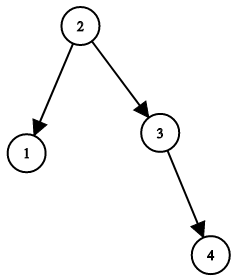

1382. Balance a Binary Search Tree

Given a binary search tree, return a **balanced** binary search tree with the same node values.

A binary search tree is balanced if and only if the depth of the two subtrees of every node never differ by more than 1.

If there is more than one answer, return any of them.

 

**Example 1:**



```
Input: root = [1,null,2,null,3,null,4,null,null]
Output: [2,1,3,null,null,null,4]
Explanation: This is not the only correct answer, [3,1,4,null,2,null,null] is also correct.
```

**Constraints:**

* The number of nodes in the tree is between `1` and `10^4`.
* The tree nodes will have distinct values between `1` and `10^5`.

# Submissions
---
**Solution 1: (Tree)**
```
Runtime: 376 ms
Memory Usage: 19.1 MB
```
```python
# Definition for a binary tree node.
# class TreeNode:
#     def __init__(self, x):
#         self.val = x
#         self.left = None
#         self.right = None

class Solution:
    def balanceBST(self, root: TreeNode) -> TreeNode:
        vals = []
        
        def inorder(node):
            nonlocal vals
            if node:
                inorder(node.left)
                vals.append(node.val)
                inorder(node.right)
        
        def dfs(nums):
            if not nums:
                return
            mid = len(nums) // 2
            node = TreeNode(nums[mid])
            node.left = dfs(nums[:mid])
            node.right = dfs(nums[mid+1:])
            return node
        
        inorder(root)
        return dfs(vals)
```