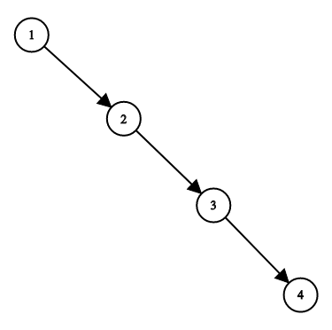

1382. Balance a Binary Search Tree

Given a binary search tree, return a **balanced** binary search tree with the same node values.

A binary search tree is balanced if and only if the depth of the two subtrees of every node never differ by more than 1.

If there is more than one answer, return any of them.

 

**Example 1:**



```
Input: root = [1,null,2,null,3,null,4,null,null]
Output: [2,1,3,null,null,null,4]
Explanation: This is not the only correct answer, [3,1,4,null,2,null,null] is also correct.
```

**Constraints:**

* The number of nodes in the tree is between `1` and `10^4`.
* The tree nodes will have distinct values between `1` and `10^5`.

# Submissions
---
**Solution 1: (Tree)**
```
Runtime: 376 ms
Memory Usage: 19.1 MB
```
```python
# Definition for a binary tree node.
# class TreeNode:
#     def __init__(self, x):
#         self.val = x
#         self.left = None
#         self.right = None

class Solution:
    def balanceBST(self, root: TreeNode) -> TreeNode:
        vals = []
        
        def inorder(node):
            nonlocal vals
            if node:
                inorder(node.left)
                vals.append(node.val)
                inorder(node.right)
        
        def dfs(nums):
            if not nums:
                return
            mid = len(nums) // 2
            node = TreeNode(nums[mid])
            node.left = dfs(nums[:mid])
            node.right = dfs(nums[mid+1:])
            return node
        
        inorder(root)
        return dfs(vals)
```

**Solution 2: (DFS)**
```
Runtime: 64 ms
Memory: 46.57 MB
```
```c++
/**
 * Definition for a binary tree node.
 * struct TreeNode {
 *     int val;
 *     TreeNode *left;
 *     TreeNode *right;
 *     TreeNode() : val(0), left(nullptr), right(nullptr) {}
 *     TreeNode(int x) : val(x), left(nullptr), right(nullptr) {}
 *     TreeNode(int x, TreeNode *left, TreeNode *right) : val(x), left(left), right(right) {}
 * };
 */
class Solution {
    void dfs(TreeNode *node, vector<TreeNode*> &dp) {
        if (!node) {
            return;
        }
        dfs(node->left, dp);
        dp.push_back(node);
        dfs(node->right, dp);
    }
    TreeNode *dfs2(int i, int j, vector<TreeNode*> &dp) {
        if (i > j) {
            return nullptr;
        } else if (i == j) {
            dp[i]->left = nullptr;
            dp[i]->right = nullptr;
            return dp[i];
        }
        int mid = (i+j)/2;
        TreeNode *cur = dp[mid];
        cur->left = dfs2(i, mid-1, dp);
        cur->right = dfs2(mid+1, j, dp);
        return cur;
    }
public:
    TreeNode* balanceBST(TreeNode* root) {
        vector<TreeNode*> dp;
        dfs(root, dp);
        return dfs2(0, dp.size()-1, dp);
    }
};
```

**Solution 3: (Inorder Traversal + Recursive Construction)**
```
Runtime: 81 ms
Memory: 62.65 MB
```
```c++
/**
 * Definition for a binary tree node.
 * struct TreeNode {
 *     int val;
 *     TreeNode *left;
 *     TreeNode *right;
 *     TreeNode() : val(0), left(nullptr), right(nullptr) {}
 *     TreeNode(int x) : val(x), left(nullptr), right(nullptr) {}
 *     TreeNode(int x, TreeNode *left, TreeNode *right) : val(x), left(left), right(right) {}
 * };
 */
class Solution {
    void inorderTraversal(TreeNode* root, vector<int>& inorder) {
        // Perform an inorder traversal to store the elements in sorted order
        if (root == nullptr) return;
        inorderTraversal(root->left, inorder);
        inorder.push_back(root->val);
        inorderTraversal(root->right, inorder);
    }

    TreeNode* createBalancedBST(const vector<int>& inorder, int start,
                                int end) {
        // Base case: if the start index is greater than the end index, return
        // nullptr
        if (start > end) return nullptr;

        // Find the middle element of the current range
        int mid = start + (end - start) / 2;

        // Recursively construct the left and right subtrees
        TreeNode* leftSubtree = createBalancedBST(inorder, start, mid - 1);
        TreeNode* rightSubtree = createBalancedBST(inorder, mid + 1, end);

        // Create a new node with the middle element and attach the subtrees
        return new TreeNode(inorder[mid], leftSubtree, rightSubtree);
    }
public:
    TreeNode* balanceBST(TreeNode* root) {
        // Create a vector to store the inorder traversal of the BST
        vector<int> inorder;
        inorderTraversal(root, inorder);

        int size = inorder.size();

        // Construct and return the balanced BST
        return createBalancedBST(inorder, 0, size - 1);
    }
};
```

**Solution 4: (Day-Stout-Warren Algorithm / In-Place Balancing)**
```
Runtime: 63 ms
Memory: 43.62 MB
```
```c++
/**
 * Definition for a binary tree node.
 * struct TreeNode {
 *     int val;
 *     TreeNode *left;
 *     TreeNode *right;
 *     TreeNode() : val(0), left(nullptr), right(nullptr) {}
 *     TreeNode(int x) : val(x), left(nullptr), right(nullptr) {}
 *     TreeNode(int x, TreeNode *left, TreeNode *right) : val(x), left(left), right(right) {}
 * };
 */
class Solution {
    // Function to perform a right rotation
    void rightRotate(TreeNode* parent, TreeNode* node) {
        TreeNode* tmp = node->left;
        node->left = tmp->right;
        tmp->right = node;
        parent->right = tmp;
    }

    // Function to perform a left rotation
    void leftRotate(TreeNode* parent, TreeNode* node) {
        TreeNode* tmp = node->right;
        node->right = tmp->left;
        tmp->left = node;
        parent->right = tmp;
    }

    // Function to perform a series of left rotations to balance the vine
    void makeRotations(TreeNode* vineHead, int count) {
        TreeNode* current = vineHead;
        for (int i = 0; i < count; ++i) {
            TreeNode* tmp = current->right;
            leftRotate(current, tmp);
            current = current->right;
        }
    }
public:
    TreeNode* balanceBST(TreeNode* root) {
        if (!root) return nullptr;

        // Step 1: Create the backbone (vine)
        // Temporary dummy node
        TreeNode* vineHead = new TreeNode(0);
        vineHead->right = root;
        TreeNode* current = vineHead;
        while (current->right) {
            if (current->right->left) {
                rightRotate(current, current->right);
            } else {
                current = current->right;
            }
        }

        // Step 2: Count the nodes
        int nodeCount = 0;
        current = vineHead->right;
        while (current) {
            ++nodeCount;
            current = current->right;
        }

        // Step 3: Create a balanced BST
        int m = pow(2, floor(log2(nodeCount + 1))) - 1;
        makeRotations(vineHead, nodeCount - m);
        while (m > 1) {
            m /= 2;
            makeRotations(vineHead, m);
        }

        TreeNode* balancedRoot = vineHead->right;
        // Delete the temporary dummy node
        delete vineHead;
        return balancedRoot;
    }
};
```
