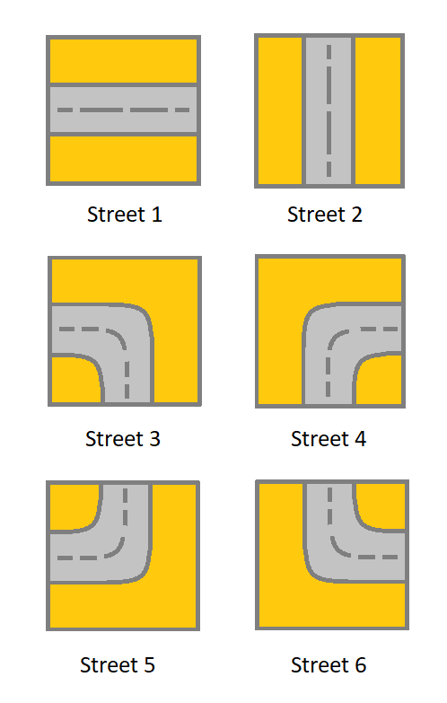

1391. Check if There is a Valid Path in a Grid

Given a m x n `grid`. Each cell of the grid represents a street. The street of `grid[i][j]` can be:
* **1** which means a street connecting the left cell and the right cell.
* **2** which means a street connecting the upper cell and the lower cell.
* **3** which means a street connecting the left cell and the lower cell.
* **4** which means a street connecting the right cell and the lower cell.
* **5** which means a street connecting the left cell and the upper cell.
* **6** which means a street connecting the right cell and the upper cell.



You will initially start at the street of the upper-left cell `(0,0)`. A valid path in the grid is a path which starts from the upper left cell `(0,0)` and ends at the bottom-right cell `(m - 1, n - 1)`. **The path should only follow the streets**.

Notice that you are **not allowed to change** any street.

Return true if there is a valid path in the grid or false otherwise.

 

**Example 1:**


```
Input: grid = [[2,4,3],[6,5,2]]
Output: true
Explanation: As shown you can start at cell (0, 0) and visit all the cells of the grid to reach (m - 1, n - 1).
```

**Example 2:**

```
Input: grid = [[1,2,1],[1,2,1]]
Output: false
Explanation: As shown you the street at cell (0, 0) is not connected with any street of any other cell and you will get stuck at cell (0, 0)
```

**Example 3:**
```
Input: grid = [[1,1,2]]
Output: false
Explanation: You will get stuck at cell (0, 1) and you cannot reach cell (0, 2).
```

**Example 4:**
```
Input: grid = [[1,1,1,1,1,1,3]]
Output: true
```

**Example 5:**
```
Input: grid = [[2],[2],[2],[2],[2],[2],[6]]
Output: true
``` 

**Constraints:**

* `m == grid.length`
* `n == grid[i].length`
* `1 <= m, n <= 300`
* `1 <= grid[i][j] <= 6`

# Submissions
---
**Solution 1: (DFS)**
```
Runtime: 1652 ms
Memory Usage: 130.5 MB
```
```python
class Solution:
    def hasValidPath(self, grid: List[List[int]]) -> bool:
        R, C = len(grid), len(grid[0])
        if R == 0:
            return true
        directions = {1: [(0,-1),(0,1)],
                      2: [(-1,0),(1,0)],
                      3: [(0,-1),(1,0)],
                      4: [(0,1),(1,0)],
                      5: [(0,-1),(-1,0)],
                      6: [(0,1),(-1,0)]}
        visited = set()
        goal = (R - 1, C - 1)
        
        def dfs(x, y):
            visited.add((x, y))
            if (x, y) == goal:
                return True
            for dx, dy in directions[grid[x][y]]:
                nx, ny = x + dx, y + dy
                if (0 <= nx < R and 0 <= ny < C) and (nx, ny) not in visited and (-dx, -dy) in directions[grid[nx][ny]]:
                    if dfs(nx, ny):
                        return True
            return False
        
        return dfs(0,0)
```