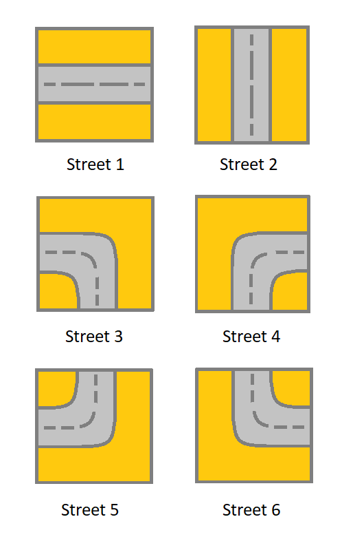
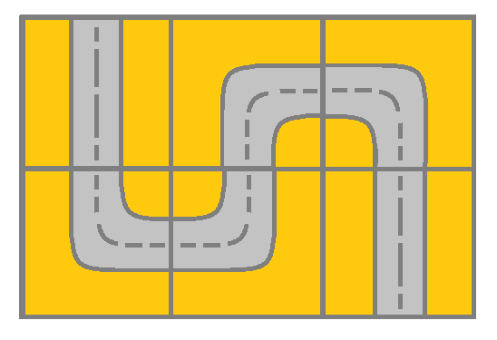

1391. Check if There is a Valid Path in a Grid

Given a m x n `grid`. Each cell of the grid represents a street. The street of `grid[i][j]` can be:
* **1** which means a street connecting the left cell and the right cell.
* **2** which means a street connecting the upper cell and the lower cell.
* **3** which means a street connecting the left cell and the lower cell.
* **4** which means a street connecting the right cell and the lower cell.
* **5** which means a street connecting the left cell and the upper cell.
* **6** which means a street connecting the right cell and the upper cell.



You will initially start at the street of the upper-left cell `(0,0)`. A valid path in the grid is a path which starts from the upper left cell `(0,0)` and ends at the bottom-right cell `(m - 1, n - 1)`. **The path should only follow the streets**.

Notice that you are **not allowed to change** any street.

Return true if there is a valid path in the grid or false otherwise.

 

**Example 1:**


```
Input: grid = [[2,4,3],[6,5,2]]
Output: true
Explanation: As shown you can start at cell (0, 0) and visit all the cells of the grid to reach (m - 1, n - 1).
```

**Example 2:**

```
Input: grid = [[1,2,1],[1,2,1]]
Output: false
Explanation: As shown you the street at cell (0, 0) is not connected with any street of any other cell and you will get stuck at cell (0, 0)
```

**Example 3:**
```
Input: grid = [[1,1,2]]
Output: false
Explanation: You will get stuck at cell (0, 1) and you cannot reach cell (0, 2).
```

**Example 4:**
```
Input: grid = [[1,1,1,1,1,1,3]]
Output: true
```

**Example 5:**
```
Input: grid = [[2],[2],[2],[2],[2],[2],[6]]
Output: true
``` 

**Constraints:**

* `m == grid.length`
* `n == grid[i].length`
* `1 <= m, n <= 300`
* `1 <= grid[i][j] <= 6`

# Submissions
---
**Solution 1: (DFS)**
```
Runtime: 1652 ms
Memory Usage: 130.5 MB
```
```python
class Solution:
    def hasValidPath(self, grid: List[List[int]]) -> bool:
        R, C = len(grid), len(grid[0])
        if R == 0:
            return true
        directions = {1: [(0,-1),(0,1)],
                      2: [(-1,0),(1,0)],
                      3: [(0,-1),(1,0)],
                      4: [(0,1),(1,0)],
                      5: [(0,-1),(-1,0)],
                      6: [(0,1),(-1,0)]}
        visited = set()
        goal = (R - 1, C - 1)
        
        def dfs(x, y):
            visited.add((x, y))
            if (x, y) == goal:
                return True
            for dx, dy in directions[grid[x][y]]:
                nx, ny = x + dx, y + dy
                if (0 <= nx < R and 0 <= ny < C) and (nx, ny) not in visited and (-dx, -dy) in directions[grid[nx][ny]]:
                    if dfs(nx, ny):
                        return True
            return False
        
        return dfs(0,0)
```

**Solution 2: (Constructing a Graph Based on Adjacent Relationships)**
```
Runtime: 51 ms, Beats 14.11%
Memory: 53.22 MB, Beats 79.84%
```
```c++
class Solution {
    static constexpr int MAX_N = 300 * 300 + 5;

    struct DisjointSet {
        int f[MAX_N];

        DisjointSet() {
            for (int i = 0; i < MAX_N; ++i) {
                f[i] = i;
            }
        }

        int find(int x) { return x == f[x] ? x : f[x] = find(f[x]); }

        void merge(int x, int y) { f[find(x)] = find(y); }
    } ds;
public:
    bool hasValidPath(vector<vector<int>>& grid) {
        int m = grid.size(), n = grid[0].size();

        auto getId = [&](int x, int y) { return x * n + y; };

        auto detectL = [&](int x, int y) {
            if (y - 1 >= 0 && (grid[x][y - 1] == 4 || grid[x][y - 1] == 6 ||
                               grid[x][y - 1] == 1)) {
                ds.merge(getId(x, y), getId(x, y - 1));
            }
        };

        auto detectR = [&](int x, int y) {
            if (y + 1 < n && (grid[x][y + 1] == 3 || grid[x][y + 1] == 5 ||
                              grid[x][y + 1] == 1)) {
                ds.merge(getId(x, y), getId(x, y + 1));
            }
        };

        auto detectU = [&](int x, int y) {
            if (x - 1 >= 0 && (grid[x - 1][y] == 3 || grid[x - 1][y] == 4 ||
                               grid[x - 1][y] == 2)) {
                ds.merge(getId(x, y), getId(x - 1, y));
            }
        };

        auto detectD = [&](int x, int y) {
            if (x + 1 < m && (grid[x + 1][y] == 5 || grid[x + 1][y] == 6 ||
                              grid[x + 1][y] == 2)) {
                ds.merge(getId(x, y), getId(x + 1, y));
            }
        };

        auto handler = [&](int x, int y) {
            switch (grid[x][y]) {
                case 1: {
                    detectL(x, y);
                    detectR(x, y);
                } break;
                case 2: {
                    detectU(x, y);
                    detectD(x, y);
                } break;
                case 3: {
                    detectL(x, y);
                    detectD(x, y);
                } break;
                case 4: {
                    detectR(x, y);
                    detectD(x, y);
                } break;
                case 5: {
                    detectL(x, y);
                    detectU(x, y);
                } break;
                case 6: {
                    detectR(x, y);
                    detectU(x, y);
                }
            }
        };

        for (int i = 0; i < m; ++i) {
            for (int j = 0; j < n; ++j) {
                handler(i, j);
            }
        }

        return ds.find(getId(0, 0)) == ds.find(getId(m - 1, n - 1));
    }
};
```

**Solution 3: (Constructing a Graph Based on Cell Property)**
```
Runtime: 44 ms, Beats 17.74%
Memory: 52.66 MB, Beats 81.05%
```
```c++
class Solution {
    static constexpr int MAX_N = 300 * 300 + 5;
    static constexpr int patterns[7] = {0,      0b1010, 0b0101, 0b1100,
                                        0b0110, 0b1001, 0b0011};
    static constexpr int dirs[4][2] = {{-1, 0}, {0, 1}, {1, 0}, {0, -1}};

    struct DisjointSet {
        int f[MAX_N];

        DisjointSet() {
            for (int i = 0; i < MAX_N; ++i) f[i] = i;
        }

        int find(int x) { return x == f[x] ? x : f[x] = find(f[x]); }

        void merge(int x, int y) { f[find(x)] = find(y); }
    } ds;
public:
    bool hasValidPath(vector<vector<int>>& grid) {
        int m = grid.size(), n = grid[0].size();

        auto getId = [&](int x, int y) { return x * n + y; };

        auto handler = [&](int x, int y) {
            int pattern = patterns[grid[x][y]];
            for (int i = 0; i < 4; ++i) {
                if (pattern & (1 << i)) {
                    int sx = x + dirs[i][0];
                    int sy = y + dirs[i][1];
                    if (sx >= 0 && sx < m && sy >= 0 && sy < n and
                        (patterns[grid[sx][sy]] & (1 << ((i + 2) % 4)))) {
                        ds.merge(getId(x, y), getId(sx, sy));
                    }
                }
            }
        };

        for (int i = 0; i < m; ++i) {
            for (int j = 0; j < n; ++j) {
                handler(i, j);
            }
        }

        return ds.find(getId(0, 0)) == ds.find(getId(m - 1, n - 1));
    }
};
```

**Solution 4: (BFS)**
```
Runtime: 30 ms, Beats 39.92%
Memory: 58.68 MB, Beats 52.42%
```
```c++
class Solution {
    const vector<vector<vector<int>>> g = {
        {{}     ,{}     ,{}     ,{}     },
        {{1,3,5},{}     ,{1,4,6},{}     },
        {{}     ,{2,5,6},{}     ,{2,3,4}},
        {{}     ,{2,5,6},{1,4,6},{}     },
        {{1,3,5},{2,5,6},{}     ,{}     },
        {{}     ,{}     ,{1,4,6},{2,3,4}},
        {{1,3,5},{}     ,{}     ,{2,3,4}}
    };
    int dd[5] = {0, 1, 0, -1, 0};
public:
    bool hasValidPath(vector<vector<int>>& grid) {
        int m = grid.size(), n = grid[0].size(), nr, nc;
        queue<array<int, 3>> q;
        q.push({0, 0, grid[0][0]});
        grid[0][0] = 0;
        while (q.size()) {
            auto [r, c, s] = q.front();
            q.pop();
            if (r == m - 1 && c == n - 1) {
                return true;
            }
            for (int d = 0; d < 4; d ++) {
                nr = r + dd[d];
                nc = c + dd[d + 1];
                if (0 <= nr && nr < m && 0 <= nc && nc < n && grid[nr][nc]) {
                    if (find(g[s][d].begin(), g[s][d].end(), grid[nr][nc]) != g[s][d].end()) {
                        q.push({nr, nc, grid[nr][nc]});
                        grid[nr][nc] = 0;
                    }
                }
            }
        }
        return false;
    }
};
```

**Solution 5: (BFS, status bitmask)**
```
Runtime: 27 ms, Beats 47.58%
Memory: 58.06 MB, Beats 54.84%
```
```c++
class Solution {
    const vector<vector<int>> g = {
        {       0,        0,        0,      0},
        {0b101010,        0,0b1010010,      0},
        {0       ,0b1100100,        0,0b11100},
        {0       ,0b1100100,0b1010010,      0},
        {0b101010,0b1100100,        0,      0},
        {0       ,        0,0b1010010,0b11100},
        {0b101010,        0,        0,0b11100}
    };
    int dd[5] = {0, 1, 0, -1, 0};
public:
    bool hasValidPath(vector<vector<int>>& grid) {
        int m = grid.size(), n = grid[0].size(), nr, nc;
        queue<array<int, 3>> q;
        q.push({0, 0, grid[0][0]});
        grid[0][0] = 0;
        while (q.size()) {
            auto [r, c, s] = q.front();
            q.pop();
            if (r == m - 1 && c == n - 1) {
                return true;
            }
            for (int d = 0; d < 4; d ++) {
                nr = r + dd[d];
                nc = c + dd[d + 1];
                if (0 <= nr && nr < m && 0 <= nc && nc < n && grid[nr][nc]) {
                    for (int i = 1; i <= 6; i ++) {
                        if (g[s][d] & (1<<i) && grid[nr][nc] == i) {
                            q.push({nr, nc, grid[nr][nc]});
                            grid[nr][nc] = 0;
                            break;
                        }
                    }
                }
            }
        }
        return false;
    }
};
```

**Solution 6: (BFS, location bitmask)**
```
Runtime: 27 ms, Beats 47.58%
Memory: 57.73 MB, Beats 56.85%
```
```c++
class Solution {
    const vector<int> g = {
        0,
        0b0101,
        0b1010,
        0b0110,
        0b0011,
        0b1100,
        0b1001
    };
    int dd[5] = {0, 1, 0, -1, 0};
public:
    bool hasValidPath(vector<vector<int>>& grid) {
        int m = grid.size(), n = grid[0].size(), nr, nc, ns;
        queue<array<int, 3>> q;
        q.push({0, 0, grid[0][0]});
        grid[0][0] = 0;
        while (q.size()) {
            auto [r, c, s] = q.front();
            q.pop();
            if (r == m - 1 && c == n - 1) {
                return true;
            }
            for (int d = 0; d < 4; d ++) {
                nr = r + dd[d];
                nc = c + dd[d + 1];
                if (0 <= nr && nr < m && 0 <= nc && nc < n && grid[nr][nc] && (g[s] & (1 << d))) {
                    ns = grid[nr][nc];
                    if (g[ns] & (1 << ((d + 2) % 4))) {
                        q.push({nr, nc, ns});
                        grid[nr][nc] = 0;
                    }
                }
            }
        }
        return false;
    }
};
```
