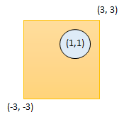

1401. Circle and Rectangle Overlapping

Given a circle represented as `(radius, x_center, y_center)` and an axis-aligned rectangle represented as `(x1, y1, x2, y2)`, where `(x1, y1)` are the coordinates of the bottom-left corner, and `(x2, y2)` are the coordinates of the top-right corner of the rectangle.

Return `True` if the circle and rectangle are overlapped otherwise return `False`.

In other words, check if there are any point `(xi, yi)` such that belongs to the circle and the rectangle at the same time.

 

**Example 1:**


```
Input: radius = 1, x_center = 0, y_center = 0, x1 = 1, y1 = -1, x2 = 3, y2 = 1
Output: true
Explanation: Circle and rectangle share the point (1,0) 
```

**Example 2:**


```
Input: radius = 1, x_center = 0, y_center = 0, x1 = -1, y1 = 0, x2 = 0, y2 = 1
Output: true
```

**Example 3:**


```
Input: radius = 1, x_center = 1, y_center = 1, x1 = -3, y1 = -3, x2 = 3, y2 = 3
Output: true
```

**Example 4:**
```
Input: radius = 1, x_center = 1, y_center = 1, x1 = 1, y1 = -3, x2 = 2, y2 = -1
Output: false
```

**Constraints:**

* `1 <= radius <= 2000`
* `-10^4 <= x_center, y_center, x1, y1, x2, y2 <= 10^4`
* `x1 < x2`
* `y1 < y2`

# Submissions
---
**Solution 1: (Geometry)**

Hi, there are 3 conditions that allow us to judge on the intersection of the shapes:

* a corner of a rectangle is inside the circle
* one of the sides of the rectangle crosses the circle
* the center of the circle is inside of the rectangle

Hope that helps!

Cheers

Edit: oops, the algorithm of course is O(1).


```
Runtime: 32 ms
Memory Usage: 14 MB
```
```python
class Solution:
    def checkOverlap(self, radius: int, x_center: int, y_center: int, x1: int, y1: int, x2: int, y2: int) -> bool:
        corners = [(x1,y1), (x2,y1), (x2,y2), (x1, y2)]
        for (x, y) in corners:
            if (x_center - x)**2 + (y_center - y)**2 <= radius**2:
                return True

        for x in [x1, x2]:
            if x_center - radius <= x <= x_center + radius and y2 - y_center >= 0 and y1 - y_center <= 0:
                return True
        for y in [y1, y2]:
            if y_center - radius <= y <= y_center + radius and x2 - x_center >= 0 and x1 - x_center <= 0:
                return True

        if x1 <= x_center <= x2 and y1 <= y_center <= y2:
            return True
        return False 
```