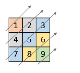

1424. Diagonal Traverse II

Given a list of lists of integers, `nums`, return all elements of `nums` in diagonal order as shown in the below images.
 

**Example 1:**


```
Input: nums = [[1,2,3],[4,5,6],[7,8,9]]
Output: [1,4,2,7,5,3,8,6,9]
```

**Example 2:**


```
Input: nums = [[1,2,3,4,5],[6,7],[8],[9,10,11],[12,13,14,15,16]]
Output: [1,6,2,8,7,3,9,4,12,10,5,13,11,14,15,16]
```

**Example 3:**
```
Input: nums = [[1,2,3],[4],[5,6,7],[8],[9,10,11]]
Output: [1,4,2,5,3,8,6,9,7,10,11]
```

**Example 4:**
```
Input: nums = [[1,2,3,4,5,6]]
Output: [1,2,3,4,5,6]
```

**Constraints:**

* `1 <= nums.length <= 10^5`
* `1 <= nums[i].length <= 10^5`
* `1 <= nums[i][j] <= 10^9`
* There at most `10^5` elements in `nums`.

# Submissions
---
**Solution 1: (Hash Table)**
```
Runtime: 1064 ms
Memory Usage: 37.7 MB
```
```python
class Solution:
    def findDiagonalOrder(self, nums: List[List[int]]) -> List[int]:
        R = len(nums)
        d = collections.defaultdict(list)
        ans = []
        for i in range(R):
            for j in range(len(nums[i])):
                d[i+j].append(nums[i][j])
        k = 0
        for k in sorted(d):
            ans.extend(d[k][::-1])
            k += 1
            
        return ans
        
```