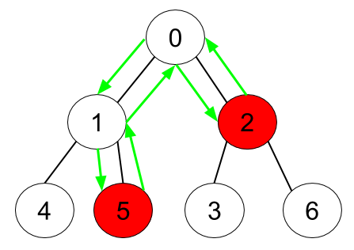

1443. Minimum Time to Collect All Apples in a Tree

Given an undirected tree consisting of `n` vertices numbered from `0` to `n-1`, which has some apples in their vertices. You spend `1` second to walk over one edge of the tree. Return the minimum time in seconds you have to spend in order to collect all apples in the tree starting at **vertex 0** and coming back to this vertex.

The edges of the undirected tree are given in the array edges, where `edges[i] = [fromi, toi]` means that exists an edge connecting the vertices `fromi` and `toi`. Additionally, there is a boolean array `hasApple`, where `hasApple[i] = true` means that vertex `i` has an apple, otherwise, it does not have any apple.

 

**Example 1:**


```
Input: n = 7, edges = [[0,1],[0,2],[1,4],[1,5],[2,3],[2,6]], hasApple = [false,false,true,false,true,true,false]
Output: 8 
Explanation: The figure above represents the given tree where red vertices have an apple. One optimal path to collect all apples is shown by the green arrows.
```

**Example 2:**


```
Input: n = 7, edges = [[0,1],[0,2],[1,4],[1,5],[2,3],[2,6]], hasApple = [false,false,true,false,false,true,false]
Output: 6
Explanation: The figure above represents the given tree where red vertices have an apple. One optimal path to collect all apples is shown by the green arrows.
```

**Example 3:**
```
Input: n = 7, edges = [[0,1],[0,2],[1,4],[1,5],[2,3],[2,6]], hasApple = [false,false,false,false,false,false,false]
Output: 0
```

**Constraints:**

* `1 <= n <= 10^5`
* `edges.length == n-1`
* `edges[i].length == 2`
* `fromi < toi`
* `hasApple.length == n`

# Submissions
---
**Solution 1: (DFS)**
```
Runtime: 720 ms
Memory Usage: 50.1 MB
```
```python
Info = collections.namedtuple('Info', ('found', 'dist'))

class Solution:
    def minTime(self, n: int, edges: List[List[int]], hasApple: List[bool]) -> int:
        # build an adjacency list to represent the tree using `edges`
        tree = collections.defaultdict(list)

        # You don't need to make it undirected since the structure represents a tree
        for u, v in edges:
            tree[u].append(v)
        
        # A recursive helper function that find the lowest apple and passes
        # the information (is apple found, distance from the lowest apple to the current node)
        # to the upper node
        
        def traverse(node):
            if node not in tree:
                return Info(hasApple[node], 0)
            curr_dist, apple_found = 0, hasApple[node]
            for child in tree[node]:
                info = traverse(child)
                curr_dist += 2 + info.dist if info.found else 0
                apple_found |= info.found
                
            return Info(apple_found, curr_dist)
        
        # Get the information from the starting vertex 0
        return traverse(0).dist
```

**Solution 2: (DFS)**
```
Runtime: 660 ms
Memory Usage: 49.3 MB
```
```python
class Solution:
    def minTime(self, n: int, edges: List[List[int]], hasApple: List[bool]) -> int:
        g = [[] for _ in range(n)]
        for u, v in edges:
            g[u].append(v)
        
        # Return a the number of steps to reach all apples and come back
        # to the current node. Return 0 if no apples found.
        def dfs(node):
            rst = 0
            for c in g[node]:
                rst += dfs(c)
            if (hasApple[node] or rst > 0) and node != 0:
                rst += 2
            return rst
        
        return dfs(0)
```

**Solution 3: (BFS)**
```
Runtime: 780 ms
Memory Usage: 68.3 MB
```
```python
class Solution:
    def minTime(self, n: int, edges: List[List[int]], hasApple: List[bool]) -> int:
        d_neighbors = collections.defaultdict(set)
        for a,b in edges:
            d_neighbors[a].add(b)
            d_neighbors[b].add(a)
        
        steps = [0] * n
        
        leafs = set(node for node, lst_neighbor in d_neighbors.items() if len(lst_neighbor) == 1 )
        leafs.discard(0)
        
        while leafs:
            new_leafs = set()
            for leaf in leafs:
                parent = d_neighbors[leaf].pop()
                if hasApple[leaf]:
                    steps[parent] += 2 + steps[leaf]
                    hasApple[parent] = True
                d_neighbors[parent].discard(leaf)
                if len( d_neighbors[parent] ) == 1:
                    new_leafs.add( parent )
            leafs = new_leafs
            leafs.discard(0)
            
        return steps[0]
```