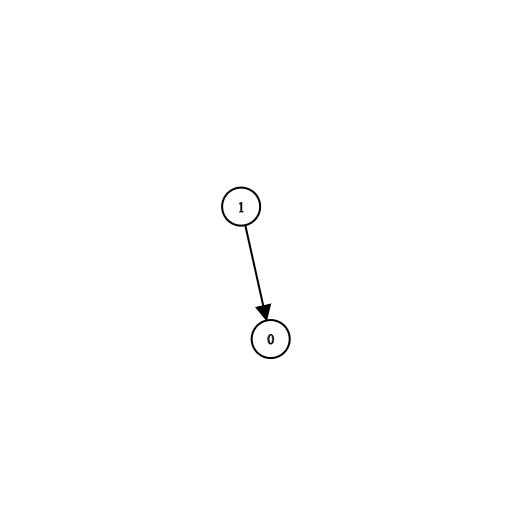
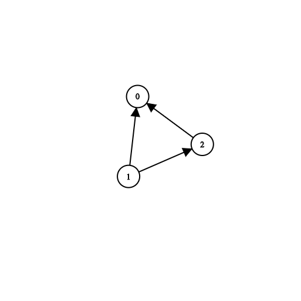

1462. Course Schedule IV

There are a total of `n` courses you have to take, labeled from `0` to `n-1`.

Some courses may have direct prerequisites, for example, to take course `0` you have first to take course `1`, which is expressed as a pair: `[1,0]`

Given the total number of courses `n`, a list of direct `prerequisite` pairs and a list of `queries` pairs.

You should answer for each `queries[i]` whether the course `queries[i][0]` is a prerequisite of the course `queries[i][1]` or not.

Return a list of boolean, the answers to the given `queries`.

Please note that if course `a` is a prerequisite of course `b` and course `b` is a prerequisite of course `c`, then, course `a` is a prerequisite of course `c`.

 

**Example 1:**


```
Input: n = 2, prerequisites = [[1,0]], queries = [[0,1],[1,0]]
Output: [false,true]
Explanation: course 0 is not a prerequisite of course 1 but the opposite is true.
```

**Example 2:**
```
Input: n = 2, prerequisites = [], queries = [[1,0],[0,1]]
Output: [false,false]
Explanation: There are no prerequisites and each course is independent.
```

**Example 3:**


```
Input: n = 3, prerequisites = [[1,2],[1,0],[2,0]], queries = [[1,0],[1,2]]
Output: [true,true]
```

**Example 4:**
```
Input: n = 3, prerequisites = [[1,0],[2,0]], queries = [[0,1],[2,0]]
Output: [false,true]
```

**Example 5:**
```
Input: n = 5, prerequisites = [[0,1],[1,2],[2,3],[3,4]], queries = [[0,4],[4,0],[1,3],[3,0]]
Output: [true,false,true,false]
```

**Constraints:**

* `2 <= n <= 100`
* `0 <= prerequisite.length <= (n * (n - 1) / 2)`
* `0 <= prerequisite[i][0], prerequisite[i][1] < n`
* `prerequisite[i][0] != prerequisite[i][1]`
* The `prerequisites` graph has no cycles.
* The `prerequisites` graph has no repeated edges.
* `1 <= queries.length <= 10^4`
* `queries[i][0] != queries[i][1]`

# Submissions
---
**Solution 1: (DP Top-Down)**
```
Runtime: 1044 ms
Memory Usage: 19.4 MB
```
```python
class Solution:
    def checkIfPrerequisite(self, n: int, prerequisites: List[List[int]], queries: List[List[int]]) -> List[bool]:
        if not prerequisites:
            return [False]*len(queries)
        graph = collections.defaultdict(list)
        for u, v in prerequisites:
            graph[u].append(v)
        
        from functools import lru_cache
        @lru_cache(None)
        def dfs(i, to_reach):
            if i == to_reach:
                return True
            if not graph[i]:
                return False
            return any(dfs(j, to_reach) for j in graph[i])
        
        return [dfs(i, j) for i, j in queries]
```

**Solution 2: (DP Bottom-Up, Floyd–Warshall)**
```
Runtime: 2432 ms
Memory Usage: 16.7 MB
```
```python
class Solution:
    def checkIfPrerequisite(self, n: int, prerequisites: List[List[int]], queries: List[List[int]]) -> List[bool]:
        connected = [[False] * n for i in range(n)]

        for i, j in prerequisites:
            connected[i][j] = True

        for k in range(n):
            for i in range(n):
                for j in range(n):
                    connected[i][j] = connected[i][j] or (connected[i][k] and connected[k][j])

        return [connected[i][j] for i, j in queries]
```

**Solution 3: (DFS)**
```
Runtime: 293 ms
Memory: 77.20 MB
```
```c++
class Solution {
    // Performs DFS and returns true if there's a path between src and target
    // and false otherwise.
    bool isPrerequisite(unordered_map<int, vector<int>>& adjList,
                        vector<bool>& visited, int src, int target) {
        visited[src] = 1;

        if (src == target) {
            return true;
        }

        int answer = false;
        for (auto adj : adjList[src]) {
            if (!visited[adj]) {
                answer =
                    answer || isPrerequisite(adjList, visited, adj, target);
            }
        }
        return answer;
    }
public:
    vector<bool> checkIfPrerequisite(int numCourses, vector<vector<int>>& prerequisites, vector<vector<int>>& queries) {
        unordered_map<int, vector<int>> adjList;
        for (auto edge : prerequisites) {
            adjList[edge[0]].push_back(edge[1]);
        }

        vector<bool> answer;
        for (auto q : queries) {
            // Reset the visited array for each query.
            vector<bool> visited(numCourses, false);
            answer.push_back(isPrerequisite(adjList, visited, q[0], q[1]));
        }

        return answer;
    }
};
```

**Solution 4: (Floyd Warshall Algorithm)**

    1 -> 2 -> 3 -> 4
    ------
        -------
    -----------
             -------
    ----------------

    
    4 -> 3 -> 2 -> 1
              ------
         -------
         -----------
    -------
    ----------------

    3 -> 2 -> 4 -> 1
         ------
             -------
         -----------
    -------
    ----------------

    2 -> 3 -> 4 -> 1
    ------
        --------
    ------------
             -------
    ---------------- 

```
Runtime: 111 ms
Memory: 71.14 MB
```
```c++
class Solution {
public:
    vector<bool> checkIfPrerequisite(int numCourses, vector<vector<int>>& prerequisites, vector<vector<int>>& queries) {
        vector<vector<bool>> isPrerequisite(numCourses,
                                            vector<bool>(numCourses, false));
        for (auto edge : prerequisites) {
            isPrerequisite[edge[0]][edge[1]] = true;
        }

        for (int intermediate = 0; intermediate < numCourses; intermediate++) {
            for (int src = 0; src < numCourses; src++) {
                for (int target = 0; target < numCourses; target++) {
                    // If src -> intermediate & intermediate -> target exists
                    // then src -> target will also exist.
                    isPrerequisite[src][target] =
                        isPrerequisite[src][target] ||
                        (isPrerequisite[src][intermediate] &&
                         isPrerequisite[intermediate][target]);
                }
            }
        }

        vector<bool> answer;
        for (auto q : queries) {
            answer.push_back(isPrerequisite[q[0]][q[1]]);
        }

        return answer;
    }
};
```

**Solution 5: (Topological Sort)**
```
Runtime: 47 ms
Memory: 68.31 MB
```
```c++
class Solution {
public:
    vector<bool> checkIfPrerequisite(int numCourses, vector<vector<int>>& prerequisites, vector<vector<int>>& queries) {
        int n = queries.size(), i;
        vector<vector<int>> g(numCourses);
        vector<int> indeg(numCourses);
        queue<int> q;
        vector<vector<bool>> dp(numCourses, vector<bool>(numCourses));
        vector<bool> ans;
        for (auto p: prerequisites) {
            g[p[0]].push_back(p[1]);
            indeg[p[1]] += 1;
        }
        for (i = 0; i < numCourses; i ++) {
            if (indeg[i] == 0) {
                q.push(i);
            }
        }
        while (q.size()) {
            auto u = q.front();
            q.pop();
            for (auto v: g[u]) {
                for (i = 0; i < numCourses; i ++) {
                    dp[v][i] = dp[v][i] | dp[u][i];
                }
                dp[v][u] = true;
                indeg[v] -= 1;
                if (indeg[v] == 0) {
                    q.push(v);
                }
            }
        }
        for (i = 0; i < n; i ++) {
            ans.push_back(dp[queries[i][1]][queries[i][0]]);
        }
        return ans;
    }
};
```
