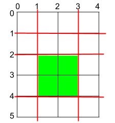

1465. Maximum Area of a Piece of Cake After Horizontal and Vertical Cuts

Given a rectangular cake with height `h` and width `w`, and two arrays of integers `horizontalCuts` and `verticalCuts` where `horizontalCuts[i]` is the distance from the top of the rectangular cake to the `i`th horizontal cut and similarly, `verticalCuts[j]` is the distance from the left of the rectangular cake to the `j`th vertical cut.

Return the maximum area of a piece of cake after you cut at each horizontal and vertical position provided in the arrays `horizontalCuts` and `verticalCuts`. Since the answer can be a huge number, return this modulo `10^9 + 7`.

 

**Example 1:**


```
Input: h = 5, w = 4, horizontalCuts = [1,2,4], verticalCuts = [1,3]
Output: 4 
Explanation: The figure above represents the given rectangular cake. Red lines are the horizontal and vertical cuts. After you cut the cake, the green piece of cake has the maximum area.
```

**Example 2:**


```
Input: h = 5, w = 4, horizontalCuts = [3,1], verticalCuts = [1]
Output: 6
Explanation: The figure above represents the given rectangular cake. Red lines are the horizontal and vertical cuts. After you cut the cake, the green and yellow pieces of cake have the maximum area.
```

**Example 3:**
```
Input: h = 5, w = 4, horizontalCuts = [3], verticalCuts = [3]
Output: 9
```

**Constraints:**

* `2 <= h, w <= 10^9`
* `1 <= horizontalCuts.length < min(h, 10^5)`
* `1 <= verticalCuts.length < min(w, 10^5)`
* `1 <= horizontalCuts[i] < h`
* 1 <= verticalCuts[i] < w`
* It is guaranteed that all elements in `horizontalCuts` are distinct.
* It is guaranteed that all elements in v`erticalCuts` are distinct.

# Submissions
---
**Solution 1: (Sort, Greedy)**
```
Runtime: 328 ms
Memory Usage: 26.8 MB
```
```python
class Solution:
    def maxArea(self, h: int, w: int, horizontalCuts: List[int], verticalCuts: List[int]) -> int:
        horizontalCuts.sort()
        verticalCuts.sort()
        dy, dx = max(horizontalCuts[0], h - horizontalCuts[-1]), max(verticalCuts[0], w - verticalCuts[-1])
        for i in range(1, len(horizontalCuts)):
            dy = max(dy, horizontalCuts[i] - horizontalCuts[i - 1])
        for i in range(1, len(verticalCuts)):
            dx = max(dx, verticalCuts[i] - verticalCuts[i - 1])
        return dx * dy % (10**9 + 7)
```

**Solution 2: (Sort, Greedy)**
```
Runtime: 112 ms
Memory Usage: 32.3 MB
```
```c++
class Solution {
public:
    int maxArea(int h, int w, vector<int>& horizontalCuts, vector<int>& verticalCuts) {
        horizontalCuts.push_back(0);
        horizontalCuts.push_back(h);
        
        verticalCuts.push_back(0);
        verticalCuts.push_back(w);
        
        sort(horizontalCuts.begin(),horizontalCuts.end());
        sort(verticalCuts.begin(),verticalCuts.end());
        
        long long l = 0, b = 0;
        
        for(int i=1; i<horizontalCuts.size(); i++){
            if (b < horizontalCuts[i] - horizontalCuts[i-1]){
                b = horizontalCuts[i] - horizontalCuts[i-1];
            }
        }
        for (int i=1; i<verticalCuts.size(); i++){
            if(l < verticalCuts[i] - verticalCuts[i-1]){
                l = verticalCuts[i] - verticalCuts[i-1];
            }
        }
        return (l*b)%1000000007;
    }
};
```
