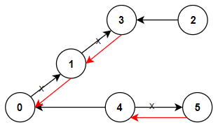

1466. Reorder Routes to Make All Paths Lead to the City Zero

There are `n` cities numbered from `0` to `n-1` and `n-1` roads such that there is only one way to travel between two different cities (this network form a tree). Last year, The ministry of transport decided to orient the roads in one direction because they are too narrow.

Roads are represented by connections where `connections[i] = [a, b]` represents a road from city `a` to `b`.

This year, there will be a big event in the capital (city `0`), and many people want to travel to this city.

Your task consists of reorienting some roads such that each city can visit the city `0`. Return the minimum number of edges changed.

It's guaranteed that each city can reach the city `0` after reorder.

 

**Example 1:**


```
Input: n = 6, connections = [[0,1],[1,3],[2,3],[4,0],[4,5]]
Output: 3
Explanation: Change the direction of edges show in red such that each node can reach the node 0 (capital).
```

**Example 2:**


```
Input: n = 5, connections = [[1,0],[1,2],[3,2],[3,4]]
Output: 2
Explanation: Change the direction of edges show in red such that each node can reach the node 0 (capital).
```

**Example 3:**
```
Input: n = 3, connections = [[1,0],[2,0]]
Output: 0
```

**Constraints:**

* `2 <= n <= 5 * 10^4`
* `connections.length == n-1`
* `connections[i].length == 2`
* `0 <= connections[i][0], connections[i][1] <= n-1`
* `connections[i][0] != connections[i][1]`

# Submissions
---
**Solution 1: (DFS)**

Start from node 0 (the capital) and dfs on the path and see if the path is
in the same direction as the traversal. If it is on the same direction that
means we need to reverse it because it can never get to the capital.

```
Runtime: 1072 ms
Memory Usage: 44.6 MB
```
```python
class Solution:
    def minReorder(self, n: int, connections: List[List[int]]) -> int:
        self.res = 0    
        roads = set()
        graph = collections.defaultdict(list)
        for u, v in connections:
            roads.add((u, v))
            graph[v].append(u)
            graph[u].append(v)

        def dfs(u, parent):
            self.res += (parent, u) in roads
            for v in graph[u]:
                if v == parent:
                    continue
                dfs(v, u)

        dfs(0, -1)
        return self.res            
```

**Solution 2: (DFS)**
```
Runtime: 553 ms
Memory: 126.3 MB
```
```c++
class Solution {
    void dfs(int u, int v, int &rst, vector<bool> &seen, set<pair<int, int>> &st, vector<vector<int>> &g) {
        seen[v] = true;
        if (st.count({u, v})) {
            rst += 1;
        }
        for (int &nv: g[v]) {
            if (!seen[nv]) {
                dfs(v, nv, rst, seen, st, g);
            }
        }
    }
public:
    int minReorder(int n, vector<vector<int>>& connections) {
        vector<vector<int>> g(n);
        set<pair<int, int>> st;
        for (int i = 0; i < connections.size(); i ++) {
            g[connections[i][0]].push_back(connections[i][1]);
            g[connections[i][1]].push_back(connections[i][0]);
            st.insert({connections[i][0], connections[i][1]});
        }
        vector<bool> seen(n);
        int ans = 0;
        dfs(-1, 0, ans, seen, st, g);
        return ans;
    }
};
```

**Solution 3: (BFS)**
```
Runtime: 303 ms
Memory: 110.3 MB
```
```c++
class Solution {
public:
    int minReorder(int n, vector<vector<int>>& connections) {
        vector<vector<pair<int, int>>> g(n);
        for (vector<int> v: connections) {
            g[v[0]].push_back({v[1], 0});
            g[v[1]].push_back({v[0], 1});
        }
        queue<int> q;
        q.push(0);
        vector<bool> visited(n);
        visited[0] = true;
        int ans = 0, v;
        while (!q.empty()) {
            v = q.front();
            q.pop();
            visited[v] = true;
            for (auto [nv, io]: g[v]) {
                if (!visited[nv]) {
                    ans += io == 0;
                    q.push(nv);
                }
            }
        }
        return ans;
    }
};
```
