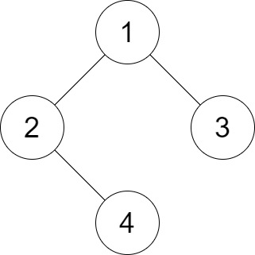
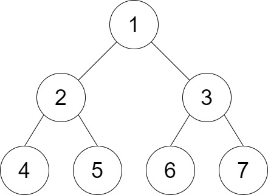

1530. Number of Good Leaf Nodes Pairs

Given the `root` of a binary tree and an integer `distance`. A pair of two different leaf nodes of a binary tree is said to be good if the length of the shortest path between them is less than or equal to `distance`.

Return the number of good leaf node pairs in the tree.

 

**Example 1:**


```
Input: root = [1,2,3,null,4], distance = 3
Output: 1
Explanation: The leaf nodes of the tree are 3 and 4 and the length of the shortest path between them is 3. This is the only good pair.
```

**Example 2:**


```
Input: root = [1,2,3,4,5,6,7], distance = 3
Output: 2
Explanation: The good pairs are [4,5] and [6,7] with shortest path = 2. The pair [4,6] is not good because the length of ther shortest path between them is 4.
```

**Example 3:**
```
Input: root = [7,1,4,6,null,5,3,null,null,null,null,null,2], distance = 3
Output: 1
Explanation: The only good pair is [2,5].
```

**Example 4:**
```
Input: root = [100], distance = 1
Output: 0
```

**Example 5:**
```
Input: root = [1,1,1], distance = 2
Output: 1
```

**Constraints:**

* The number of nodes in the tree is in the range `[1, 2^10]`.
* Each node's value is between `[1, 100]`.
* `1 <= distance <= 10`

# Submissions
---
**Solution 1: (DFS, Post Order)**
```
Runtime: 360 ms
Memory Usage: 15.3 MB
```
```python
# Definition for a binary tree node.
# class TreeNode:
#     def __init__(self, val=0, left=None, right=None):
#         self.val = val
#         self.left = left
#         self.right = right
class Solution:
    def countPairs(self, root: TreeNode, distance: int) -> int:
        ans = 0
        
        def dfs(node):
            nonlocal ans
            if not node:
                return []
            if not node.left and not node.right:
                return [(0, 1)]
            left = dfs(node.left)
            right = dfs(node.right)
            for ld, ln in left:
                for rd, rn in right:
                    if ld+rd+2 <= distance:
                        ans += ln*rn
            return [(d+1, n) for d, n in left + right]
        
        dfs(root)
        return ans
```

**Solution 2: (DFS, Counter, Post Order)**
```
Runtime: 224 ms
Memory Usage: 15.2 MB
```
```python
# Definition for a binary tree node.
# class TreeNode:
#     def __init__(self, val=0, left=None, right=None):
#         self.val = val
#         self.left = left
#         self.right = right
class Solution:
    def countPairs(self, root: TreeNode, distance: int) -> int:
        ans = 0
        
        def dfs(node):
            nonlocal ans
            if not node:
                return collections.Counter()
            if not node.left and not node.right:
                return collections.Counter([0])
            lcount = dfs(node.left)
            rcount = dfs(node.right)
            for ld, ln in lcount.items():
                for rd, rn in rcount.items():
                    if ld+rd+2 <= distance:
                        ans += ln*rn
            return Counter({d+1: n for d, n in (lcount + rcount).items()})
        
        dfs(root)
        return ans
            
```

**Solution 3: (DFS, Post Order)**
```
Runtime: 132 ms
Memory Usage: 36.8 MB
```
```c++
/**
 * Definition for a binary tree node.
 * struct TreeNode {
 *     int val;
 *     TreeNode *left;
 *     TreeNode *right;
 *     TreeNode() : val(0), left(nullptr), right(nullptr) {}
 *     TreeNode(int x) : val(x), left(nullptr), right(nullptr) {}
 *     TreeNode(int x, TreeNode *left, TreeNode *right) : val(x), left(left), right(right) {}
 * };
 */
class Solution {
public:
    int ans = 0;
    int countPairs(TreeNode* root, int distance) {
        dfs(root, distance);
        return ans;
    }
    //Idea is it do dfs & return a list of distances of all leaf nodes to the ancestor 
    //and let the ancestor compare the distances of all it's leaf nodes, add them to result
    vector<int> dfs(TreeNode*root, int d){
        vector<int> p = {};
        if(root == nullptr) return p;
        
        auto left = dfs(root->left, d);
        auto right = dfs(root->right, d);
        
        if(left.size() == 0 && right.size() ==0){
            p.push_back(1);
            return p;
        } 
        //Compare distance and add them to answer
        for(int i = 0; i<left.size(); i++){
            for(int j=0; j<right.size(); j++){
                if(left[i]+right[j] <=d ){
                    ans ++;
                }
            }
        }
        //Increase distance by one for all child and send them to parent
        for(int i=0; i<left.size(); i++){
            left[i]++;
            p.push_back(left[i]);
        }
          
         for(int i=0; i<right.size(); i++){
            right[i]++;
            p.push_back(right[i]);
        }
        
        return p;
    }
};
```