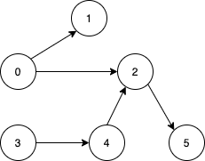

1557. Minimum Number of Vertices to Reach All Nodes

Given a directed acyclic graph, with `n` vertices numbered from `0` to `n-1`, and an array `edges` where `edges[i] = [fromi, toi]` represents a directed edge from node `fromi` to node `toi`.

Find the smallest set of vertices from which all nodes in the graph are reachable. It's guaranteed that a unique solution exists.

Notice that you can return the vertices in any order.

 

**Example 1:**


```
Input: n = 6, edges = [[0,1],[0,2],[2,5],[3,4],[4,2]]
Output: [0,3]
Explanation: It's not possible to reach all the nodes from a single vertex. From 0 we can reach [0,1,2,5]. From 3 we can reach [3,4,2,5]. So we output [0,3].
```

**Example 2:**


```
Input: n = 5, edges = [[0,1],[2,1],[3,1],[1,4],[2,4]]
Output: [0,2,3]
Explanation: Notice that vertices 0, 3 and 2 are not reachable from any other node, so we must include them. Also any of these vertices can reach nodes 1 and 4.
```

**Constraints:**

* `2 <= n <= 10^5`
* `1 <= edges.length <= min(10^5, n * (n - 1) / 2)`
* `edges[i].length == 2`
* `0 <= fromi, toi < n`
* All pairs `(fromi, toi)` are distinct.

# Submissions
---
**Solution 1: (Set)**

Just return the nodes with no in-degres.

```
Runtime: 1548 ms
Memory Usage: 51.8 MB
```
```python
class Solution:
    def findSmallestSetOfVertices(self, n: int, edges: List[List[int]]) -> List[int]:
        return list(set(range(n)) - set(j for i, j in edges))
```

**Solution 2: (Array)**
```
Runtime: 600 ms
Memory Usage: 94.4 MB
```
```c++
class Solution {
public:
    vector<int> findSmallestSetOfVertices(int n, vector<vector<int>>& edges) {
        vector<int> res, seen(n);
        for (auto& e: edges)
            seen[e[1]] = 1;
        for (int i = 0; i < n; ++i)
            if (seen[i] == 0)
                res.push_back(i);
        return res;
    }
};
```