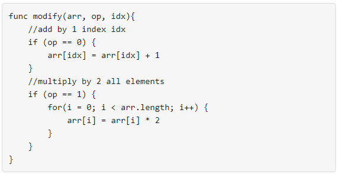

1558. Minimum Numbers of Function Calls to Make Target Array



Your task is to form an integer array `nums` from an initial array of zeros `arr` that is the same size as `nums`.

Return the minimum number of function calls to make `nums` from `arr`.

The answer is guaranteed to fit in a 32-bit signed integer.

 

**Example 1:**
```
Input: nums = [1,5]
Output: 5
Explanation: Increment by 1 (second element): [0, 0] to get [0, 1] (1 operation).
Double all the elements: [0, 1] -> [0, 2] -> [0, 4] (2 operations).
Increment by 1 (both elements)  [0, 4] -> [1, 4] -> [1, 5] (2 operations).
Total of operations: 1 + 2 + 2 = 5.
```

**Example 2:**
```
Input: nums = [2,2]
Output: 3
Explanation: Increment by 1 (both elements) [0, 0] -> [0, 1] -> [1, 1] (2 operations).
Double all the elements: [1, 1] -> [2, 2] (1 operation).
Total of operations: 2 + 1 = 3.
```

**Example 3:**
```
Input: nums = [4,2,5]
Output: 6
Explanation: (initial)[0,0,0] -> [1,0,0] -> [1,0,1] -> [2,0,2] -> [2,1,2] -> [4,2,4] -> [4,2,5](nums).
```

**Example 4:**
```
Input: nums = [3,2,2,4]
Output: 7
```

**Example 5:**
```
Input: nums = [2,4,8,16]
Output: 8
```

**Constraints:**

* `1 <= nums.length <= 10^5`
* `0 <= nums[i] <= 10^9`

# Submissions
---
**Solution 1: (Math)**

**Intuition**

Think in backward way,
for each number a in A,
* if a % 2 == 1, we do operation 0 backward, turning 1 to 0.
* If all a % 2 == 0, we do operation 1 backward.

**Some observation here:**

For each bit "1" in the bianry format of a,
we need at least one operation 0.
All operation 1 can be shared.


**Explanation**

For each number a,
we count the number of bits "1",
as well as the length of a in binary format.

* The number of operation 0 equals to the total number of bits "1".
* The number of operation 1 equals to maximum bit length - 1.


**Complexity**

* Time O(Nlog(10^9)))
* Space O(1)


```
Runtime: 316 ms
Memory Usage: 21.4 MB
```
```python
class Solution:
    def minOperations(self, nums: List[int]) -> int:
        
        # return sum(bin(a).count('1') for a in nums) + len(bin(max(nums))[2:]) - 1
        return sum(bin(a).count('1') for a in nums) + len(bin(max(nums))) - 3
```

**Solution 2: (Math)**
```
Runtime: 120 ms
Memory Usage: 25.4 MB
```
```c++
class Solution {
public:
    int minOperations(vector<int>& nums) {
        int res = 0, maxLen = 0;
        for (int a : nums) {
            int bits = 0;
            while (a > 0) {
                res += a & 1;
                bits++;
                a >>= 1;
            }
            maxLen = max(maxLen, bits);
        }
        return res + maxLen - 1;
    }
};
```

**Solution 3: (Math, Brute Force)**
```
Runtime: 904 ms
Memory Usage: 21.6 MB
```
```python
class Solution:
    def minOperations(self, nums: List[int]) -> int:
        twos = 0
        ones = 0
        for n in nums:
            mul = 0
            while n:
                if n%2: # odd number, just delete 1 so that it's now a multiple of 2
                    n -= 1
                    ones += 1
                else: # multiple of 2, so just divide by 2 
                    n //= 2
                    mul += 1
            twos = max(twos, mul)
        return ones + twos
```