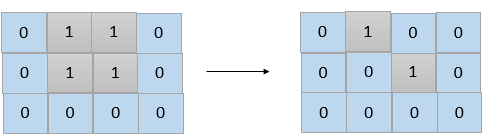

1568. Minimum Number of Days to Disconnect Island

Given a 2D `grid` consisting of `1`s (land) and `0`s (water).  An island is a maximal 4-directionally (horizontal or vertical) connected group of 1s.

The `grid` is said to be **connected** if we have **exactly one island**, otherwise is said **disconnected**.

In one day, we are allowed to change any single land cell (`1`) into a water cell (`0`).

Return the minimum number of days to disconnect the grid.

 

**Example 1:**


```
Input: grid = [[0,1,1,0],[0,1,1,0],[0,0,0,0]]
Output: 2
Explanation: We need at least 2 days to get a disconnected grid.
Change land grid[1][1] and grid[0][2] to water and get 2 disconnected island.
```

**Example 2:**
```
Input: grid = [[1,1]]
Output: 2
Explanation: Grid of full water is also disconnected ([[1,1]] -> [[0,0]]), 0 islands.
```

**Example 3:**
```
Input: grid = [[1,0,1,0]]
Output: 0
```

**Example 4:**
```
Input: grid = [[1,1,0,1,1],
               [1,1,1,1,1],
               [1,1,0,1,1],
               [1,1,0,1,1]]
Output: 1
```

**Example 5:**
```
Input: grid = [[1,1,0,1,1],
               [1,1,1,1,1],
               [1,1,0,1,1],
               [1,1,1,1,1]]
Output: 2
```

**Constraints:**

* `1 <= grid.length, grid[i].length <= 30`
* `grid[i][j] is 0 or 1`.

# Submissions
---
**Solution 1: (Union-Find)**

**Idea**

* How to make the grid disconnected?

    We can tell from the first official example that, the worst situation we may get into is to take 2 steps and separate a single island out.
    More specifically, there are 3 situation.

    1. The number of island on the grid is not 1.
        
        return 0
    1. The number of island on the grid is 1, and we can break them into 2 islands within 1 step.
        
        return 1
    1. The number of island on the grid is 1, and we cannot break them into 2 islands within 1 step.
        
        return 2, because no matter what, we can always separate 1 island out within 2 steps
* How to count the number of islands on the grid

    There are many different ways like DFS, Union Find. I use union find here.

**Complexity**

* Time: O(n^4)
* Space: O(n^2)

```
Runtime: 5784 ms
Memory Usage: 21.8 MB
```
```python
class Solution:
    def minDays(self, grid: List[List[int]]) -> int:
        m, n = len(grid), len(grid[0])
        
        def countIsland():
            roots = {(i,j):(i,j) for i in range(m) for j in range(n)}
            def find(x):
                if roots[x] != x: roots[x] = find(roots[x])
                return roots[x]                    
            
            def unite(x, y):
                roots[find(x)] = find(y)
                
            for i in range(m):
                for j in range(n):
                    if grid[i][j]:
                        if i < m - 1 and grid[i + 1][j]:
                            unite((i, j), (i + 1, j))
                        if j < n - 1 and grid[i][j + 1]:
                            unite((i, j), (i, j + 1))
            return len(set(find((i, j)) for i in range(m) for j in range(n) if grid[i][j]))                            
        
        if countIsland() != 1:
            return 0
        
        for i in range(m):
            for j in range(n):
                if grid[i][j]:
                    grid[i][j] = 0
                    if countIsland() != 1:
                        return 1
                    grid[i][j] = 1
        return 2
```