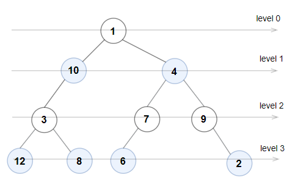
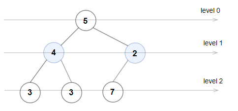

1609. Even Odd Tree

A binary tree is named **Even-Odd** if it meets the following conditions:

* The root of the binary tree is at level index `0`, its children are at level index `1`, their children are at level index `2`, etc.
* For every **even-indexed** level, all nodes at the level have odd integer values in **strictly increasing** order (from left to right).
* For every **odd-indexed** level, all nodes at the level have even integer values in **strictly decreasing** order (from left to right).

Given the root of a binary tree, return `true` if the binary tree is **Even-Odd**, otherwise return `false`.

 

**Example 1:**


```
Input: root = [1,10,4,3,null,7,9,12,8,6,null,null,2]
Output: true
Explanation: The node values on each level are:
Level 0: [1]
Level 1: [10,4]
Level 2: [3,7,9]
Level 3: [12,8,6,2]
Since levels 0 and 2 are all odd and increasing, and levels 1 and 3 are all even and decreasing, the tree is Even-Odd.
```

**Example 2:**


```
Input: root = [5,4,2,3,3,7]
Output: false
Explanation: The node values on each level are:
Level 0: [5]
Level 1: [4,2]
Level 2: [3,3,7]
Node values in the level 2 must be in strictly increasing order, so the tree is not Even-Odd.
```

**Example 3:**


```
Input: root = [5,9,1,3,5,7]
Output: false
Explanation: Node values in the level 1 should be even integers.
```

**Example 4:**

```
Input: root = [1]
Output: true
```

**Example 5:**

```
Input: root = [11,8,6,1,3,9,11,30,20,18,16,12,10,4,2,17]
Output: true
```

**Constraints:**

* The number of nodes in the tree is in the range `[1, 105]`.
* `1 <= Node.val <= 106`

# Submissions
---
**Solution 1: (BFS, Level-order)**
```
Runtime: 476 ms
Memory Usage: 40.4 MB
```
```python
# Definition for a binary tree node.
# class TreeNode:
#     def __init__(self, val=0, left=None, right=None):
#         self.val = val
#         self.left = left
#         self.right = right
class Solution:
    def isEvenOddTree(self, root: TreeNode) -> bool:
        queue = collections.deque([root])
        is_even = True
        while queue:
            prev = None
            for _ in range(len(queue)):
                node = queue.popleft()
                if is_even:
                    if node.val % 2 == 0: return False
                    if prev and prev.val >= node.val: return False
                else:
                    if node.val % 2 == 1: return False
                    if prev and prev.val <= node.val: return False
                if node.left: queue.append(node.left)
                if node.right: queue.append(node.right)
                prev = node
            is_even = not is_even
        return True
```