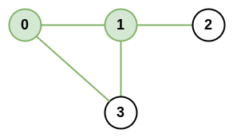

1615. Maximal Network Rank

There is an infrastructure of `n` cities with some number of roads connecting these cities. Each `roads[i] = [ai, bi]` indicates that there is a bidirectional road between cities `ai` and `bi`.

The **network rank of two different cities** is defined as the total number of **directly** connected roads to **either** city. If a road is directly connected to both cities, it is only counted **once**.

The **maximal network rank** of the infrastructure is the **maximum network rank** of all pairs of different cities.

Given the integer `n` and the array `roads`, return the **maximal network rank** of the entire infrastructure.

 

**Example 1:**


```
Input: n = 4, roads = [[0,1],[0,3],[1,2],[1,3]]
Output: 4
Explanation: The network rank of cities 0 and 1 is 4 as there are 4 roads that are connected to either 0 or 1. The road between 0 and 1 is only counted once.
```

**Example 2:**


```
Input: n = 5, roads = [[0,1],[0,3],[1,2],[1,3],[2,3],[2,4]]
Output: 5
Explanation: There are 5 roads that are connected to cities 1 or 2.
```

**Example 3:**
```
Input: n = 8, roads = [[0,1],[1,2],[2,3],[2,4],[5,6],[5,7]]
Output: 5
Explanation: The network rank of 2 and 5 is 5. Notice that all the cities do not have to be connected.
```

**Constraints:**

* `2 <= n <= 100`
* `0 <= roads.length <= n * (n - 1) / 2`
* `roads[i].length == 2`
* `0 <= ai, bi <= n-1`
* `ai != bi`
* Each pair of cities has at most one road connecting them.

# Submissions
---
**Solution 1: (Hash Table)**
```
Runtime: 344 ms
Memory Usage: 15.2 MB
```
```python
class Solution:
    def maximalNetworkRank(self, n: int, roads: List[List[int]]) -> int:
        g = collections.defaultdict(set)
        for a, b in roads:
            g[a].add(b)
            g[b].add(a)
        ans = 0
        for u, v in itertools.combinations(range(n), 2):
            ans = max(ans, len(g[u]) + len(g[v]) - (u in g[v]))
        return ans
```

**Solution 2: (Brute Force)**
```
Runtime: 103 ms
Memory: 42.1 MB
```
```c++
class Solution {
public:
    int maximalNetworkRank(int n, vector<vector<int>>& roads) {
        // build adjacency list
        vector<unordered_set<int>> adj(n);
        for(auto road: roads) {
            adj[road[0]].insert(road[1]);
            adj[road[1]].insert(road[0]);
        }

        // find the maximum pair of connections
        int maxi = INT_MIN;
        for(int i = 0; i < n - 1; i++) {
            for(int j = i + 1; j < n; j++) {
                int total = adj[i].size() + adj[j].size();

                // if they are connected subtract 1 from total
                if(adj[i].count(j)) total--;

                maxi = max(maxi,total);
            }
        }

        return maxi;
    }
};
```

**Solution 3: (Binary Saarch)**
```
Runtime: 70 ms
Memory: 33.6 MB
```
```c++
class Solution {
public:
    int maximalNetworkRank(int n, vector<vector<int>>& roads) {
        vector<int>ad[n+1];
        for(auto x:roads){
            ad[x[0]].push_back(x[1]);
            ad[x[1]].push_back(x[0]);
        }
        for(auto &x:ad){
            sort(x.begin(),x.end());
        }
        int ans = 0;
        for(int i=0;i<n;i++){
            for(int j=i+1;j<n;j++){
                int temp_ans = ad[i].size() + ad[j].size();
                int index = lower_bound(ad[i].begin(),ad[i].end(),j)-ad[i].begin();
                if(index!=ad[i].size()){
                    if(ad[i][index]==j)temp_ans--;
                }
                ans = max(ans, temp_ans);
            }
        }
        return ans;
    }
};
```
