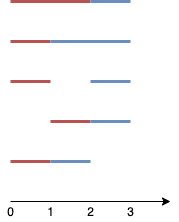

1621. Number of Sets of K Non-Overlapping Line Segments

Given n points on a 1-D plane, where the `i`th point (from `0` to `n-1`) is at `x = i`, find the number of ways we can draw exactly `k` **non-overlapping** line segments such that each segment covers two or more points. The endpoints of each segment must have **integral coordinates**. The `k` line segments **do not** have to cover all `n` points, and they are **allowed** to share endpoints.

Return the number of ways we can draw `k` non-overlapping line segments. Since this number can be huge, return it modulo `109 + 7`.

 

**Example 1:**


```
Input: n = 4, k = 2
Output: 5
Explanation: 
The two line segments are shown in red and blue.
The image above shows the 5 different ways {(0,2),(2,3)}, {(0,1),(1,3)}, {(0,1),(2,3)}, {(1,2),(2,3)}, {(0,1),(1,2)}.
```

**Example 2:**
```
Input: n = 3, k = 1
Output: 3
Explanation: The 3 ways are {(0,1)}, {(0,2)}, {(1,2)}.
```

**Example 3:**
```
Input: n = 30, k = 7
Output: 796297179
Explanation: The total number of possible ways to draw 7 line segments is 3796297200. Taking this number modulo 109 + 7 gives us 796297179.
```

**Example 4:**
```
Input: n = 5, k = 3
Output: 7
```

**Example 5:**
```
Input: n = 3, k = 2
Output: 1
```

**Constraints:**

* `2 <= n <= 1000`
* `1 <= k <= n-1`

# Submissions
---
**Solution 1: (DP Top-Down)**
```
Runtime: 3744 ms
Memory Usage: 769.6 MB
```
```python
class Solution:
    def numberOfSets(self, n: int, k: int) -> int:
        M = 10**9+7
        
        @lru_cache(None)
        def dp(idx, rem, isInMiddle):
            if idx == n-1:
                if rem:
                    return 0
                else:
                    return 1
            ans = 0
            if isInMiddle:
                ans += dp(idx+1, rem, True)
                ans += dp(idx+1, rem, False)
                if rem > 0:
                    ans += dp(idx+1, rem-1, True)
            else:
                ans += dp(idx+1, rem, False)
                if rem > 0:
                    ans += dp(idx+1, rem-1, True)
            return ans%M
        
        return dp(0, k, False)
```

**Solution 2: (Math, Transform to select 2k points from n+k-1)**

**Intuition**

* Case 1: Given n points, take k segments, allowed to share endpoints.
Same as:
* Case 2: Given n + k - 1 points, take k segments, not allowed to share endpoints.


**Prove**

In case 2, for each solution,
remove one point after the segments,
then we got one valid solution for case 1.

Reversly also right.


**Explanation**

Easy combination number C(n + k - 1, 2k).


```
Runtime: 32 ms
Memory Usage: 14.2 MB
```
```python
class Solution:
    def numberOfSets(self, n: int, k: int) -> int:
        return math.comb(n + k - 1, k * 2) % (10**9 + 7)
```

**Solution 3: (DP Bottom-Up, knapsack)**

dp[i][j]: the number of valid ways to construct i line segments using the points in [0,j]
dp[0][j] = 1 for j = [0, n−1]
dp[i][0] = 0 for i > 0

                          j-1
dp[i][j] = dp[i][j - 1] + Sim dp[i-1][p]
                          p=0
           ------------   --------------
             not take          take


    n = 4, k = 2

           0 1 2 3
dp         1 1 1 1
prefixSum    1 2 3 4

i = 1
dp         0 1 3 6       
prefixSum    0 1 4 10

i = 2;
dp         0 0 1 5   < ans
prefixSum    0 0 1 6


```
Runtime: 27 ms, Beats 68.22%
Memory: 9.50 MB, Beats 85.98%
```
```c++
const int MOD = 1e9 + 7;
class Solution {
public:
    int numberOfSets(int n, int k) {
        vector<int> dp(n), prefixSums(n + 1);
        for (int j = 0; j < n; j++) {
            dp[j] = 1;
            prefixSums[j + 1] = (prefixSums[j] + dp[j]) % MOD;
        }
        for (int i = 1; i <= k; i++) {
            dp[0] = 0;
            for (int j = 1; j < n; j++) {
                dp[j] = (dp[j - 1] + prefixSums[j]) % MOD;
            }
            for (int j = 0; j < n; j++) {
                prefixSums[j + 1] = (prefixSums[j] + dp[j]) % MOD;
            }
        }
        return dp[n - 1];
    }
};
```

**Solution 4: (Math, Combinatorics, DP Top-Down)**
```
Runtime: 67 ms, Beats 48.60%
Memory: 145.38 MB, Beats 14.48%
```
```c++
const int MOD = 1e9 + 7;
class Solution {
    vector<vector<long long>> dp; 
    long long dfs(int n, int r){ 
        if (r == 0 || r == n) {
            return 1;
        }
        if (r > n - r) {
            return dfs(n, n - r);
        }
        if (dp[n][r] !=- 1) {
            return dp[n][r];
        } 
        return dp[n][r] = (dfs(n - 1, r - 1) + dfs(n - 1, r)) % MOD; 
    } 
public:
    int numberOfSets(int n, int k) {
        int N = n + k - 1; 
        int R = 2 * k; 
 
        dp.assign(N + 1, vector<long long>(R + 1, -1)); 
        return dfs(N, R); 
    }
};
```

**Solution 4: (Math, Combinatorics, DP Bottom-Up)**
```
Runtime: 0 ms, Beats 100.00%
Memory: 7.64 MB, Beats 100.00%
```
```c++
const int MOD = 1e9 + 7;
class Solution {
    long long quickPow(long long a, long long e) {
        long long result = 1;
        while (e > 0) {
            if (e & 1) result = result * a % MOD;
            a = a * a % MOD;
            e >>= 1;
        }
        return result;
    }
public:
    int numberOfSets(int n, int k) {
        int m = 2 * k;
        long long numerator = 1, denominator = 1;
        for (int i = 1; i <= m; i++) {
            numerator = numerator * (n + k - i) % MOD;
            denominator = denominator * i % MOD;
        }
        return numerator * quickPow(denominator, MOD - 2) % MOD;
    }
};
```

**Solution 5: (Math, Combinatorics, DP Bottom-Up)**

* When segments DO NOT touch at endpoints:If no two segments shared endpoints, picking k segments would mean choosing 2k distinct endpoints out of n points: c(n, 2k).
* Allowing segments to share endpoints:Segments are allowed to share an endpoint (e.g., segment 1 ends at x=2 and segment 2 starts at x=2). Each shared endpoint reduces the total number of distinct points needed by 1.
    * If m segments touch each other sequentially, we need m + 1 points instead of 2m points.
    * By using the standard Stars and Bars technique, allowing k non-zero length segments to share adjacent endpoints is equivalent to selecting 2k endpoints from n + k - 1 points.

C(n + k - 1, 2*k) % (1e9 + 7)


n point pick k segment may share endpoint 
= n point pick 2k point may share endpoint
= n + k - 1 point pick 2k point not share endpoint
      -----
      k segment share endpoint = add k - 1 point
      
        v share 1 endpoint
     x--x--x
     2 segment share 1 endpoint

--------------------------
    n = 4, k = 2
-> c(5, 4) = 5

```
Runtime: 0 ms, Beats 100.00%
Memory: 7.74 MB, Beats 98.13%
```
```c++
const int MOD = 1e9 + 7;
class Solution {
    // Fast exponentiation for modular inverse: a^(MOD-2) % MOD
    long long power(long long base, long long exp) {
        long long res = 1;
        base %= MOD;
        while (exp > 0) {
            if (exp % 2 == 1) res = (res * base) % MOD;
            base = (base * base) % MOD;
            exp /= 2;
        }
        return res;
    }

    long long modInverse(long long n) {
        return power(n, MOD - 2);
    }
public:
    int numberOfSets(int n, int k) {
        int N = n + k - 1;
        int R = 2 * k;

        if (R > N) return 0;

        // Compute Combination C(N, R) % MOD = N! / (R! * (N-R)!)
        long long num = 1, den = 1;

        for (int i = 0; i < R; i++) {
            num = (num * (N - i)) % MOD;
            den = (den * (i + 1)) % MOD;
        }

        return (num * modInverse(den)) % MOD;
    }
};
```

**Solution 6: (DP Bottom-Up, knapsack, start/not-start new segment)**

dp[i][j][0] be the number of ways to draw j segments using a subset of points up to x = i, where point i is NOT currently part of an active line segment.
dp[i][j][1] be the number of ways to draw j segments using a subset of points up to x = i, where point i IS currently being used as the right endpoint of the j-th segment.


    n = 4, k = 2

dp    0 1 2 3
0 0   1 1 1 1
  1
1 0       1 3
  1     1 2 3
2 0         1  < sum
  1       1 4  <

```
Runtime: 735 ms, Beats 20.56%
Memory: 290.32 MB, Beats 12.62%
```
```c=+
const int MOD = 1e9 + 7;
class Solution {
public:
    int numberOfSets(int n, int k) {
        // dp[i][j][0] -> point i is NOT ending a segment
        // dp[i][j][1] -> point i IS ending a segment
        vector<vector<vector<long long>>> dp(
            n, vector<vector<long long>>(k + 1, vector<long long>(2, 0))
        );

        // Base case: 0 segments formed using point 0
        dp[0][0][0] = 1;

        for (int i = 1; i < n; ++i) {
            // Base case: 0 segments formed using up to point i
            dp[i][0][0] = 1;

            for (int j = 1; j <= k; ++j) {
                // Point i is NOT part of segment j
                dp[i][j][0] = (dp[i - 1][j][0] + dp[i - 1][j][1]) % MOD;

                // Point i IS ending segment j:
                // 1. Extend existing segment j from i-1 -> dp[i-1][j][1]
                // 2. Start new segment j from i-1       -> dp[i-1][j-1][0] + dp[i-1][j-1][1]
                long long start_new = (dp[i - 1][j - 1][0] + dp[i - 1][j - 1][1]) % MOD;
                long long extend_old = dp[i - 1][j][1];

                dp[i][j][1] = (start_new + extend_old) % MOD;
            }
        }

        // Final answer is the total ways to draw k segments at point n-1
        return (dp[n - 1][k][0] + dp[n - 1][k][1]) % MOD;
    }
};
```
