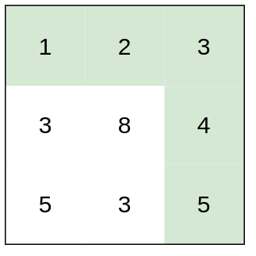

1631. Path With Minimum Effort

You are a hiker preparing for an upcoming hike. You are given `heights`, a 2D array of size `rows x columns`, where `heights[row][col]` represents the height of cell `(row, col)`. You are situated in the top-left cell, `(0, 0)`, and you hope to travel to the bottom-right cell, `(rows-1, columns-1)` (i.e., **0-indexed**). You can move **up**, **down**, **left**, or **right**, and you wish to find a route that requires the minimum **effort**.

A route's **effort** is the **maximum absolute difference** in heights between two consecutive cells of the route.

Return the minimum **effort** required to travel from the top-left cell to the bottom-right cell.

 

**Example 1:**


```
Input: heights = [[1,2,2],[3,8,2],[5,3,5]]
Output: 2
Explanation: The route of [1,3,5,3,5] has a maximum absolute difference of 2 in consecutive cells.
This is better than the route of [1,2,2,2,5], where the maximum absolute difference is 3.
```

**Example 2:**


```
Input: heights = [[1,2,3],[3,8,4],[5,3,5]]
Output: 1
Explanation: The route of [1,2,3,4,5] has a maximum absolute difference of 1 in consecutive cells, which is better than route [1,3,5,3,5].
```

**Example 3:**


```
Input: heights = [[1,2,1,1,1],[1,2,1,2,1],[1,2,1,2,1],[1,2,1,2,1],[1,1,1,2,1]]
Output: 0
Explanation: This route does not require any effort.
```

**Constraints:**

* `rows == heights.length`
* `columns == heights[i].length`
* `1 <= rows, columns <= 100`
* `1 <= heights[i][j] <= 106`

# Submissions
---
**Solution 1: (BFS, Dijkstra)**
```
Runtime: 708 ms
Memory Usage: 15.2 MB
```
```python
class Solution:
    def minimumEffortPath(self, heights: List[List[int]]) -> int:
        m, n = len(heights), len(heights[0])
        dist = [[float('inf')] * n for _ in range(m)]
        minHeap = []
        minHeap.append((0, 0, 0))  # distance, row, col
        DIR = [0, 1, 0, -1, 0]
        while minHeap:
            d, r, c = heappop(minHeap)
            if r == m - 1 and c == n - 1:
                return d  # Reach to bottom right
            for i in range(4):
                nr, nc = r + DIR[i], c + DIR[i + 1]
                if 0 <= nr < m and 0 <= nc < n:
                    newDist = max(d, abs(heights[nr][nc] - heights[r][c]))
                    if dist[nr][nc] > newDist:
                        dist[nr][nc] = newDist
                        heappush(minHeap, (dist[nr][nc], nr, nc))
```

**Solution 2: (BFS, Dijkstra)**
```
Runtime: 73 ms
Memory: 19.4 MB
```
```c++
int dx[] = {-1,1,0,0};
int dy[] = {0,0,1,-1};
class Solution {
public:
    int minimumEffortPath(vector<vector<int>>& heights) {
        int n = heights.size();
        int m = heights[0].size();

        vector<vector<int>> dist(n,vector<int>(m,1e9));
        dist[0][0] = 0;

        priority_queue<pair<int,pair<int,int>>> pq;
        pq.push({0,{0,0}});

        while(!pq.empty()){
            int curr_diff = -pq.top().first;
            int x = pq.top().second.first;
            int y = pq.top().second.second;
            pq.pop();

            if(x==n-1 && y==m-1) return curr_diff;

            for(int i=0; i<4; i++){
                int newx = x + dx[i];
                int newy = y + dy[i];

                if(newx >= 0 && newy >= 0 && newx < n && newy < m){
                    int new_diff = max(abs(heights[x][y] - heights[newx][newy]),curr_diff);

                    if(new_diff < dist[newx][newy]){
                        dist[newx][newy] = new_diff;
                        pq.push({-new_diff,{newx,newy}});
                    }

                }
            }
        }

        return 0;
    }
};
```
