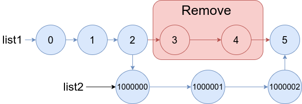

1669. Merge In Between Linked Lists

You are given two linked lists: `list1` and `list2` of sizes `n` and m` respectively.

Remove list1's nodes from the `a`th node to the `b`th node, and put `list2` in their place.

The blue edges and nodes in the following figure incidate the result:


Build the result list and return its head.

 

**Example 1:**


```
Input: list1 = [0,1,2,3,4,5], a = 3, b = 4, list2 = [1000000,1000001,1000002]
Output: [0,1,2,1000000,1000001,1000002,5]
Explanation: We remove the nodes 3 and 4 and put the entire list2 in their place. The blue edges and nodes in the above figure indicate the result.
```

**Example 2:**


```
Input: list1 = [0,1,2,3,4,5,6], a = 2, b = 5, list2 = [1000000,1000001,1000002,1000003,1000004]
Output: [0,1,1000000,1000001,1000002,1000003,1000004,6]
Explanation: The blue edges and nodes in the above figure indicate the result.
```

**Constraints:**

* `3 <= list1.length <= 104`
* `1 <= a <= b < list1.length - 1`
* `1 <= list2.length <= 104`

# Submissions
---
**Solution 1: (Linked List)**
```
Runtime: 564 ms
Memory Usage: 20.2 MB
```
```python
# Definition for singly-linked list.
# class ListNode:
#     def __init__(self, val=0, next=None):
#         self.val = val
#         self.next = next
class Solution:
    def mergeInBetween(self, list1: ListNode, a: int, b: int, list2: ListNode) -> ListNode:
        start, end = None, list1
        for i in range(b):
            if i == a - 1:
                start = end
            end = end.next
        start.next = list2
        while list2.next:
            list2 = list2.next
        list2.next = end.next
        end.next = None
        return list1
```

**Solution 2: (Linked List)**
```
Runtime: 116 ms
Memory Usage: 32.9 MB
```
```c
/**
 * Definition for singly-linked list.
 * struct ListNode {
 *     int val;
 *     struct ListNode *next;
 * };
 */


struct ListNode* mergeInBetween(struct ListNode* list1, int a, int b, struct ListNode* list2){
    struct ListNode *cur = list1, *start, *end;
    int i = 0;
    while (i <= b) {
        if (i == a - 1)
            start = cur;
        if (i == b) {
            end = cur->next;
            break;
        }
        cur = cur->next;
        i += 1;
    }
    start->next = list2;
    cur = list2;
    while (cur->next) {
        cur = cur->next;
    }
    cur->next = end;
    return list1;
}
```
