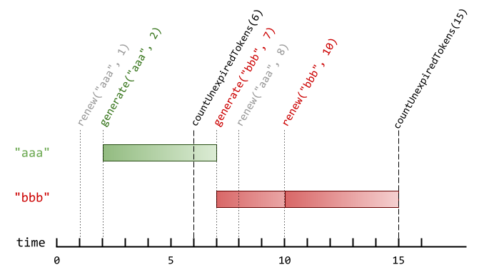

1797. Design Authentication Manager

There is an authentication system that works with authentication tokens. For each session, the user will receive a new authentication token that will expire `timeToLive` seconds after the `currentTime`. If the token is renewed, the expiry time will be extended to expire `timeToLive` seconds after the (potentially different) `currentTime`.

Implement the `AuthenticationManager` class:

* `AuthenticationManager(int timeToLive)` constructs the AuthenticationManager and sets the `timeToLive`.
* `generate(string tokenId, int currentTime)` generates a new token with the given `tokenId` at the given `currentTime` in seconds.
* `renew(string tokenId, int currentTime)` renews the unexpired token with the given `tokenId` at the given `currentTime` in seconds. If there are no unexpired tokens with the given `tokenId`, the request is ignored, and nothing happens.
* `countUnexpiredTokens(int currentTime)` returns the number of unexpired tokens at the given `currentTime`.

Note that if a token expires at time `t`, and another action happens on time `t` (`renew` or `countUnexpiredTokens`), the expiration takes place before the other actions.

 

**Example 1:**


```
Input
["AuthenticationManager", "renew", "generate", "countUnexpiredTokens", "generate", "renew", "renew", "countUnexpiredTokens"]
[[5], ["aaa", 1], ["aaa", 2], [6], ["bbb", 7], ["aaa", 8], ["bbb", 10], [15]]
Output
[null, null, null, 1, null, null, null, 0]

Explanation
AuthenticationManager authenticationManager = new AuthenticationManager(5); // Constructs the AuthenticationManager with timeToLive = 5 seconds.
authenticationManager.renew("aaa", 1); // No token exists with tokenId "aaa" at time 1, so nothing happens.
authenticationManager.generate("aaa", 2); // Generates a new token with tokenId "aaa" at time 2.
authenticationManager.countUnexpiredTokens(6); // The token with tokenId "aaa" is the only unexpired one at time 6, so return 1.
authenticationManager.generate("bbb", 7); // Generates a new token with tokenId "bbb" at time 7.
authenticationManager.renew("aaa", 8); // The token with tokenId "aaa" expired at time 7, and 8 >= 7, so at time 8 the renew request is ignored, and nothing happens.
authenticationManager.renew("bbb", 10); // The token with tokenId "bbb" is unexpired at time 10, so the renew request is fulfilled and now the token will expire at time 15.
authenticationManager.countUnexpiredTokens(15); // The token with tokenId "bbb" expires at time 15, and the token with tokenId "aaa" expired at time 7, so currently no token is unexpired, so return 0.
```

**Constraints:**

* `1 <= timeToLive <= 108`
* `1 <= currentTime <= 108`
* `1 <= tokenId.length <= 5`
* `tokenId` consists only of lowercase letters.
* All calls to generate will contain unique values of `tokenId`.
* The values of `currentTime` across all the function calls will be **strictly increasing**.
* At most `2000` calls will be made to all functions combined.

# Submissions
---
**Solution 1: (OrderdeDict)**
```
Runtime: 128 ms
Memory Usage: 15.6 MB
```
```python
class AuthenticationManager:

    def __init__(self, timeToLive: int):
        self._time = timeToLive
        self._dict = collections.OrderedDict()

    # remove all outdated keys if there is any
    def _evict(self, currentTime):
        while self._dict and next(iter(self._dict.values())) <= currentTime:
            self._dict.popitem(last=False)
    
    def generate(self, tokenId: str, currentTime: int) -> None:
        self._evict(currentTime)
        self._dict[tokenId] = currentTime + self._time # put new keys at the tail (the newest)

    def renew(self, tokenId: str, currentTime: int) -> None:
        self._evict(currentTime)
            
        if tokenId not in self._dict:
            return
        # move new item to the end of the OrderedDict
        self._dict.move_to_end(tokenId) # the renew key must be the newest, so move to tail
        self._dict[tokenId] = currentTime + self._time

    def countUnexpiredTokens(self, currentTime: int) -> int:
        self._evict(currentTime)
        return len(self._dict)


# Your AuthenticationManager object will be instantiated and called as such:
# obj = AuthenticationManager(timeToLive)
# obj.generate(tokenId,currentTime)
# obj.renew(tokenId,currentTime)
# param_3 = obj.countUnexpiredTokens(currentTime)
```

**Solution 2: (Time map and Token map)**
```
Runtime: 55 ms
Memory: 36.78 MB
```
```c++
class AuthenticationManager {
    int ttl;
    set<pair<int, string>> time_map;
    unordered_map<string, int> token_map;
    void clean(int currentTime) {
        while(!time_map.empty() && begin(time_map)->first <= currentTime) {
            token_map.erase(begin(time_map)->second);
            time_map.erase(begin(time_map));
        }
    }
public:
    AuthenticationManager(int timeToLive) {
        ttl = timeToLive;
    }

    void generate(string tokenId, int currentTime) {
        token_map[tokenId] = currentTime + ttl;
        time_map.insert({currentTime + ttl, tokenId});
    }
    
    void renew(string tokenId, int currentTime) {
        clean(currentTime);
        auto it = token_map.find(tokenId);
        if (it != end(token_map)) {
            time_map.erase({it->second, it->first});
            it->second = currentTime + ttl;
            time_map.insert({currentTime + ttl, tokenId});
        }
    }
    
    int countUnexpiredTokens(int currentTime) {
        clean(currentTime);
        return token_map.size();
    }
};

/**
 * Your AuthenticationManager object will be instantiated and called as such:
 * AuthenticationManager* obj = new AuthenticationManager(timeToLive);
 * obj->generate(tokenId,currentTime);
 * obj->renew(tokenId,currentTime);
 * int param_3 = obj->countUnexpiredTokens(currentTime);
 */
```
