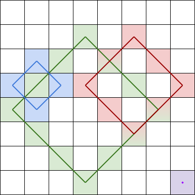
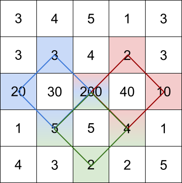

1878. Get Biggest Three Rhombus Sums in a Grid

You are given an `m x n` integer matrix `grid`.

A **rhombus sum** is the sum of the elements that form **the border** of a regular rhombus shape in `grid`. The rhombus must have the shape of a square rotated 45 degrees with each of the corners centered in a grid cell. Below is an image of four valid rhombus shapes with the corresponding colored cells that should be included in each **rhombus sum**:


Note that the rhombus can have an area of 0, which is depicted by the purple rhombus in the bottom right corner.

Return the biggest three distinct **rhombus sums** in the grid in **descending order**. If there are less than three distinct values, return all of them.

 

**Example 1:**


```
Input: grid = [[3,4,5,1,3],[3,3,4,2,3],[20,30,200,40,10],[1,5,5,4,1],[4,3,2,2,5]]
Output: [228,216,211]
Explanation: The rhombus shapes for the three biggest distinct rhombus sums are depicted above.
- Blue: 20 + 3 + 200 + 5 = 228
- Red: 200 + 2 + 10 + 4 = 216
- Green: 5 + 200 + 4 + 2 = 211
```

**Example 2:**


```
Input: grid = [[1,2,3],[4,5,6],[7,8,9]]
Output: [20,9,8]
Explanation: The rhombus shapes for the three biggest distinct rhombus sums are depicted above.
- Blue: 4 + 2 + 6 + 8 = 20
- Red: 9 (area 0 rhombus in the bottom right corner)
- Green: 8 (area 0 rhombus in the bottom middle)
```

**Example 3:**
```
Input: grid = [[7,7,7]]
Output: [7]
Explanation: All three possible rhombus sums are the same, so return [7].
```

**Constraints:**

* `m == grid.length`
* `n == grid[i].length`
* `1 <= m, n <= 50`
* `1 <= grid[i][j] <= 10^5`

# Submissions
---
**Solution 1: (Brute Force, Heap)**
```
Runtime: 1940 ms
Memory Usage: 17.7 MB
```
```python
class Solution:
    def getBiggestThree(self, grid: List[List[int]]) -> List[int]:
        m, n = len(grid), len(grid[0])
        S = {cell for row in grid for cell in row}
        heap = list(S)
        heapq.heapify(heap)
        while len(heap) > 3:
            heapq.heappop(heap)
        for i in range(m):
            for j in range(n):
                for k in range(1, min(m, n)):
                    if i - k < 0 or i + k >= m or j - k < 0 or j + k >= n:
                        break
                    curr = 0
                    for l in range(k + 1):
                        curr += grid[i+l][j+k-l] + grid[i-l][j+k-l] + grid[i+l][j-k+l] + grid[i-l][j-k+l]
                    curr -= grid[i+k][j] + grid[i-k][j] + grid[i][j+k] + grid[i][j-k]
                    if curr not in S:
                        S.add(curr)
                        heapq.heappush(heap, curr)
                        if len(heap) > 3: heapq.heappop(heap)
        return sorted(heap, reverse=True)
```