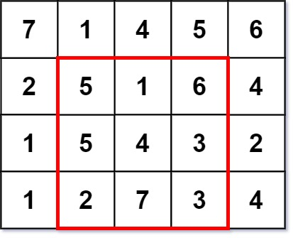
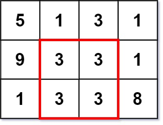

1895. Largest Magic Square

A `k x k` **magic square** is a `k x k` grid filled with integers such that every row sum, every column sum, and both diagonal sums are **all equal**. The integers in the magic square **do not have to be distinct**. Every `1 x 1` grid is trivially a magic square.

Given an `m x n` integer `grid`, return the **size** (i.e., the side length `k`) of the largest **magic square** that can be found within this grid.

 

**Example 1:**


```
Input: grid = [[7,1,4,5,6],[2,5,1,6,4],[1,5,4,3,2],[1,2,7,3,4]]
Output: 3
Explanation: The largest magic square has a size of 3.
Every row sum, column sum, and diagonal sum of this magic square is equal to 12.
- Row sums: 5+1+6 = 5+4+3 = 2+7+3 = 12
- Column sums: 5+5+2 = 1+4+7 = 6+3+3 = 12
- Diagonal sums: 5+4+3 = 6+4+2 = 12
```

**Example 2:**


```
Input: grid = [[5,1,3,1],[9,3,3,1],[1,3,3,8]]
Output: 2
```

**Constraints:**

* `m == grid.length`
* `n == grid[i].length`
* `1 <= m, n <= 50`
* `1 <= grid[i][j] <= 10^6`

# Submissions
---
**Solution 1: (Prefix Sum, Brute Force)**
```
Runtime: 732 ms
Memory Usage: 14.4 MB
```
```python
class Solution:
    def largestMagicSquare(self, grid: List[List[int]]) -> int:
        m, n = len(grid), len(grid[0])
        preSumRow = [[0] * (n + 1) for _ in range(m)]
        preSumCol = [[0] * (m + 1) for _ in range(n)]
        for r in range(m):
            for c in range(n):
                preSumRow[r][c + 1] = preSumRow[r][c] + grid[r][c]
                preSumCol[c][r + 1] = preSumCol[c][r] + grid[r][c]

        def getSumRow(row, l, r):  # row, l, r inclusive
            return preSumRow[row][r + 1] - preSumRow[row][l]

        def getSumCol(col, l, r):  # row, l, r inclusive
            return preSumCol[col][r + 1] - preSumCol[col][l]

        def test(k):
            for r in range(m - k + 1):
                for c in range(n - k + 1):
                    diag, antiDiag = 0, 0
                    for d in range(k):
                        diag += grid[r + d][c + d]
                        antiDiag += grid[r + d][c + k - 1 - d]

                    match = diag == antiDiag
                    nr, nc = r, c
                    while nr < r + k and match:
                        match = diag == getSumRow(nr, c, c + k - 1)
                        nr += 1
                    while nc < c + k and match:
                        match = diag == getSumCol(nc, r, r + k - 1)
                        nc += 1
                    if match: return True  # if all the sums is equal then return True as valid
            return False

        for k in range(min(m, n), 1, -1):
            if test(k): return k  # the first valid `k` is the maximum result
        return 1
```

**Solution 2: (Enumerating Squares + Prefix Sum Optimization, from largest length to smallest, brute force)**
```
Runtime: 0 ms, Beats 100.00%
Memory: 14.26 MB, Beats 54.65%
```
```c++
class Solution {
public:
    int largestMagicSquare(vector<vector<int>>& grid) {
        int m = grid.size(), n = grid[0].size();
        // prefix sum of each row
        vector<vector<int>> rowsum(m, vector<int>(n));
        for (int i = 0; i < m; ++i) {
            rowsum[i][0] = grid[i][0];
            for (int j = 1; j < n; ++j) {
                rowsum[i][j] = rowsum[i][j - 1] + grid[i][j];
            }
        }
        // prefix sum of each column
        vector<vector<int>> colsum(m, vector<int>(n));
        for (int j = 0; j < n; ++j) {
            colsum[0][j] = grid[0][j];
            for (int i = 1; i < m; ++i) {
                colsum[i][j] = colsum[i - 1][j] + grid[i][j];
            }
        }

        // enumerate edge lengths from largest to smallest
        for (int edge = min(m, n); edge >= 2; --edge) {
            // enumerate the top-left corner position (i,j) of the square
            for (int i = 0; i + edge <= m; ++i) {
                for (int j = 0; j + edge <= n; ++j) {
                    // the value for each row, column, and diagonal should be
                    // calculated (using the first row as a sample)
                    int stdsum =
                        rowsum[i][j + edge - 1] - (j ? rowsum[i][j - 1] : 0);
                    bool check = true;
                    // enumerate each row and directly compute the sum using
                    // prefix sums since we have already used the first line as
                    // a sample, we can skip the first line here.
                    for (int ii = i + 1; ii < i + edge; ++ii) {
                        if (rowsum[ii][j + edge - 1] -
                                (j ? rowsum[ii][j - 1] : 0) !=
                            stdsum) {
                            check = false;
                            break;
                        }
                    }
                    if (!check) {
                        continue;
                    }
                    // enumerate each column and directly calculate the sum
                    // using prefix sums
                    for (int jj = j; jj < j + edge; ++jj) {
                        if (colsum[i + edge - 1][jj] -
                                (i ? colsum[i - 1][jj] : 0) !=
                            stdsum) {
                            check = false;
                            break;
                        }
                    }
                    if (!check) {
                        continue;
                    }
                    // d1 and d2 represent the sums of the two diagonals
                    // respectively. here d denotes diagonal
                    int d1 = 0, d2 = 0;
                    // sum directly by traversing without using the prefix sum.
                    for (int k = 0; k < edge; ++k) {
                        d1 += grid[i + k][j + k];
                        d2 += grid[i + k][j + edge - 1 - k];
                    }
                    if (d1 == stdsum && d2 == stdsum) {
                        return edge;
                    }
                }
            }
        }

        return 1;
    }
};
```
**Solution 3: (Enumerating Squares + Prefix Sum Optimization, from largest length to smallest, brute force)**

              k = min(m,n)
         |-----------|
         j            j+k
                        |-----k-----| pre_row
         0  1  2  ...  m-k     m-1  m
i    0   -------------
     1   |\ k0   k0 /|
         | x       x |
         |k0       k0|
         -------------
i+k
                        
m-1
m
       pre_col


```
Runtime: 1 ms, Beats 96.80%
Memory: 14.32 MB, Beats 43.90%
```
```c++
class Solution {
public:
    int largestMagicSquare(vector<vector<int>>& grid) {
        int m = grid.size(), n = grid[0].size(), i, j, k, i2, j2, k0, a, d1, d2;
        bool is_valid;
        vector<vector<int>> pre_row(m + 1, vector<int>(n + 1));
        for (i = 0; i < m; i ++) {
            for (j = 0; j < n; j ++) {
                pre_row[i][j + 1] = pre_row[i][j] + grid[i][j];
            }
        }
        vector<vector<int>> pre_col(m + 1, vector<int>(n + 1));
        for (j = 0; j < n; j ++) {
            for (i = 0; i < m; i ++) {
                pre_col[i + 1][j] = pre_col[i][j] + grid[i][j];
            }
        }
        for (k = min(m, n); k >= 2; k --) {
            for (i = 0; i + k <= m; i ++) {
                for (j = 0; j + k <= n; j ++) {
                    a = pre_row[i][j + k] - pre_row[i][j];
                    is_valid = true;
                    for (i2 = i + 1; i2 < i + k; i2 ++) {
                        if (pre_row[i2][j + k] - pre_row[i2][j] != a) {
                            is_valid = false;
                            break;
                        }
                    }
                    if (!is_valid) {
                        continue;
                    }
                    for (j2 = j; j2 < j + k; j2 ++) {
                        if (pre_col[i + k][j2] - pre_col[i][j2] != a) {
                            is_valid = false;
                            break;
                        }
                    }
                    if (!is_valid) {
                        continue;
                    }
                    d1 = 0;
                    d2 = 0;
                    for (k0 = 0; k0 < k; k0 ++) {
                        d1 += grid[i + k0][j + k0];
                        d2 += grid[i + k0][j + k - 1 - k0];
                    }
                    if (d1 == a && d2 == a) {
                        return k;
                    }
                }
            }
        }

        return 1;
    }
};
```
