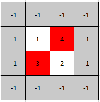

1901. Find a Peak Element II

A **peak** element in a 2D grid is an element that is **strictly greater** than all of its adjacent neighbors to the left, right, top, and bottom.

Given a **0-indexed** `m x n` matrix mat where **no two adjacent cells are equal**, find **any** peak element `mat[i][j]` and return the length 2 array `[i,j]`.

You may assume that the entire matrix is surrounded by an **outer perimeter** with the value `-1` in each cell.

You must write an algorithm that runs in `O(m log(n))` or `O(n log(m))` time.

 

**Example 1:**


```
Input: mat = [[1,4],[3,2]]
Output: [0,1]
Explanation: Both 3 and 4 are peak elements so [1,0] and [0,1] are both acceptable answers.
```

**Example 2:**


```
Input: mat = [[10,20,15],[21,30,14],[7,16,32]]
Output: [1,1]
Explanation: Both 30 and 32 are peak elements so [1,1] and [2,2] are both acceptable answers.
```

**Constraints:**

* `m == mat.length`
* `n == mat[i].length`
* `1 <= m, n <= 500`
* `1 <= mat[i][j] <= 10^5`
* No two adjacent cells are equal.

# Submissions
---
// **Solution 1: (Heap)**
// ```
// Runtime: 2511 ms
// Memory: 54.4 MB
// ```
// ```python
// class Solution:
//     def findPeakGrid(self, mat: List[List[int]]) -> List[int]:
//         R, C = len(mat), len(mat[0])
//         hq = [(mat[0][0], 0, 0)]
//         seen = set([(0, 0)])
//         while hq:
//             v, r, c = heapq.heappop(hq)
//             if all(v > mat[nr][nc] for nr, nc in [(r+1, c), (r-1, c), (r, c+1), (r, c-1)] if 0 <= nr < R and 0 <= nc < C):
//                 return [r, c]
//             for nr, nc in [(r+1, c), (r-1, c), (r, c+1), (r, c-1)]:
//                 if 0 <= nr < R and 0 <= nc < C and not (nr, nc) in seen:
//                     seen.add((nr, nc))
//                     heapq.heappush(hq, (mat[nr][nc], nr, nc))
// ```

**Solution 2: (Binary Search)**

if matrix[i][j + 1] > matrix[i][j] 
then matrix[i][j + 1] is bigger than all elements in column j
thus maximum of column j + 1 is bigger than its row-neighbour in column j
thus, there exists some peak in the right half of the matrix

```
Runtime: 136 ms
Memory: 46.8 MB
```
```c++
class Solution {
public:
    vector<int> findPeakGrid(vector<vector<int>>& mat) {
        int startCol = 0, endCol = mat[0].size()-1;
        
        while (startCol <= endCol){
            int maxRow = 0, midCol = startCol + (endCol-startCol)/2;
            
            for (int row = 0; row < mat.size(); row++){
                maxRow = mat[row][midCol] >= mat[maxRow][midCol] ? row : maxRow;   
            }
            
            bool leftIsBig = midCol-1 >= startCol && mat[maxRow][midCol-1] > mat[maxRow][midCol];
            bool rightIsBig = midCol+1 <= endCol && mat[maxRow][midCol+1] > mat[maxRow][midCol];
            
            if (!leftIsBig && !rightIsBig)
                return vector<int>{ maxRow, midCol};
            else if (rightIsBig)
                startCol = midCol+1;
            else // leftIsBig
                endCol = midCol-1;
        }
        return vector<int>{-1,-1};
    }
};
```
