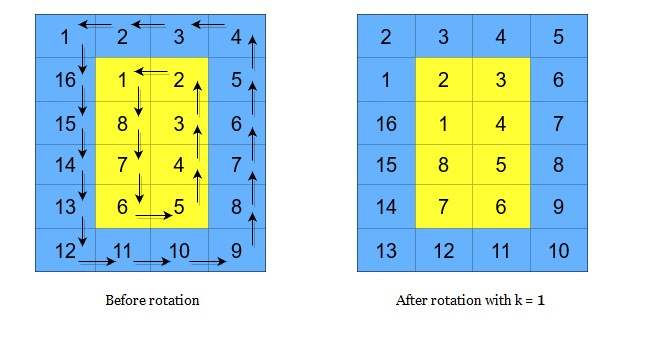
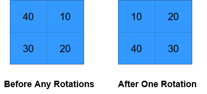
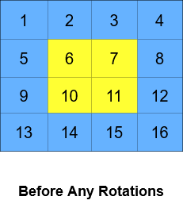
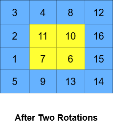

1914. Cyclically Rotating a Grid

You are given an `m x n` integer matrix `grid`, where `m` and `n` are both **even** integers, and an integer `k`.

The matrix is composed of several layers, which is shown in the below image, where each color is its own layer:


A cyclic rotation of the matrix is done by cyclically rotating **each layer** in the matrix. To cyclically rotate a layer once, each element in the layer will take the place of the adjacent element in the **counter-clockwise** direction. An example rotation is shown below:



Return the matrix after applying `k` cyclic rotations to it.

**Example 1:**


```
Input: grid = [[40,10],[30,20]], k = 1
Output: [[10,20],[40,30]]
Explanation: The figures above represent the grid at every state.
```

**Example 2:**




```
Input: grid = [[1,2,3,4],[5,6,7,8],[9,10,11,12],[13,14,15,16]], k = 2
Output: [[3,4,8,12],[2,11,10,16],[1,7,6,15],[5,9,13,14]]
Explanation: The figures above represent the grid at every state.
```

**Constraints:**

* `m == grid.length`
* `n == grid[i].length`
* `2 <= m, n <= 50`
* Both `m` and `n` are even integers.
* `1 <= grid[i][j] <= 5000`
* `1 <= k <= 10^9`

# Submissions
---
**Solution 1: (Brute Force)**
```
Runtime: 140 ms
Memory Usage: 14.5 MB
```
```python
class Solution:
    def rotateGrid(self, grid: List[List[int]], k: int) -> List[List[int]]:
        m, n = len(grid), len(grid[0]) # dimensions 
        
        for r in range(min(m, n)//2): 
            i = j = r
            vals = []
            for jj in range(j, n-j-1):     vals.append(grid[i][jj])
            for ii in range(i, m-i-1):     vals.append(grid[ii][n-j-1])
            for jj in range(n-j-1, j, -1): vals.append(grid[m-i-1][jj])
            for ii in range(m-i-1, i, -1): vals.append(grid[ii][j])
                
            kk = k % len(vals)
            vals = vals[kk:] + vals[:kk]
            
            x = 0  
            for jj in range(j, n-j-1):     grid[i][jj] = vals[x]; x += 1
            for ii in range(i, m-i-1):     grid[ii][n-j-1] = vals[x]; x += 1
            for jj in range(n-j-1, j, -1): grid[m-i-1][jj] = vals[x]; x += 1
            for ii in range(m-i-1, i, -1): grid[ii][j] = vals[x]; x += 1
        return grid
```

**Solution 2: (Brute Force, translate each layer to 1d array)**

k = 5

    . . . . . .
    . x * * * .
    . * * x * .
    . . . . . . 

layer:1
               k
     i         kk    
r    1 1 1 1 2 2 2 2
c    1 2 3 4 4 3 2 1
val  x x x x x x x x
       i         (i + kk) % total
                 idx
     ---------------
          total
     --- --- --- ---
     up  right   left
             down

```
Runtime: 24 ms, Beats 6.62%
Memory: 20.16 MB, Beats 5.88%
```
```c++
class Solution {
public:
    vector<vector<int>> rotateGrid(vector<vector<int>>& grid, int k) {
        int m = grid.size();
        int n = grid[0].size();
        int nlayer = min(m / 2, n / 2);  // level count
        // enumerate each layer counterclockwise starting from the top-left
        // corner
        for (int layer = 0; layer < nlayer; ++layer) {
            vector<int> r, c,
                val;  // each element's row index, column index, and value
            for (int j = layer; j < n - layer - 1; ++j) {  // up
                r.push_back(layer);
                c.push_back(j);
                val.push_back(grid[layer][j]);
            }
            for (int i = layer; i < m - layer - 1; ++i) {  // right
                r.push_back(i);
                c.push_back(n - layer - 1);
                val.push_back(grid[i][n - layer - 1]);
            }
            for (int j = n - layer - 1; j > layer; --j) {  // down
                r.push_back(m - layer - 1);
                c.push_back(j);
                val.push_back(grid[m - layer - 1][j]);
            }
            for (int i = m - layer - 1; i > layer; --i) {  // left
                r.push_back(i);
                c.push_back(layer);
                val.push_back(grid[i][layer]);
            }


            int total = val.size();  // total number of elements in each layer
            int kk = k % total;      // equivalent number of rotations
            // find the value at each index after rotation
            for (int i = 0; i < total; ++i) {
                int idx =
                    (i + kk) % total;  // the index corresponding to the
                                               // value after rotation
                grid[r[i]][c[i]] = val[idx];
            }
        }
        return grid;
    }
};
```

**Solution 3: (Brute Force, translate each layer to 1d array)**


      layer n-lyaer-1
      left  right
    . . . . . .
    . x * * * .  top    layer
    . * * x * .  bottom m-layer-1
    . . . . . . 

               idx
val  * * * * * x * *

```
Runtime: 11 ms, Beats 80.15%
Memory: 17.91 MB, Beats 34.56%
```
```c++
class Solution {
public:
    vector<vector<int>> rotateGrid(vector<vector<int>>& grid, int k) {
        int m = grid.size();
        int n = grid[0].size();

        int layers = min(m, n) / 2;

        for (int layer = 0; layer < layers; layer++) {
            vector<int> vals;
            int top = layer;
            int left = layer;
            int bottom = m - layer - 1;
            int right = n - layer - 1;

            // top row
            for (int j = left; j < right; j++) {
                vals.push_back(grid[top][j]);
            }

            // right column
            for (int i = top; i < bottom; i++) {
                vals.push_back(grid[i][right]);
            }

            // bottom row
            for (int j = right; j > left; j--) {
                vals.push_back(grid[bottom][j]);
            }

            // left column
            for (int i = bottom; i > top; i--) {
                vals.push_back(grid[i][left]);
            }

            int sz = vals.size();
            int start = k % sz;
            int idx = start;

            // top row
            for (int j = left; j < right; j++) {
                grid[top][j] = vals[idx];
                idx++;
                if (idx == sz){
                    idx = 0;
                }
            }

            // right column
            for (int i = top; i < bottom; i++) {
                grid[i][right] = vals[idx];
                idx++;
                if (idx == sz){
                    idx = 0;
                }
            }

            // bottom row
            for (int j = right; j > left; j--) {
                grid[bottom][j] = vals[idx];
                idx++;
                if (idx == sz){
                    idx = 0;
                }
            }

            // left column
            for (int i = bottom; i > top; i--) {
                grid[i][left] = vals[idx];
                idx++;
                if (idx == sz){
                    idx = 0;
                }
            }
        }

        return grid;
    }
};
```
