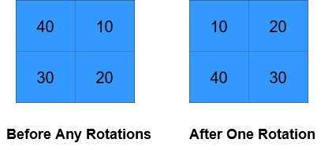

1914. Cyclically Rotating a Grid

You are given an `m x n` integer matrix `grid`, where `m` and `n` are both **even** integers, and an integer `k`.

The matrix is composed of several layers, which is shown in the below image, where each color is its own layer:


A cyclic rotation of the matrix is done by cyclically rotating **each layer** in the matrix. To cyclically rotate a layer once, each element in the layer will take the place of the adjacent element in the **counter-clockwise** direction. An example rotation is shown below:


Return the matrix after applying `k` cyclic rotations to it.

**Example 1:**


```
Input: grid = [[40,10],[30,20]], k = 1
Output: [[10,20],[40,30]]
Explanation: The figures above represent the grid at every state.
```

**Example 2:**


```
Input: grid = [[1,2,3,4],[5,6,7,8],[9,10,11,12],[13,14,15,16]], k = 2
Output: [[3,4,8,12],[2,11,10,16],[1,7,6,15],[5,9,13,14]]
Explanation: The figures above represent the grid at every state.
```

**Constraints:**

* `m == grid.length`
* `n == grid[i].length`
* `2 <= m, n <= 50`
* Both `m` and `n` are even integers.
* `1 <= grid[i][j] <= 5000`
* `1 <= k <= 10^9`

# Submissions
---
**Solution 1: (Brute Force)**
```
Runtime: 140 ms
Memory Usage: 14.5 MB
```
```python
class Solution:
    def rotateGrid(self, grid: List[List[int]], k: int) -> List[List[int]]:
        m, n = len(grid), len(grid[0]) # dimensions 
        
        for r in range(min(m, n)//2): 
            i = j = r
            vals = []
            for jj in range(j, n-j-1):     vals.append(grid[i][jj])
            for ii in range(i, m-i-1):     vals.append(grid[ii][n-j-1])
            for jj in range(n-j-1, j, -1): vals.append(grid[m-i-1][jj])
            for ii in range(m-i-1, i, -1): vals.append(grid[ii][j])
                
            kk = k % len(vals)
            vals = vals[kk:] + vals[:kk]
            
            x = 0  
            for jj in range(j, n-j-1):     grid[i][jj] = vals[x]; x += 1
            for ii in range(i, m-i-1):     grid[ii][n-j-1] = vals[x]; x += 1
            for jj in range(n-j-1, j, -1): grid[m-i-1][jj] = vals[x]; x += 1
            for ii in range(m-i-1, i, -1): grid[ii][j] = vals[x]; x += 1
        return grid
```
