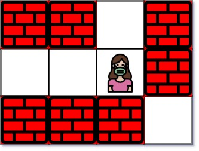

1926. Nearest Exit from Entrance in Maze

You are given an `m x n` matrix `maze` (**0-indexed**) with empty cells (represented as `'.'`) and walls (represented as `'+'`). You are also given the entrance of the maze, where `entrance = [entrancerow, entrancecol]` denotes the row and column of the cell you are initially standing at.

In one step, you can move one cell **up**, **down**, **left**, or **right**. You cannot step into a cell with a wall, and you cannot step outside the maze. Your goal is to find the **nearest exit** from the entrance. An **exit** is defined as an **empty cell** that is at the **border** of the `maze`. The `entrance` **does not count** as an exit.

Return the **number of steps** in the shortest path from the `entrance` to the nearest `exit`, or `-1` if no such path exists.

 

**Example 1:**


```
Input: maze = [["+","+",".","+"],[".",".",".","+"],["+","+","+","."]], entrance = [1,2]
Output: 1
Explanation: There are 3 exits in this maze at [1,0], [0,2], and [2,3].
Initially, you are at the entrance cell [1,2].
- You can reach [1,0] by moving 2 steps left.
- You can reach [0,2] by moving 1 step up.
It is impossible to reach [2,3] from the entrance.
Thus, the nearest exit is [0,2], which is 1 step away.
```

**Example 2:**


```
Input: maze = [["+","+","+"],[".",".","."],["+","+","+"]], entrance = [1,0]
Output: 2
Explanation: There is 1 exit in this maze at [1,2].
[1,0] does not count as an exit since it is the entrance cell.
Initially, you are at the entrance cell [1,0].
- You can reach [1,2] by moving 2 steps right.
Thus, the nearest exit is [1,2], which is 2 steps away.
```

**Example 3:**


```
Input: maze = [[".","+"]], entrance = [0,0]
Output: -1
Explanation: There are no exits in this maze.
```

**Constraints:**

* `maze.length == m`
* `maze[i].length == n`
* `1 <= m, n <= 100`
* `maze[i][j]` is either `'.'` or `'+'`.
* `entrance.length == 2`
* `0 <= entrancerow < m`
* `0 <= entrancecol < n`
* `entrance` will always be an empty cell.

# Submissions
---
**Solution 1: (BFS)**
```
Runtime: 996 ms
Memory Usage: 15.5 MB
```
```python
class Solution:
    def nearestExit(self, maze: List[List[str]], entrance: List[int]) -> int:
        R, C = len(maze), len(maze[0])
        
        q = [[entrance[0], entrance[1], 0]]
        seen = set([tuple(entrance)])
        while q:
            r, c, s = q.pop(0)
            if r == 0 or c == 0 or r == R-1 or c == C-1:
                if s > 0:
                    return s
            for nr, nc in [(r+1, c), (r-1, c), (r, c+1), (r, c-1)]:
                if 0 <= nr < R and 0 <= nc < C and maze[nr][nc] != '+':
                    if (nr, nc) not in seen:
                        seen.add((nr, nc))
                        q += [(nr, nc, s+1)]
        
        return -1
```
