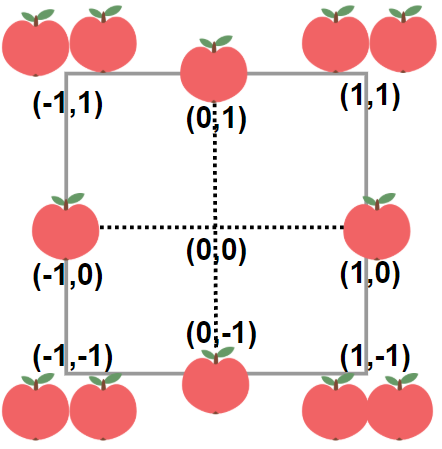

1954. Minimum Garden Perimeter to Collect Enough Apples

In a garden represented as an infinite 2D grid, there is an apple tree planted at **every** integer coordinate. The apple tree planted at an integer coordinate `(i, j`) has `|i| + |j|` apples growing on it.

You will buy an axis-aligned **square plot** of land that is centered at `(0, 0)`.

Given an integer neededApples, return the **minimum perimeter** of a plot such that **at least** `neededApples` apples are **inside or on** the perimeter of that plot.

The value of `|x|` is defined as:

* `x` if `x >= 0`
* `-x` if `x < 0`
 

**Example 1:**


```
Input: neededApples = 1
Output: 8
Explanation: A square plot of side length 1 does not contain any apples.
However, a square plot of side length 2 has 12 apples inside (as depicted in the image above).
The perimeter is 2 * 4 = 8.
```

**Example 2:**
```
Input: neededApples = 13
Output: 16
```

**Example 3:**
```
Input: neededApples = 1000000000
Output: 5040
```

**Constraints:**

* `1 <= neededApples <= 10^15`

# Submissions
---
**Solution 1: (Math)**

Use `i`, `corner` and `other` to denote the number of apples on each half axis, each corner and other parts, respectively.

Obviously, for any given `i`, each half axis has i apples; each of the `4` corners has `2 * i` apples, and the rest part (quadrant) has two times of `(i + 1) + (i + 2) + (i + 3) + ... + (2 * i - 1)` apples, which sums to `((i + 1) + (2 * i - 1)) * ((2 * i - 1) - (i + 1) + 1) / 2 * 2 = 3 * i * (i - 1)`.

```
Runtime: 2120 ms
Memory Usage: 14.2 MB
```
```python
class Solution:
    def minimumPerimeter(self, neededApples: int) -> int:
        apples = i = 0
        while apples < neededApples:
            i += 1
            corner, other = 2 * i, 3 * i * (i - 1)
            apples += 4 * (corner + i + other)
        return 8 * i
```
