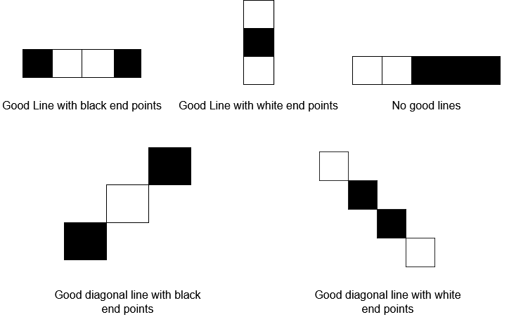

1958. Check if Move is Legal

You are given a **0-indexed** `8 x 8` grid `board`, where `board[r][c]` represents the cell `(r, c)` on a game board. On the board, free cells are represented by `'.'`, white cells are represented by `'W'`, and black cells are represented by `'B'`.

Each move in this game consists of choosing a free cell and changing it to the color you are playing as (either white or black). However, a move is only **legal** if, after changing it, the cell becomes the **endpoint of a good line** (horizontal, vertical, or diagonal).

A **good line** is a line of **three or more cells (including the endpoints)** where the endpoints of the line are one color, and the remaining cells in the middle are the **opposite color** (no cells in the line are free). You can find examples for good lines in the figure below:



Given two integers `rMove` and `cMove` and a character `color` representing the color you are playing as (white or black), return `true` if changing cell `(rMove, cMove)` to color `color` is a **legal** move, or `false` if it is not legal.

 

**Example 1:**


```
Input: board = [[".",".",".","B",".",".",".","."],[".",".",".","W",".",".",".","."],[".",".",".","W",".",".",".","."],[".",".",".","W",".",".",".","."],["W","B","B",".","W","W","W","B"],[".",".",".","B",".",".",".","."],[".",".",".","B",".",".",".","."],[".",".",".","W",".",".",".","."]], rMove = 4, cMove = 3, color = "B"
Output: true
Explanation: '.', 'W', and 'B' are represented by the colors blue, white, and black respectively, and cell (rMove, cMove) is marked with an 'X'.
The two good lines with the chosen cell as an endpoint are annotated above with the red rectangles.
```

**Example 2:**


```
Input: board = [[".",".",".",".",".",".",".","."],[".","B",".",".","W",".",".","."],[".",".","W",".",".",".",".","."],[".",".",".","W","B",".",".","."],[".",".",".",".",".",".",".","."],[".",".",".",".","B","W",".","."],[".",".",".",".",".",".","W","."],[".",".",".",".",".",".",".","B"]], rMove = 4, cMove = 4, color = "W"
Output: false
Explanation: While there are good lines with the chosen cell as a middle cell, there are no good lines with the chosen cell as an endpoint.
```

**Constraints:**

* `board.length == board[r].length == 8`
* `0 <= rMove, cMove < 8`
* `board[rMove][cMove] == '.'`
* `color` is either `'B'` or `'W'`.

# Submissions
---
**Solution 1: (Check 8 directions)**
```
Runtime: 52 ms
Memory Usage: 14.5 MB
```
```python
class Solution:
    def checkMove(self, board: List[List[str]], rMove: int, cMove: int, color: str) -> bool:
        for dr, dc in (0, 1), (0, -1), (1, 0), (-1, 0), (1, 1), (-1, -1), (1, -1), (-1, 1):
            i, j = rMove + dr, cMove + dc
            size = 2
            while 8 > i >= 0 <= j < 8:
                if board[i][j] == '.'or size < 3 and board[i][j] == color:
                    break 
                if board[i][j] == color:
                    return True    
                i += dr
                j += dc
                size += 1
        return False
```
