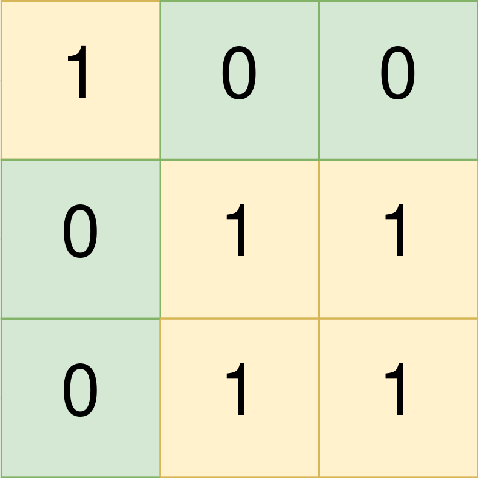
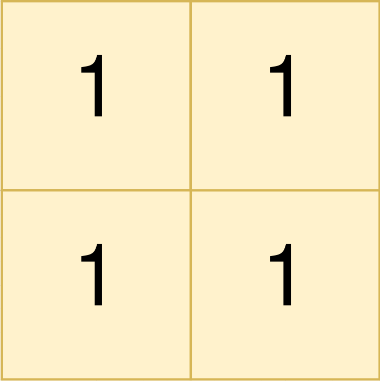

1992. Find All Groups of Farmland

You are given a **0-indexed** `m x n` binary matrix `land` where a `0` represents a hectare of forested land and a `1` represents a hectare of farmland.

To keep the land organized, there are designated rectangular areas of hectares that consist entirely of farmland. These rectangular areas are called **groups**. No two groups are adjacent, meaning farmland in one group is not four-directionally adjacent to another farmland in a different group.

land can be represented by a coordinate system where the top left corner of `land` is `(0, 0)` and the bottom right corner of `land` is `(m-1, n-1)`. Find the coordinates of the top left and bottom right corner of **each** group of farmland. A **group** of farmland with a top left corner at `(r1, c1)` and a bottom right corner at `(r2, c2)` is represented by the 4-length array `[r1, c1, r2, c2]`.

Return a 2D array containing the 4-length arrays described above for each **group** of farmland in land. If there are no groups of farmland, return an empty array. You may return the answer in **any order**.

 

**Example 1:**


```
Input: land = [[1,0,0],[0,1,1],[0,1,1]]
Output: [[0,0,0,0],[1,1,2,2]]
Explanation:
The first group has a top left corner at land[0][0] and a bottom right corner at land[0][0].
The second group has a top left corner at land[1][1] and a bottom right corner at land[2][2].
```

**Example 2:**


```
Input: land = [[1,1],[1,1]]
Output: [[0,0,1,1]]
Explanation:
The first group has a top left corner at land[0][0] and a bottom right corner at land[1][1].
```

**Example 3:**


```
Input: land = [[0]]
Output: []
Explanation:
There are no groups of farmland.
```

**Constraints:**

* `m == land.length`
* `n == land[i].length`
* `1 <= m, n <= 300`
* `land` consists of only `0`'s and `1`'s.
* Groups of farmland are **rectangular** in shape.

# Submissions
---
**Solution 1: (DFS)**
```
Runtime: 1392 ms
Memory Usage: 27.1 MB
```
```python
class Solution:
    def findFarmland(self, land: List[List[int]]) -> List[List[int]]:
        m, n = len(land), len(land[0])
        ans = []
        for i in range(m):
            for j in range(n): 
                if land[i][j]: # found farmland
                    mini, minj = i, j 
                    maxi, maxj = i, j 
                    stack = [(i, j)]
                    land[i][j] = 0 # mark as visited 
                    while stack: 
                        i, j = stack.pop()
                        for ii, jj in (i-1, j), (i, j-1), (i, j+1), (i+1, j): 
                            if 0 <= ii < m and 0 <= jj < n and land[ii][jj]: 
                                stack.append((ii, jj))
                                land[ii][jj] = 0 
                                maxi = max(maxi, ii)
                                maxj = max(maxj, jj)
                    ans.append([mini, minj, maxi, maxj])
        return ans
```

**Solution 2: (Straight Forward)**
```
Runtime: 116 ms
Memory Usage: 56.3 MB
```
```c++
class Solution {
public:
    vector<vector<int>> findFarmland(vector<vector<int>>& land) {
        int m = land.size();
        int n = land[0].size();
        
        vector<vector<int>> result;
        for(int i = 0; i<m; i++) {
            for(int j = 0; j<n; j++) {
                
                //We have to deal with 1s only
                if(land[i][j] == 0) continue;

                //Find right most column of rectangle (see the image below)
                int c1 = j;
                while(c1 < n && land[i][c1] == 1) {
                    c1++;
                }

                //Find bottom most row of rectangle (see the image below)
                int r2 = i;
                while(r2 < m && land[r2][j] == 1) {
                    r2++;
                }
                
                //Then you can find bottom right most of rectangle
                c1 = c1==0 ? c1 : c1-1;
                r2 = r2==0 ? r2 : r2-1;

                //Use them as your answer
                //{r1, c1} = {i, j}
                //{r2, c2} = {r2, c1}
                result.push_back({i, j, r2, c1});
                
                //Now, mark the covered land with 0 so that you don't consider them later
                for(int k = i; k<=r2; k++) {
                    for(int l = j; l<=c1; l++) {
                        land[k][l] = 0;
                    }
                }
                
            }
        }
        return result;
    }
};
```
