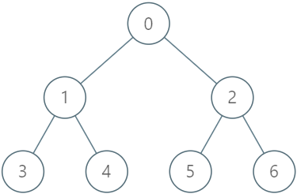

1993. Operations on Tree

You are given a tree with `n` nodes numbered from `0` to `n - 1` in the form of a parent array `parent` where `parent[i]` is the parent of the `i`th node. The root of the tree is node `0`, so `parent[0] = -1` since it has no parent. You want to design a data structure that allows users to lock, unlock, and upgrade nodes in the tree.

The data structure should support the following functions:

* **Lock:** **Locks** the given node for the given user and prevents other users from locking the same node. You may only lock a node if the node is unlocked.
* **Unlock:** **Unlocks** the given node for the given user. You may only unlock a node if it is currently locked by the same user.
* **Upgrade:** **Locks** the given node for the given user and **unlocks** all of its descendants. You may only upgrade a node if **all** 3 conditions are true:
    * The node is unlocked,
    * It has at least one locked descendant (by **any** user), and
    * It does not have any locked ancestors.

Implement the `LockingTree` class:

* `LockingTree(int[] parent)` initializes the data structure with the `parent` array.
* `lock(int num, int user)` returns `true` if it is possible for the user with id `user` to lock the node `num`, or `false` otherwise. If it is possible, the node `num` will become **locked** by the user with id `user`.
* `unlock(int num, int user)` returns `true` if it is possible for the user with id `user` to unlock the node `num`, or `false` otherwise. If it is possible, the node num will become **unlocked**.
* `upgrade(int num, int user)` returns `true` if it is possible for the user with id `user` to upgrade the node num, or `false` otherwise. If it is possible, the node num will be **upgraded**.
 

**Example 1:**


```
Input
["LockingTree", "lock", "unlock", "unlock", "lock", "upgrade", "lock"]
[[[-1, 0, 0, 1, 1, 2, 2]], [2, 2], [2, 3], [2, 2], [4, 5], [0, 1], [0, 1]]
Output
[null, true, false, true, true, true, false]

Explanation
LockingTree lockingTree = new LockingTree([-1, 0, 0, 1, 1, 2, 2]);
lockingTree.lock(2, 2);    // return true because node 2 is unlocked.
                           // Node 2 will now be locked by user 2.
lockingTree.unlock(2, 3);  // return false because user 3 cannot unlock a node locked by user 2.
lockingTree.unlock(2, 2);  // return true because node 2 was previously locked by user 2.
                           // Node 2 will now be unlocked.
lockingTree.lock(4, 5);    // return true because node 4 is unlocked.
                           // Node 4 will now be locked by user 5.
lockingTree.upgrade(0, 1); // return true because node 0 is unlocked and has at least one locked descendant (node 4).
                           // Node 0 will now be locked by user 1 and node 4 will now be unlocked.
lockingTree.lock(0, 1);    // return false because node 0 is already locked.
```

**Constraints:**

* `n == parent.length`
* `2 <= n <= 2000`
* `0 <= parent[i] <= n - 1 for i != 0`
* `parent[0] == -1`
* `0 <= num <= n - 1`
* `1 <= user <= 10^4`
* `parent` represents a valid tree.
* At most `2000` calls in total will be made to `lock`, `unlock`, and `upgrade`.

# Submissions
---
**Solution 1: (Hash Table, DFS)**
```
Runtime: 1488 ms
Memory Usage: 15.9 MB
```
```python
class LockingTree:

    def __init__(self, parent: List[int]):
        self.parent = parent
        self.tree = [[] for _ in parent]
        for i, x in enumerate(parent): 
            if x != -1: self.tree[x].append(i)
        self.locked = {}

    def lock(self, num: int, user: int) -> bool:
        if num in self.locked: return False 
        self.locked[num] = user
        return True 

    def unlock(self, num: int, user: int) -> bool:
        if self.locked.get(num) != user: return False 
        self.locked.pop(num)
        return True

    def upgrade(self, num: int, user: int) -> bool:
        if num in self.locked: return False # check for unlocked
        
        node = num
        while node != -1: 
            if node in self.locked: break # locked ancestor
            node = self.parent[node]
        else: 
            stack = [num]
            descendant = []
            while stack: 
                node = stack.pop()
                if node in self.locked: descendant.append(node)
                for child in self.tree[node]: stack.append(child)
            if descendant: 
                self.locked[num] = user # lock given node 
                for node in descendant: self.locked.pop(node) # unlock all descendants
                return True 
        return False # locked ancestor 


# Your LockingTree object will be instantiated and called as such:
# obj = LockingTree(parent)
# param_1 = obj.lock(num,user)
# param_2 = obj.unlock(num,user)
# param_3 = obj.upgrade(num,user)
```

**Solution 2: (Hash Table, DFS)**
```
Runtime: 568 ms
Memory Usage: 134.3 MB
```
```c++
class LockingTree {
public:
    unordered_map<int, vector<int>> descendents;
    vector<vector<int>> Node;
    /*
        Node[i][0] = parent[i]
        Node[i][1] = -1; (means unlocked)
        Node[i][1] = x;  (means locked by user x)
    */
    int n;
    LockingTree(vector<int>& parent) {
        n = parent.size();
        Node.resize(n, vector<int>(2, -1));
        
        Node[0][0] = -1; //root has no parent
        for(int i = 1; i<n; i++) {
            Node[i][0] = parent[i];
            descendents[parent[i]].push_back(i);            
        }
    }
    
    bool lock(int num, int user) {
        if(Node[num][1] != -1) return false;
        
        Node[num][1] = user;
        return true;
    }
    
    bool unlock(int num, int user) {
        if(Node[num][1] != user) return false;
        
        Node[num][1] = -1;
        return true;
    }
    
    //Condition-2 (Atleast one descendent should be locked)
    void checkDescendents(int num, bool& atleastOne) {
        if(descendents.count(num) == 0 || descendents[num].size() == 0)
            return;
        
        for(int& x : descendents[num]) {
            if(Node[x][1] != -1) {
                atleastOne = true;
                return;
            }
            checkDescendents(x, atleastOne);
        }
    }
    
    //Condition-3 (Check if any ancestor is locked)
    bool IsAnyAncestorLocked(int& num) {
        if(num == -1)
            return false; //you reached end and found none locked
        
        return Node[num][1] != -1 || IsAnyAncestorLocked(Node[num][0]);
    }
    
    void unlockDescendents(int num) {
        if(descendents.count(num) == 0 || descendents[num].size() == 0)
            return;
        
        for(int& x : descendents[num]) {
            Node[x][1] = -1;
            unlockDescendents(x);
        }
    }
    
    bool upgrade(int num, int user) {
        //condition : 1
        if(Node[num][1] != -1) return false;
        
        
        //condition : 2
        bool atleastOne = false;
        checkDescendents(num, atleastOne);
        //If no node was locked, return false
        if(!atleastOne) return false;
        
        
        //condition : 3
        if(IsAnyAncestorLocked(Node[num][0])) return false;
        
        
        //Do the rest
        unlockDescendents(num);
        Node[num][1] = user;
        return true;
    }
};

/**
 * Your LockingTree object will be instantiated and called as such:
 * LockingTree* obj = new LockingTree(parent);
 * bool param_1 = obj->lock(num,user);
 * bool param_2 = obj->unlock(num,user);
 * bool param_3 = obj->upgrade(num,user);
 */
```
