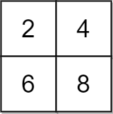
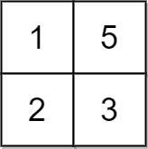

2033. Minimum Operations to Make a Uni-Value Grid

You are given a 2D integer `grid` of size `m x n` and an integer `x`. In one operation, you can **add** `x` to or **subtract** `x` from any element in the `grid`.

A **uni-value grid** is a grid where all the elements of it are equal.

Return the **minimum** number of operations to make the grid **uni-value**. If it is not possible, return `-1`.

 

**Example 1:**

```
Input: grid = [[2,4],[6,8]], x = 2
Output: 4
Explanation: We can make every element equal to 4 by doing the following: 
- Add x to 2 once.
- Subtract x from 6 once.
- Subtract x from 8 twice.
A total of 4 operations were used.
```

**Example 2:**


```
Input: grid = [[1,5],[2,3]], x = 1
Output: 5
Explanation: We can make every element equal to 3.
```

**Example 3:**


```
Input: grid = [[1,2],[3,4]], x = 2
Output: -1
Explanation: It is impossible to make every element equal.
```

**Constraints:**

* `m == grid.length`
* `n == grid[i].length`
* `1 <= m, n <= 10^5`
* `1 <= m * n <= 10^5`
* `1 <= x, grid[i][j] <= 10^4`

# Submissions
---
**Solution 1: (Medium)**
```
Runtime: 1748 ms
Memory Usage: 49.5 MB
```
```python
class Solution:
    def minOperations(self, grid: List[List[int]], x: int) -> int:
        nums = sorted([v for row in grid for v in row])
        N = len(nums)
        mid_left = nums[N//2-1]
        mid_right = nums[N//2]
        left = 0
        for i in range(N):
            d, r = divmod(abs(mid_left - nums[i]), x)
            if r:
                return -1
            left += d
        right = 0
        for i in range(N):
            d, r = divmod(abs(mid_right - nums[i]), x)
            if r:
                return -1
            right += d
        return min(left, right)
```

**Solution 2: (DP)**
```
Runtime: 272 ms
Memory Usage: 90.2 MB
```
```c++
class Solution {
public:
    int minOperations(vector<vector<int>>& grid, int x) {
        int res = INT_MAX, ops = 0;
        vector<int> v, dp(grid.size() * grid[0].size());
        for (auto &row : grid)
            v.insert(end(v), begin(row), end(row));
        sort(begin(v), end(v));
        for (int i = 0; i < v.size() - 1; ++i) {
            if ((v[i + 1] - v[i]) % x)
                return -1;
            dp[i + 1] = dp[i] + (i + 1) * (v[i + 1] - v[i]) / x;
        }
        for (int i = v.size() - 1; i > 0; --i) {
            ops += (v.size() - i) * (v[i] - v[i - 1]) / x;
            res = min(res, ops + dp[i - 1]);
        }
        return res == INT_MAX ? 0 : res;
    }
};
```
