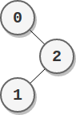

2049. Count Nodes With the Highest Score

There is a **binary tree** rooted at `0` consisting of `n` nodes. The nodes are labeled from `0` to `n - 1`. You are given a **0-indexed** integer array `parents` representing the tree, where `parents[i]` is the parent of node `i`. Since node `0` is the root, `parents[0] == -1`.

Each node has a **score**. To find the score of a node, consider if the node and the edges connected to it were **removed**. The tree would become one or more **non-empty** subtrees. The size of a subtree is the number of the nodes in it. The **score** of the node is the **product of the sizes** of all those subtrees.

Return the **number** of nodes that have the **highest score**.

 

**Example 1:**


```
Input: parents = [-1,2,0,2,0]
Output: 3
Explanation:
- The score of node 0 is: 3 * 1 = 3
- The score of node 1 is: 4 = 4
- The score of node 2 is: 1 * 1 * 2 = 2
- The score of node 3 is: 4 = 4
- The score of node 4 is: 4 = 4
The highest score is 4, and three nodes (node 1, node 3, and node 4) have the highest score.
```

**Example 2:**


```
Input: parents = [-1,2,0]
Output: 2
Explanation:
- The score of node 0 is: 2 = 2
- The score of node 1 is: 2 = 2
- The score of node 2 is: 1 * 1 = 1
The highest score is 2, and two nodes (node 0 and node 1) have the highest score.
```

**Constraints:**

* `n == parents.length`
* `2 <= n <= 10^5`
* `parents[0] == -1`
* `0 <= parents[i] <= n - 1 for i != 0`
* `parents` represents a valid binary tree.

# Submissions
---
**Solution 1: (DFS, postorder)**
```
Runtime: 1536 ms
Memory Usage: 130.5 MB
```
```python
class Solution:
    def countHighestScoreNodes(self, parents: List[int]) -> int:
        graph = collections.defaultdict(list)
        for node, parent in enumerate(parents):  # build graph
            graph[parent].append(node)
        n = len(parents)                         # total number of nodes
        d = collections.Counter()
        def count_nodes(node):                   # number of children node + self
            p, s = 1, 0                          # p: product, s: sum
            for child in graph[node]:            # for each child (only 2 at maximum)
                res = count_nodes(child)         # get its nodes count
                p *= res                         # take the product
                s += res                         # take the sum
            p *= max(1, n - 1 - s)               # times up-branch (number of nodes other than left, right children ans itself)
            d[p] += 1                            # count the product
            return s + 1                         # return number of children node + 1 (self)
        count_nodes(0)                           # starting from root (0)
        return d[max(d.keys())]                  # return max count
```

**Solution 2: (DFS, postorder)**
```
Runtime: 272 ms
Memory Usage: 130.7 MB
```
```c++
class Solution {
    int helper(int src,vector<vector<int>>& g,vector<int>& size){
         int ans = 1;
         for(auto child:g[src]){
             ans += helper(child,g,size);
         }
         return size[src] = ans; 
     }
public:
    int countHighestScoreNodes(vector<int>& parents) {
        int n = parents.size();
        vector<int> size(n,0);  // size[i] indicates size of subtree(rooted at i node) + 1
        vector<vector<int>> g(n); // storing left and right child of a node
        for(int i=1;i<n;i++){
            g[parents[i]].push_back(i);
        }
        helper(0,g,size);  // calculating size of each subtree
        long long cnt = 0, maxi = 0;
        for(int i=0;i<n;i++){
            long long pro = 1; 
            pro = max(pro,(long long)n - size[i]); // calculating leftover nodes excluding child nodes 
            for(auto node:g[i]){
                pro = pro * size[node]; // multiplying with size of subtree
            }
            if(pro > maxi){
                maxi = pro;
                cnt = 1;
            }
            else if(pro == maxi){
                cnt++;
            }
        }
        return cnt;
    }
};
```
