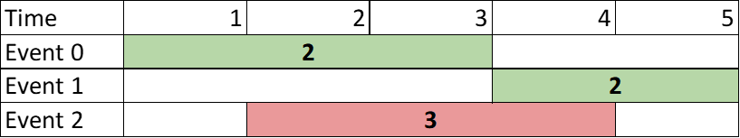
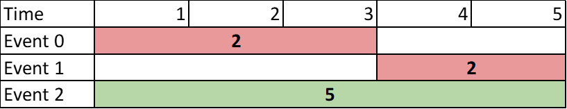
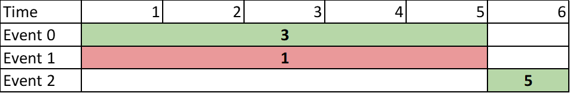

2054. Two Best Non-Overlapping Events

You are given a **0-indexed** 2D integer array of `events` where `events[i] = [startTimei, endTimei, valuei]`. The `i`th event starts at `startTimei` and ends at `endTimei`, and if you attend this event, you will receive a value of `valuei`. You can choose **at most two non-overlapping** events to attend such that the sum of their values is **maximized**.

Return this **maximum** sum.

Note that the start time and end time is inclusive: that is, you cannot attend two events where one of them starts and the other ends at the same time. More specifically, if you attend an event with end time `t`, the next event must start at or after `t + 1`.

 

**Example 1:**


```
Input: events = [[1,3,2],[4,5,2],[2,4,3]]
Output: 4
Explanation: Choose the green events, 0 and 1 for a sum of 2 + 2 = 4.
```

**Example 2:**


```
Example 1 Diagram
Input: events = [[1,3,2],[4,5,2],[1,5,5]]
Output: 5
Explanation: Choose event 2 for a sum of 5.
```

**Example 3:**


```
Input: events = [[1,5,3],[1,5,1],[6,6,5]]
Output: 8
Explanation: Choose events 0 and 2 for a sum of 3 + 5 = 8.
```

**Constraints:**

* `2 <= events.length <= 10^5`
* `events[i].length == 3`
* `1 <= startTimei <= endTimei <= 10^9`
* `1 <= valuei <= 10^6`

# Submissions
---
**Solution 1: (Binary Search, Prefix Sum)**
```
Runtime: 1788 ms
Memory Usage: 55.9 MB
```
```python
class Solution:
    def maxTwoEvents(self, events: List[List[int]]) -> int:
        N = len(events)
        events.sort()
        start, end, val = zip(*events)
        mx = [0]*N
        mx[N-1] = val[N-1]
        for i in range(N-2, -1, -1):
            mx[i] = max(val[i], mx[i+1])
        ans = 0
        for s, e, v in events:
            ans = max(ans, v)
            ni = bisect.bisect_right(start, e)
            if ni < N:
                ans = max(ans, v + mx[ni])
        return ans
```

**Solution 2: (Heap)**
```
Runtime: 112 ms
Memory: 139.53 MB
```
```c++
class Solution {
public:
    int maxTwoEvents(vector<vector<int>>& events) {
        int ans = 0, cur = 0;
        priority_queue<pair<int,int>, vector<pair<int,int>>, greater<pair<int,int>>> pq;
        sort(events.begin(), events.end());
        for (auto e: events) {
            while (pq.size() && pq.top().first < e[0]) {
                cur = max(cur, pq.top().second);
                pq.pop();
            }
            ans = max(ans, cur + e[2]);
            pq.push({e[1], e[2]});
        }
        return ans;
    }
};
```

**Solution 3: (Greedy)**

    events = [[1,3,2],[4,5,2],[2,4,3]]

        1  2  3  4  5  6
        ---2---
                 -2--
           --3----

cur  0       2   3 
ans     2  3     4 < ans

```
Runtime: 107 ms
Memory: 155.24 MB
```
```c++
class Solution {
public:
    int maxTwoEvents(vector<vector<int>>& events) {
        int ans = 0, cur = 0;
        vector<tuple<int,int,int>> dp;
        for (auto e: events) {
            dp.push_back({e[0], 1, e[2]});
            dp.push_back({e[1] + 1, 0, e[2]});
        }
        sort(dp.begin(), dp.end());
        for (auto [_, t, v]: dp) {
            if (t == 1) {
                ans = max(ans, v + cur);
            } else {
                cur = max(cur, v);
            }
        }
        return ans;
    }
};
```
