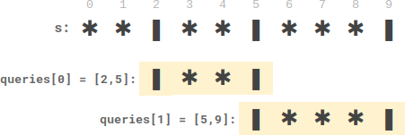
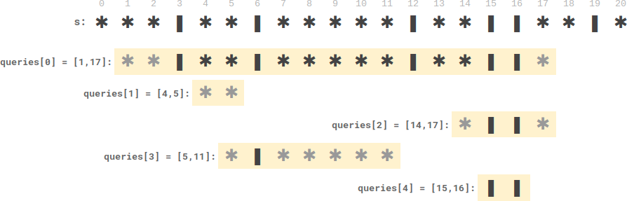

2055. Plates Between Candles

There is a long table with a line of plates and candles arranged on top of it. You are given a **0-indexed** string `s` consisting of characters `'*'` and `'|'` only, where a `'*'` represents a plate and a `'|'` represents a candle.

You are also given a **0-indexed** 2D integer array `queries` where `queries[i] = [lefti, righti]` denotes the **substring** `s[lefti...righti]` (**inclusive**). For each query, you need to find the **number** of plates **between candles** that are **in the substring**. A plate is considered **between candles** if there is at least one candle to its left **and** at least one candle to its right **in the substring**.

* For example, `s = "||**||**|*"`, and a query `[3, 8]` denotes the substring `"*||**|"`. The number of plates between candles in this substring is `2`, as each of the two plates has at least one candle **in the substring** to its left **and** right.

Return an integer array `answer` where `answer[i]` is the answer to the `i`th query.

 

**Example 1:**


```
Input: s = "**|**|***|", queries = [[2,5],[5,9]]
Output: [2,3]
Explanation:
- queries[0] has two plates between candles.
- queries[1] has three plates between candles.
```

**Example 2:**


```
# Input: s = "***|**|*****|**||**|*", queries = [[1,17],[4,5],[14,17],[5,11],[15,16]]
Output: [9,0,0,0,0]
Explanation:
- queries[0] has nine plates between candles.
- The other queries have zero plates between candles.
```

**Constraints:**

* `3 <= s.length <= 10^5`
* `s` consists of `'*'` and `'|'` characters.
* `1 <= queries.length <= 10^5`
* `queries[i].length == 2`
* `0 <= lefti <= righti < s.length`

# Submissions
---
**Solution 1: (Binary Search)**
```
Runtime: 1976 ms
Memory Usage: 53.9 MB
```
```python
class Solution:
    def platesBetweenCandles(self, s: str, queries: List[List[int]]) -> List[int]:
        A = [i for i,c in enumerate(s) if c == '|']
        res = []
        for a,b in queries:
            i = bisect.bisect_left(A, a)
            j = bisect.bisect(A, b) - 1
            res.append((A[j] - A[i]) - (j - i) if i < j else 0)
        return res
```

**Solution 2: (Binary Search)**
```
Runtime: 432 ms
Memory Usage: 140.3 MB
```
```c++
class Solution {
public:
    vector<int> platesBetweenCandles(string s, vector<vector<int>>& queries) {
        vector<int> A, res;
        for (int i = 0; i < s.size(); ++i)
            if (s[i] == '|')
                A.push_back(i);
        for (int q = 0; q < queries.size(); ++q) {
            int i = lower_bound(A.begin(), A.end(), queries[q][0]) - A.begin();
            int j = upper_bound(A.begin(), A.end(), queries[q][1]) - A.begin() - 1;
            res.push_back(i < j ? (A[j] - A[i]) - (j - i) : 0);
        }
        return res;
    }
};
```
