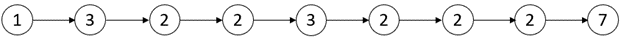

2058. Find the Minimum and Maximum Number of Nodes Between Critical Points

A **critical point** in a linked list is defined as **either** a **local maxima** or a **local minima**.

A node is a **local maxima** if the current node has a value **strictly greater** than the previous node and the next node.

A node is a **local minima** if the current node has a value **strictly smaller** than the previous node and the next node.

Note that a node can only be a local maxima/minima if there exists **both** a previous node and a next node.

Given a linked list `head`, return an array of length 2 containing `[minDistance, maxDistance]` where `minDistance` is the **minimum distance** between **any two distinct** critical points and `maxDistance` is the **maximum distance** between **any two distinct** critical points. If there are **fewer** than two critical points, return `[-1, -1]`.

 

**Example 1:**


```
Input: head = [3,1]
Output: [-1,-1]
Explanation: There are no critical points in [3,1].
```

**Example 2:**

!{2058_a2.png](img/2058_a2.png)
```
Input: head = [5,3,1,2,5,1,2]
Output: [1,3]
Explanation: There are three critical points:
- [5,3,1,2,5,1,2]: The third node is a local minima because 1 is less than 3 and 2.
- [5,3,1,2,5,1,2]: The fifth node is a local maxima because 5 is greater than 2 and 1.
- [5,3,1,2,5,1,2]: The sixth node is a local minima because 1 is less than 5 and 2.
The minimum distance is between the fifth and the sixth node. minDistance = 6 - 5 = 1.
The maximum distance is between the third and the sixth node. maxDistance = 6 - 3 = 3.
```

**Example 3:**


```
Input: head = [1,3,2,2,3,2,2,2,7]
Output: [3,3]
Explanation: There are two critical points:
- [1,3,2,2,3,2,2,2,7]: The second node is a local maxima because 3 is greater than 1 and 2.
- [1,3,2,2,3,2,2,2,7]: The fifth node is a local maxima because 3 is greater than 2 and 2.
Both the minimum and maximum distances are between the second and the fifth node.
Thus, minDistance and maxDistance is 5 - 2 = 3.
Note that the last node is not considered a local maxima because it does not have a next node.
```

**Example 4:**


```
Input: head = [2,3,3,2]
Output: [-1,-1]
Explanation: There are no critical points in [2,3,3,2].
```

**Constraints:**

* The number of nodes in the list is in the range `[2, 10^5]`.
* `1 <= Node.val <= 10^5`

# Submissions
---
**Solution 1: (Linked List)**
```
Runtime: 1168 ms
Memory Usage: 54.8 MB
```
```python
# Definition for singly-linked list.
# class ListNode:
#     def __init__(self, val=0, next=None):
#         self.val = val
#         self.next = next
class Solution:
    def nodesBetweenCriticalPoints(self, head: Optional[ListNode]) -> List[int]:
        critical = []
        i = 1
        prev = head
        cur = head.next
        while cur.next:
            if prev.val < cur.val > cur.next.val or prev.val > cur.val < cur.next.val:
                critical += [i] 
            prev = cur
            cur = cur.next
            i += 1
        if len(critical) < 2:
            return [-1, -1]
        else:
            minDistance = float('inf')
            for i in range(1, len(critical)):
                minDistance = min(minDistance, critical[i]-critical[i-1])
            return [minDistance, critical[-1]-critical[0]]
```

**Solution 2: (Linked List)**
```
Runtime: 216 ms
Memory Usage: 117.2 MB
```
```c++
/**
 * Definition for singly-linked list.
 * struct ListNode {
 *     int val;
 *     ListNode *next;
 *     ListNode() : val(0), next(nullptr) {}
 *     ListNode(int x) : val(x), next(nullptr) {}
 *     ListNode(int x, ListNode *next) : val(x), next(next) {}
 * };
 */
class Solution {
public:
    vector<int> nodesBetweenCriticalPoints(ListNode* head) {
        ListNode *prev=head;
        head=head->next;
        int i=1;
        vector<int> index;
        while(head->next){
            if((prev->val < head->val and head->val > head->next->val) ||( prev->val > head->val and head->val < head->next->val)){
                index.push_back(i);
            }
            prev=head;
            head=head->next;
            i++;
        }
        if(index.size() < 2) return {-1,-1};
        
        int mindist=INT_MAX;
        for(int i=0;i<index.size()-1;i++){
            mindist=min(index[i+1]-index[i],mindist);
        }
        return {mindist,index.back()-index[0]};
    }
};
```
