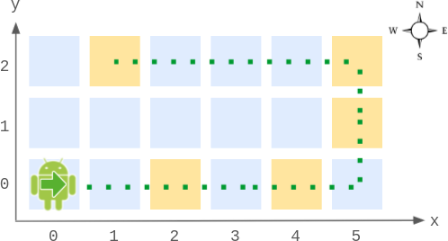

2069. Walking Robot Simulation II

A `width` x `height` grid is on an XY-plane with the **bottom-left** cell at `(0, 0)` and the **top-right** cell at `(width - 1, height - 1)`. The grid is aligned with the four cardinal directions (`"North"`, `"East"`, `"South"`, and `"West"`). A robot is **initially** at cell `(0, 0)` facing direction `"East"`.

The robot can be instructed to move for a specific number of steps. For each step, it does the following.

1. Attempts to move **forward one** cell in the direction it is facing.
1. If the cell the robot is **moving to** is **out of bounds**, the robot instead **turns** 90 degrees **counterclockwise** and retries the step.

After the robot finishes moving the number of steps required, it stops and awaits the next instruction.

Implement the **Robot** class:

* `Robot(int width, int height)` Initializes the `width` x `height` grid with the robot at `(0, 0)` facing `"East"`.
* `void move(int num)` Instructs the robot to move forward `num` steps.
* `int[] getPos()` Returns the current cell the robot is at, as an array of length 2, `[x, y]`.
* `String getDir()` Returns the current direction of the robot, `"North"`, `"East"`, `"South",` or `"West"`.
 

**Example 1:**


```
Input
["Robot", "move", "move", "getPos", "getDir", "move", "move", "move", "getPos", "getDir"]
[[6, 3], [2], [2], [], [], [2], [1], [4], [], []]
Output
[null, null, null, [4, 0], "East", null, null, null, [1, 2], "West"]

Explanation
Robot robot = new Robot(6, 3); // Initialize the grid and the robot at (0, 0) facing East.
robot.move(2);  // It moves two steps East to (2, 0), and faces East.
robot.move(2);  // It moves two steps East to (4, 0), and faces East.
robot.getPos(); // return [4, 0]
robot.getDir(); // return "East"
robot.move(2);  // It moves one step East to (5, 0), and faces East.
                // Moving the next step East would be out of bounds, so it turns and faces North.
                // Then, it moves one step North to (5, 1), and faces North.
robot.move(1);  // It moves one step North to (5, 2), and faces North (not West).
robot.move(4);  // Moving the next step North would be out of bounds, so it turns and faces West.
                // Then, it moves four steps West to (1, 2), and faces West.
robot.getPos(); // return [1, 2]
robot.getDir(); // return "West"
```
 

**Constraints:**

* `2 <= width, height <= 100`
* `1 <= num <= 10^5`
* At most `10^4` calls in total will be made to `move`, `getPos`, and `getDir`.

# Submissions
---
**Solution 1: (Array)**
```
Runtime: 336 ms
Memory Usage: 18.6 MB
```
```python
class Robot:

    def __init__(self, width: int, height: int):
        self.i = 0
        self.pos = [[0, 0, 'South']] + [[i, 0, 'East'] for i in range(1, width)] + \
            [[width - 1, i, 'North'] for i in range(1, height)] + \
            [[i, height - 1, 'West'] for i in range(width - 2, -1, -1)] +\
            [[0, i, 'South'] for i in range(height - 2, 0, -1)]
    def move(self, num: int) -> None:
        self.i += num

    def getPos(self) -> List[int]:
        return self.pos[self.i % len(self.pos)][:2]

    def getDir(self) -> str:
        return self.pos[self.i % len(self.pos)][2] if self.i else 'East'
        


# Your Robot object will be instantiated and called as such:
# obj = Robot(width, height)
# obj.move(num)
# param_2 = obj.getPos()
# param_3 = obj.getDir()
```
