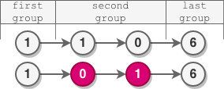
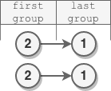

2074. Reverse Nodes in Even Length Groups

You are given the `head` of a linked list.

The nodes in the linked list are **sequentially** assigned to **non-empty** groups whose lengths form the sequence of the natural numbers `(1, 2, 3, 4, ...)`. The length of a group is the number of nodes assigned to it. In other words,

* The `1`st node is assigned to the first group.
* The `2`nd and the 3rd nodes are assigned to the second group.
* The `4`th, `5`th, and `6`th nodes are assigned to the third group, and so on.
Note that the length of the last group may be less than or equal to `1 + the length of the second to last group`.

**Reverse** the nodes in each group with an **even** length, and return the `head` of the modified linked list.

 

**Example 1:**


```
Input: head = [5,2,6,3,9,1,7,3,8,4]
Output: [5,6,2,3,9,1,4,8,3,7]
Explanation:
- The length of the first group is 1, which is odd, hence no reversal occurrs.
- The length of the second group is 2, which is even, hence the nodes are reversed.
- The length of the third group is 3, which is odd, hence no reversal occurrs.
- The length of the last group is 4, which is even, hence the nodes are reversed.
```

**Example 2:**


```
Input: head = [1,1,0,6]
Output: [1,0,1,6]
Explanation:
- The length of the first group is 1. No reversal occurrs.
- The length of the second group is 2. The nodes are reversed.
- The length of the last group is 1. No reversal occurrs.
```

**Example 3:**


```
Input: head = [2,1]
Output: [2,1]
Explanation:
- The length of the first group is 1. No reversal occurrs.
- The length of the last group is 1. No reversal occurrs.
```

**Example 4:**
```
Input: head = [8]
Output: [8]
Explanation: There is only one group whose length is 1. No reversal occurrs.
```

**Constraints:**

* The number of nodes in the list is in the range `[1, 105]`.
* `0 <= Node.val <= 10^5`

# Submissions
---
**Solution 1: (Linked-List)**
```
Runtime: 2256 ms
Memory Usage: 53.9 MB
```
```python
# Definition for singly-linked list.
# class ListNode:
#     def __init__(self, val=0, next=None):
#         self.val = val
#         self.next = next
class Solution:
    def reverseEvenLengthGroups(self, head: Optional[ListNode]) -> Optional[ListNode]:
        prev = head
        d = 2 # the head doesn't need to be reversed anytime so starts with length 2
        while prev.next:
            node, n = prev, 0
            for _ in range(d):
                if not node.next:
                    break
                n += 1
                node = node.next
            if n & 1:  # odd length
                prev = node
            else:      # even length
                node, rev = prev.next, None
                for _ in range(n):
                    node.next, node, rev = rev, node.next, node
                prev.next.next, prev.next, prev = node, rev, prev.next
            d += 1
        return head
```

**Solution 2: (Linked-List)**
```
Runtime: 412 ms
Memory Usage: 79.8 MB
```
```c
/**
 * Definition for singly-linked list.
 * struct ListNode {
 *     int val;
 *     struct ListNode *next;
 * };
 */


struct ListNode* reverseEvenLengthGroups(struct ListNode* head){
    struct ListNode *prev = head, *cur, *rev, *nxt;
    int d = 2, n, i;
    while (prev->next) {
        cur = prev;
        n = 0;
        i = 0;
        for (i = 0; i < d; i ++) {
            if (!cur->next)
                break;
            n += 1;
            cur = cur->next;
        }
        if (n&1) {
            prev = cur;
        } else {
            rev = NULL;
            cur = prev->next;
            for (i = 0; i < n; i ++) {
                nxt = cur->next;
                cur->next = rev;
                rev = cur;
                cur = nxt;
            }
            prev->next->next = cur;
            nxt = prev->next;
            prev->next = rev;
            prev = nxt;
        }
        d += 1;
    }
    return head;
}
```
