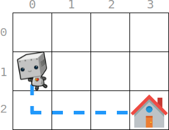

2087. Minimum Cost Homecoming of a Robot in a Grid

There is an `m x n` grid, where `(0, 0)` is the top-left cell and `(m - 1, n - 1)` is the bottom-right cell. You are given an integer array `startPos` where `startPos = [startrow, startcol]` indicates that initially, a robot is at the cell `(startrow, startcol)`. You are also given an integer array `homePos` where `homePos = [homerow, homecol]` indicates that its home is at the cell `(homerow, homecol)`.

The robot needs to go to its home. It can move one cell in four directions: **left**, **right**, **up**, or **down**, and it can not move outside the boundary. Every move incurs some cost. You are further given two **0-indexed** integer arrays: `rowCosts` of length `m` and `colCosts` of length `n`.

* If the robot moves **up** or **down** into a cell whose row is `r`, then this move costs `rowCosts[r]`.
* If the robot moves **left** or **right** into a cell whose column is `c`, then this move costs `colCosts[c]`.

Return the **minimum** total cost for this robot to return home.

 

**Example 1:**


```
Input: startPos = [1, 0], homePos = [2, 3], rowCosts = [5, 4, 3], colCosts = [8, 2, 6, 7]
Output: 18
Explanation: One optimal path is that:
Starting from (1, 0)
-> It goes down to (2, 0). This move costs rowCosts[2] = 3.
-> It goes right to (2, 1). This move costs colCosts[1] = 2.
-> It goes right to (2, 2). This move costs colCosts[2] = 6.
-> It goes right to (2, 3). This move costs colCosts[3] = 7.
The total cost is 3 + 2 + 6 + 7 = 18
```

**Example 2:**
```
Input: startPos = [0, 0], homePos = [0, 0], rowCosts = [5], colCosts = [26]
Output: 0
Explanation: The robot is already at its home. Since no moves occur, the total cost is 0.
```

**Constraints:**

* `m == rowCosts.length`
* `n == colCosts.length`
* `1 <= m, n <= 10^5`
* `0 <= rowCosts[r], colCosts[c] <= 10^4`
* `startPos.length == 2`
* `homePos.length == 2`
* `0 <= startrow, homerow < m`
* `0 <= startcol, homecol < n`

# Submissions
---
**Solution 1: (Greedy)**
```
Runtime: 1500 ms
Memory Usage: 29.4 MB
```
```python
class Solution:
    def minCost(self, startPos: List[int], homePos: List[int], rowCosts: List[int], colCosts: List[int]) -> int:
        ans, i, j = 0, homePos[0], homePos[1]
        while i != startPos[0]:
            ans += rowCosts[i]
            i += -1 if i > startPos[0] else 1
        while j != startPos[1]:
            ans += colCosts[j]
            j += -1 if j > startPos[1] else 1
        return ans
```

**Solution 2: (Greedy)**
```
Runtime: 176 ms
Memory Usage: 149.9 MB
```
```c++
class Solution {
public:
    int minCost(vector<int>& startPos, vector<int>& homePos, vector<int>& rowCosts, vector<int>& colCosts) {
        int ans = 0;
        for(int i = homePos[0]; i != startPos[0]; i += i > startPos[0] ? -1 : 1)  // move row-wise from end to start
            ans += rowCosts[i];
        for(int i = homePos[1]; i != startPos[1]; i += i > startPos[1] ? -1 : 1)  // move col-wise from end to start
            ans += colCosts[i];
        return ans;
    }
};
```
