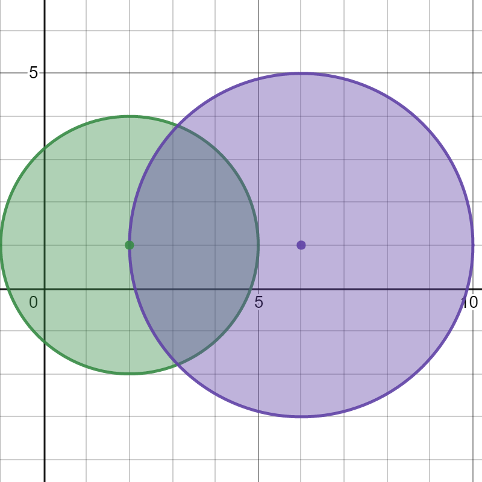
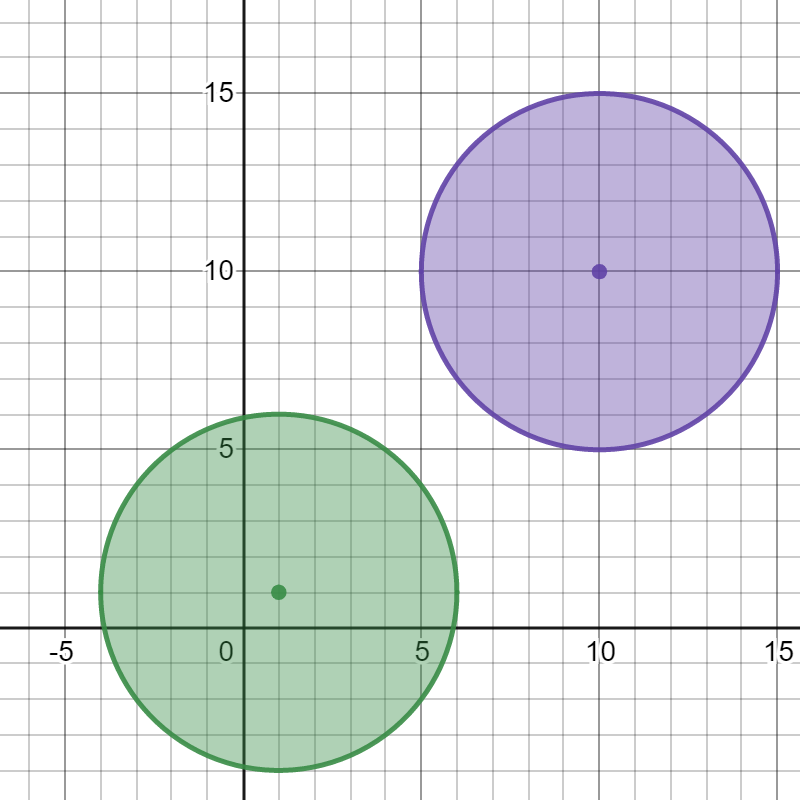
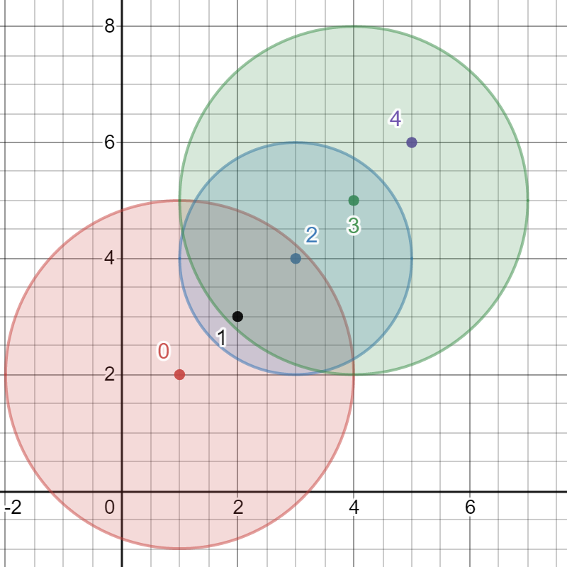

2101. Detonate the Maximum Bombs

You are given a list of bombs. The range of a bomb is defined as the area where its effect can be felt. This area is in the shape of a circle with the center as the location of the bomb.

The bombs are represented by a **0-indexed** 2D integer array `bombs` where `bombs[i] = [xi, yi, ri`]. `xi` and `yi` denote the X-coordinate and Y-coordinate of the location of the `i`th bomb, whereas `ri` denotes the radius of its range.

You may choose to detonate a **single** bomb. When a bomb is detonated, it will detonate **all bombs** that lie in its range. These bombs will further detonate the bombs that lie in their ranges.

Given the list of bombs, return the **maximum** number of bombs that can be detonated if you are allowed to detonate only **one** bomb.

 

**Example 1:**


```
Input: bombs = [[2,1,3],[6,1,4]]
Output: 2
Explanation:
The above figure shows the positions and ranges of the 2 bombs.
If we detonate the left bomb, the right bomb will not be affected.
But if we detonate the right bomb, both bombs will be detonated.
So the maximum bombs that can be detonated is max(1, 2) = 2.
```

**Example 2:**


```
Input: bombs = [[1,1,5],[10,10,5]]
Output: 1
Explanation:
Detonating either bomb will not detonate the other bomb, so the maximum number of bombs that can be detonated is 1.
```

**Example 3:**


```
Input: bombs = [[1,2,3],[2,3,1],[3,4,2],[4,5,3],[5,6,4]]
Output: 5
Explanation:
The best bomb to detonate is bomb 0 because:
- Bomb 0 detonates bombs 1 and 2. The red circle denotes the range of bomb 0.
- Bomb 2 detonates bomb 3. The blue circle denotes the range of bomb 2.
- Bomb 3 detonates bomb 4. The green circle denotes the range of bomb 3.
Thus all 5 bombs are detonated.
```

**Constraints:**

* `1 <= bombs.length <= 100`
* `bombs[i].length == 3`
* `1 <= xi, yi, ri <= 10^5`

# Submissions
---
**Solution 1: (DFS)**
```
Runtime: 2152 ms
Memory: 14.5 MB
```
```python
class Solution:
    def maximumDetonation(self, bombs: List[List[int]]) -> int:
        N = len(bombs)
        g = collections.defaultdict(list)
        for i in range(N):
            for j in range(N):
                if i == j: continue
                if ((bombs[i][0]-bombs[j][0])**2 + (bombs[i][1]-bombs[j][1])**2) <= bombs[i][2]** 2:
                    g[i] += [j]
        def dfs(v, seen):
            seen.add(v)
            rst = 1
            for nv in g[v]:
                if not nv in seen:
                    rst += dfs(nv, seen)
            return rst

        ans = 0
        for i in range(N):
            visited = set([i])
            ans = max(ans, dfs(i, visited))
        return ans
```

**Solution 2: (BFS)**
```
Runtime: 120 ms
Memory: 28.1 MB
```
```c++
class Solution {
public:
    int maximumDetonation(vector<vector<int>>& bombs) {
        int res = 0, sz = bombs.size();
        vector<vector<int>> al(bombs.size());
        for (int i = 0; i < sz; ++i) {
            long long x = bombs[i][0], y = bombs[i][1], r2 = (long long)bombs[i][2] * bombs[i][2];
            for (int j = 0; j < bombs.size(); ++j)
                if ((x - bombs[j][0]) * (x - bombs[j][0]) + (y - bombs[j][1]) * (y - bombs[j][1]) <= r2)
                    al[i].push_back(j);
        }
        for (int i = 0; i < sz && res < sz; ++i) {
            vector<int> q{i};
            unordered_set<int> detonated{i};
            while (!q.empty()) {
                vector<int> q1;
                for (int j : q)
                    for (int k : al[j])
                        if (detonated.insert(k).second)
                            q1.push_back(k);
                swap(q, q1);
            }
            res = max((int)detonated.size(), res);
        }
        return res;
    }
};
```

**Solution 3: (floyd warshall)**
```
Runtime: 126 ms
Memory: 18.77 MB
```
```c++
class Solution {
public:
    int maximumDetonation(vector<vector<int>>& bombs) {
        int n = bombs.size();
        vector<vector<int>> r(n, vector<int>(n));
            
        auto reachable = [] (auto &a, auto &b) {
            long long t1 = a[0] - b[0], t2 = a[1] - b[1], r = a[2];
            return t1 * t1 + t2 * t2 <= r * r;
        };
        
        for (int i = 0; i < n; i++) {
            for (int j = 0; j < n; j++) {
                if (reachable(bombs[i], bombs[j])) {
                    r[i][j] = 1;
                }
            }
        }
        
        for (int k = 0; k < n; k++) {
            for (int i = 0; i < n; i++) {
                for (int j = 0; j < n; j++) {
                    r[i][j] |= r[i][k] & r[k][j];
                }
            }
        }
        
        int res = 1;
        for (auto &row : r)
            res = max(res, (int) count(row.begin(), row.end(), 1));
        
        return res;
    }
};
```
