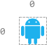

2120. Execution of All Suffix Instructions Staying in a Grid

There is an `n x n` grid, with the top-left cell at `(0, 0)` and the bottom-right cell at `(n - 1, n - 1)`. You are given the integer `n` and an integer array `startPos` where `startPos = [startrow, startcol]` indicates that a robot is initially at cell `(startrow, startcol)`.

You are also given a **0-indexed** string `s` of length `m` where `s[i]` is the ith instruction for the robot: `'L'` (move left), `'R'` (move right), `'U'` (move up), and `'D'` (move down).

The robot can begin executing from any `i`th instruction in `s`. It executes the instructions one by one towards the end of `s` but it stops if either of these conditions is met:

* The next instruction will move the robot off the grid.
* There are no more instructions left to execute.

Return an array `answer` of length `m` where `answer[i]` is the number of instructions the robot can execute if the robot begins executing from the `i`th instruction in `s`.

 

**Example 1:**


```
Input: n = 3, startPos = [0,1], s = "RRDDLU"
Output: [1,5,4,3,1,0]
Explanation: Starting from startPos and beginning execution from the ith instruction:
- 0th: "RRDDLU". Only one instruction "R" can be executed before it moves off the grid.
- 1st:  "RDDLU". All five instructions can be executed while it stays in the grid and ends at (1, 1).
- 2nd:   "DDLU". All four instructions can be executed while it stays in the grid and ends at (1, 0).
- 3rd:    "DLU". All three instructions can be executed while it stays in the grid and ends at (0, 0).
- 4th:     "LU". Only one instruction "L" can be executed before it moves off the grid.
- 5th:      "U". If moving up, it would move off the grid.
```

**Example 2:**


```
Input: n = 2, startPos = [1,1], s = "LURD"
Output: [4,1,0,0]
Explanation:
- 0th: "LURD".
- 1st:  "URD".
- 2nd:   "RD".
- 3rd:    "D".
```

**Example 3:**


```
Input: n = 1, startPos = [0,0], s = "LRUD"
Output: [0,0,0,0]
Explanation: No matter which instruction the robot begins execution from, it would move off the grid.
```

**Constraints:**

* `m == s.lengt`h
* `1 <= n, m <= 500`
* `startPos.length == 2`
* `0 <= startrow, startcol < n`
* `s` consists of `'L'`, `'R'`, `'U'`, and `'D'`.

# Submissions
---
**Solution 1: (DP Top-Down)**
```
Runtime: 1789 ms
emory: 447.1 MB
```
```python
class Solution:
    def executeInstructions(self, n: int, startPos: List[int], s: str) -> List[int]:
        m = len(s)
        d = {
            'U': (-1, 0),
            'D': (1, 0),
            'R': (0, 1),
            'L': (0, -1)
        }

        @functools.lru_cache(None)
        def dfs(r, c, i):
            if i == m:
                return 0
            nr, nc = r + d[s[i]][0], c + d[s[i]][1]
            if (not 0 <= nr < n) or (not 0 <= nc < n):
                return 0
            return 1 + dfs(nr, nc, i+1)

        ans = []
        for i in range(len(s)):
            ans += [dfs(startPos[0], startPos[1], i)]
        return ans
```
