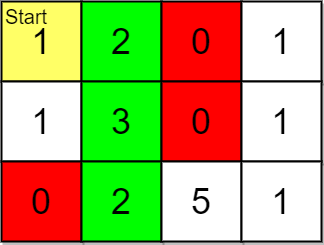
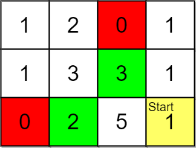
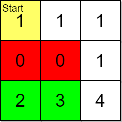

2146. K Highest Ranked Items Within a Price Range

You are given a **0-indexed** 2D integer array `grid` of size `m x n` that represents a map of the items in a shop. The integers in the `grid` represent the following:

* `0` represents a wall that you cannot pass through.
* `1` represents an empty cell that you can freely move to and from.
* All other positive integers represent the price of an item in that cell. You may also freely move to and from these item cells.

It takes `1` step to travel between adjacent grid cells.

You are also given integer arrays `pricing` and start where `pricing = [low, high]` and `start = [row, col]` indicates that you start at the position `(row, col)` and are interested only in items with a price in the range of `[low, high]` (**inclusive**). You are further given an integer k.

You are interested in the **positions** of the `k` highest-ranked items whose prices are within the given price range. The rank is determined by the first of these criteria that is different:

1. Distance, defined as the length of the shortest path from the `start` (**shorter** distance has a higher rank).
1. Price (**lower** price has a higher rank, but it must be **in the price range**).
1. The row number (**smaller** row number has a higher rank).
1. The column number (**smaller** column number has a higher rank).

Return the `k` highest-ranked items within the price range **sorted** by their rank (highest to lowest). If there are fewer than `k` reachable items within the price range, return all of them.

 

**Example 1:**


```
Input: grid = [[1,2,0,1],[1,3,0,1],[0,2,5,1]], pricing = [2,5], start = [0,0], k = 3
Output: [[0,1],[1,1],[2,1]]
Explanation: You start at (0,0).
With a price range of [2,5], we can take items from (0,1), (1,1), (2,1) and (2,2).
The ranks of these items are:
- (0,1) with distance 1
- (1,1) with distance 2
- (2,1) with distance 3
- (2,2) with distance 4
Thus, the 3 highest ranked items in the price range are (0,1), (1,1), and (2,1).
```

**Example 2:**


```
Input: grid = [[1,2,0,1],[1,3,3,1],[0,2,5,1]], pricing = [2,3], start = [2,3], k = 2
Output: [[2,1],[1,2]]
Explanation: You start at (2,3).
With a price range of [2,3], we can take items from (0,1), (1,1), (1,2) and (2,1).
The ranks of these items are:
- (2,1) with distance 2, price 2
- (1,2) with distance 2, price 3
- (1,1) with distance 3
- (0,1) with distance 4
Thus, the 2 highest ranked items in the price range are (2,1) and (1,2).
```

**Example 3:**


```
Input: grid = [[1,1,1],[0,0,1],[2,3,4]], pricing = [2,3], start = [0,0], k = 3
Output: [[2,1],[2,0]]
Explanation: You start at (0,0).
With a price range of [2,3], we can take items from (2,0) and (2,1). 
The ranks of these items are: 
- (2,1) with distance 5
- (2,0) with distance 6
Thus, the 2 highest ranked items in the price range are (2,1) and (2,0). 
Note that k = 3 but there are only 2 reachable items within the price range.
```

**Constraints:**

* `m == grid.length`
* `n == grid[i].length`
* `1 <= m, n <= 105`
* `1 <= m * n <= 105`
* `0 <= grid[i][j] <= 105`
* `pricing.length == 2`
* `2 <= low <= high <= 105`
* `start.length == 2`
* `0 <= row <= m - 1`
* `0 <= col <= n - 1`
* `grid[row][col] > 0`
* `1 <= k <= m * n`

# Submissions
---
**Solution 1: (Dijkstra)**
```
Runtime: 4871 ms
Memory Usage: 52.2 MB
```
```python
class Solution:
    def highestRankedKItems(self, grid: List[List[int]], pricing: List[int], start: List[int], k: int) -> List[List[int]]:
        R, C = map(len, (grid, grid[0]))
        ans, (x, y), (low, high) = [], start, pricing
        heap = [(0, grid[x][y], x, y)]
        seen = {(x, y)}
        while heap and len(ans) < k:
            distance, price, r, c = heapq.heappop(heap)
            if low <= price <= high and len(ans) < k:
                ans.append([r, c])
            for i, j in (r, c + 1), (r, c - 1), (r + 1, c), (r - 1, c):
                if R > i >= 0 <= j < C and grid[i][j] > 0 and (i, j) not in seen: 
                    seen.add((i, j))
                    heapq.heappush(heap, (distance + 1, grid[i][j], i, j))
        return ans
```

**Solution 2: (Dijkstra)**
```
Runtime: 1502 ms
Memory Usage: 222.1 MB
```
```c++
struct node{
    int dist; // distance of current cell from start
    int cost; // price at current cell
    int r, c; // row and column of current cell
};

// storing least desired cell at top (max. Heap)
struct compare{
    bool operator()(const node &a, const node &b){
        if(a.dist != b.dist){
            return a.dist < b.dist;
        }else if(a.cost != b.cost){
            return a.cost < b.cost;
        }else if(a.r != b.r){
            return a.r < b.r;
        }
        return a.c < b.c;
    }
};

class Solution {
public:
    vector<vector<int>> highestRankedKItems(vector<vector<int>>& grid, vector<int>& pricing, vector<int>& start, int k) {
        int n=grid.size(), m=grid[0].size();
    
        int dxy[4][2]={{-1,0},{0,1},{1,0},{0,-1}};

        queue<pair<int,int>> q;
        q.push({start[0],start[1]});
        int len=0;

        set<pair<int,int>> visited; // to keep track of visited cells
        visited.insert({start[0],start[1]});

        int lb=pricing[0], ub=pricing[1];

        priority_queue<node,vector<node>,compare> pq;

        while(q.size()>0){
            int size=q.size();
            while(size--){
                pair<int,int> p=q.front();
                q.pop();

                int i=p.first, j=p.second;
                if(grid[i][j]!=1){
                    int curCost=grid[i][j];
                    if(curCost>=lb && curCost<=ub){
                        if(pq.size()<k){
                            pq.push({len,curCost,i,j});
                        }else if(pq.size()==k){ // checking if possible to replace with better ranked cell
                            struct node tp=pq.top();
                            if(tp.dist > len){
                                pq.pop();
                                pq.push({len,curCost,i,j});
                            }else if(tp.dist==len){
                                if(tp.cost > curCost){
                                    pq.pop();
                                    pq.push({len,curCost,i,j});
                                }else if(tp.cost==curCost){
                                    if(tp.r > i){
                                        pq.pop();
                                        pq.push({len,curCost,i,j});
                                    }else if(tp.r==i && tp.c > j){
                                        pq.pop();
                                        pq.push({len,curCost,i,j});
                                    }
                                }
                            }
                        }
                    }
                }

                // moving in adjecent cells
                for(int k=0;k<4;k++){
                    int x=i+dxy[k][0], y=j+dxy[k][1];
                    if(x>=0 && y>=0 && x<n && y<m && visited.find({x,y})==visited.end() && grid[x][y]!=0){
                        visited.insert({x,y});
                        q.push({x,y});
                    }
                }
            }
            len++;
        }
        vector<vector<int>> ans;
        while(pq.size()>0){
            struct node cur=pq.top();
            pq.pop();

            ans.push_back({cur.r,cur.c});
            k--;
        }
        reverse(ans.begin(),ans.end());
        return ans;
    }
};
```
