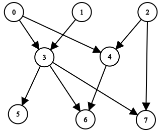
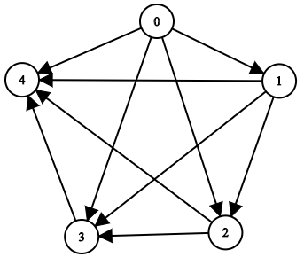

2192. All Ancestors of a Node in a Directed Acyclic Graph

You are given a positive integer `n` representing the number of nodes of a **Directed Acyclic Graph** (DAG). The nodes are numbered from `0` to `n - 1` (inclusive).

You are also given a 2D integer array `edges`, where `edges[i] = [fromi, toi]` denotes that there is a **unidirectional** edge from `fromi` to `toi` in the graph.

Return a list `answer`, where `answer[i]` is the **list of ancestors** of the `i`th node, sorted in **ascending order**.

A node `u` is an **ancestor** of another node `v` if `u` can reach `v` via a set of edges.

 

**Example 1:**


```
Input: n = 8, edgeList = [[0,3],[0,4],[1,3],[2,4],[2,7],[3,5],[3,6],[3,7],[4,6]]
Output: [[],[],[],[0,1],[0,2],[0,1,3],[0,1,2,3,4],[0,1,2,3]]
Explanation:
The above diagram represents the input graph.
- Nodes 0, 1, and 2 do not have any ancestors.
- Node 3 has two ancestors 0 and 1.
- Node 4 has two ancestors 0 and 2.
- Node 5 has three ancestors 0, 1, and 3.
- Node 6 has five ancestors 0, 1, 2, 3, and 4.
- Node 7 has four ancestors 0, 1, 2, and 3.
```

**Example 2:**


```
Input: n = 5, edgeList = [[0,1],[0,2],[0,3],[0,4],[1,2],[1,3],[1,4],[2,3],[2,4],[3,4]]
Output: [[],[0],[0,1],[0,1,2],[0,1,2,3]]
Explanation:
The above diagram represents the input graph.
- Node 0 does not have any ancestor.
- Node 1 has one ancestor 0.
- Node 2 has two ancestors 0 and 1.
- Node 3 has three ancestors 0, 1, and 2.
- Node 4 has four ancestors 0, 1, 2, and 3.
```

**Constraints:**

* `1 <= n <= 1000`
* `0 <= edges.length <= min(2000, n * (n - 1) / 2)`
* `edges[i].length == 2`
* `0 <= fromi, toi <= n - 1`
* `fromi != toi`
* There are no duplicate edges.
* The graph is **directed** and **acyclic**.

# Submissions
---
**Solution 1: (BFS)**
```
Runtime: 843 ms
Memory Usage: 41.8 MB
```
```python
class Solution:
    def getAncestors(self, n: int, edges: List[List[int]]) -> List[List[int]]:
        ans = [set() for _ in range(n)]
        g = collections.defaultdict(list)
        indeg = [0]*n
        for fromi, toi in edges:
            g[fromi] += [toi]
            indeg[toi] += 1
        q = collections.deque([i for i, v in enumerate(indeg) if v == 0])
        while q:
            v = q.popleft();
            for nv in g[v]:
                ans[nv].add(v)
                ans[nv] |= ans[v]
                indeg[nv] -= 1
                if indeg[nv] == 0:
                    q += [nv]
        for i in range(len(ans)):
            ans[i] = sorted(ans[i])
        return ans
```

**Solution 2: (DFS)**
```
Runtime: 166 ms
Memory Usage: 62.7 MB
```
```c++
class Solution {
public:
    vector<vector<int>> getAncestors(int n, vector<vector<int>>& edges) {
        vector<vector<int>> ans(n),graph(n);
        for(auto &v:edges){
            graph[v[0]].push_back(v[1]);
        }
        for(int i=0;i<n;i++){
            vector<bool> vis(n);
            dfs(graph,i,i,ans,vis);
        }
        return ans;
    }
    
    void dfs(vector<vector<int>> &graph,int i,int j,vector<vector<int>> &ans,vector<bool> &vis){
        vis[j]=true;
        for(auto &x:graph[j]){
            if(!vis[x]){
                ans[x].push_back(i);
                dfs(graph,i,x,ans,vis);
            }
            
        }
    }
};
```
