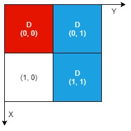

2201. Count Artifacts That Can Be Extracted

There is an `n x n` **0-indexed** grid with some artifacts buried in it. You are given the integer n and a **0-indexed** 2D integer array `artifacts` describing the positions of the rectangular artifacts where `artifacts[i] = [r1i, c1i, r2i, c2i]` denotes that the ith artifact is buried in the subgrid where:

* `(r1i, c1i)` is the coordinate of the **top-left** cell of the `i`th artifact and
* `(r2i, c2i)` is the coordinate of the **bottom-right** cell of the `i`th artifact.

You will excavate some cells of the grid and remove all the mud from them. If the cell has a part of an artifact buried underneath, it will be uncovered. If all the parts of an artifact are uncovered, you can extract it.

Given a **0-indexed** 2D integer array `dig` where `dig[i] = [ri, ci]` indicates that you will excavate the cell `(ri, ci)`, return the number of artifacts that you can extract.

The test cases are generated such that:

* No two artifacts overlap.
* Each artifact only covers at most `4` cells.
* The entries of `dig` are unique.
 

**Example 1:**


```
Input: n = 2, artifacts = [[0,0,0,0],[0,1,1,1]], dig = [[0,0],[0,1]]
Output: 1
Explanation: 
The different colors represent different artifacts. Excavated cells are labeled with a 'D' in the grid.
There is 1 artifact that can be extracted, namely the red artifact.
The blue artifact has one part in cell (1,1) which remains uncovered, so we cannot extract it.
Thus, we return 1.
```

**Example 2:**


```
Input: n = 2, artifacts = [[0,0,0,0],[0,1,1,1]], dig = [[0,0],[0,1],[1,1]]
Output: 2
Explanation: Both the red and blue artifacts have all parts uncovered (labeled with a 'D') and can be extracted, so we return 2. 
```

**Constraints:**

* `1 <= n <= 1000`
* `1 <= artifacts.length, dig.length <= min(n2, 105)`
* `artifacts[i].length == 4`
* `dig[i].length == 2`
* `0 <= r1i, c1i, r2i, c2i, ri, ci <= n - 1`
* `r1i <= r2i`
* `c1i <= c2i`
* No two artifacts will overlap.
* The number of cells covered by an artifact is **at most** `4`.
* The entries of dig are unique.

# Submissions
---
**Solution 1: (set)**
```
Runtime: 2260 ms
Memory Usage: 64.3 MB
```
```python
class Solution:
    def digArtifacts(self, n: int, artifacts: List[List[int]], dig: List[List[int]]) -> int:
        s = set(tuple(el) for el in dig)
        ans = 0
        for r1, c1, r2, c2 in artifacts:
            if all((r, c) in s for r in range(r1, r2+1) for c in range(c1, c2+1)):
                ans += 1
        return ans 
```

**Solution 2: (Array)**
```
Runtime: 492 ms
Memory Usage: 164.8 MB
```
```c++
class Solution {
public:
    int digArtifacts(int n, vector<vector<int>>& artifacts, vector<vector<int>>& dig) {
        vector<vector<bool>>visited(n,vector<bool>(n,0));
        for(auto vec:dig){
            visited[vec[0]][vec[1]] = 1;
        }
        
        int count = 0;
        for(auto artifact:artifacts){
            int r1 = artifact[0];
            int c1 = artifact[1];
            int r2 = artifact[2];
            int c2 = artifact[3];
            bool flag = true;
			
            for(int i = r1;i<=r2;i++){
                for(int j = c1;j<=c2;j++){
                    if(!visited[i][j]){
                        flag = false;
                    }
                }
            }
            
            if(flag)
                count++;
        }
        
        return count;
    }
};
```
