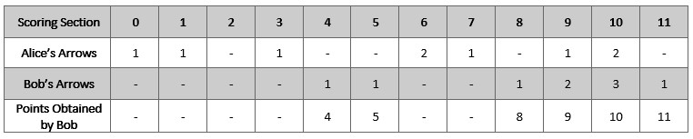
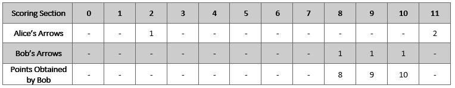

2212. Maximum Points in an Archery Competition

Alice and Bob are opponents in an archery competition. The competition has set the following rules:

1. Alice first shoots `numArrows` arrows and then Bob shoots `numArrows` arrows.
1. The points are then calculated as follows:

    1. The target has integer scoring sections ranging from `0` to `11` inclusive.
    1. For **each** section of the target with score `k` (in between `0` to `11`), say Alice and Bob have shot `ak` and `bk` arrows on that section respectively. If `ak >= bk`, then Alice takes `k` points. If `ak < bk`, then Bob takes `k` points.
    1. However, if `ak == bk == 0`, then nobody takes `k` points.

* For example, if Alice and Bob both shot `2` arrows on the section with score `11`, then Alice takes `11` points. On the other hand, if Alice shot `0` arrows on the section with score `11` and Bob shot `2` arrows on that same section, then Bob takes `11` points.

You are given the integer `numArrows` and an integer array `aliceArrows` of size `12`, which represents the number of arrows Alice shot on each scoring section from `0` to `11`. Now, Bob wants to **maximize** the total number of points he can obtain.

Return the array `bobArrows` which represents the number of arrows Bob shot on **each** scoring section from `0` to `11`. The sum of the values in bobArrows should equal `numArrows`.

If there are multiple ways for Bob to earn the maximum total points, return **any** one of them.

 

**Example 1:**


```
Input: numArrows = 9, aliceArrows = [1,1,0,1,0,0,2,1,0,1,2,0]
Output: [0,0,0,0,1,1,0,0,1,2,3,1]
Explanation: The table above shows how the competition is scored. 
Bob earns a total point of 4 + 5 + 8 + 9 + 10 + 11 = 47.
It can be shown that Bob cannot obtain a score higher than 47 points.
```

**Example 2:**


```
Input: numArrows = 3, aliceArrows = [0,0,1,0,0,0,0,0,0,0,0,2]
Output: [0,0,0,0,0,0,0,0,1,1,1,0]
Explanation: The table above shows how the competition is scored.
Bob earns a total point of 8 + 9 + 10 = 27.
It can be shown that Bob cannot obtain a score higher than 27 points.
```

**Constraints:**

* `1 <= numArrows <= 105`
* `aliceArrows.length == bobArrows.length == 12`
* `0 <= aliceArrows[i], bobArrows[i] <= numArrows`
* `sum(aliceArrows[i]) == numArrows`

# Submissions
---
**Solution 1: (Backtracking)**
```
Runtime: 380 ms
Memory Usage: 13.9 MB
```
```python
class Solution:
    def maximumBobPoints(self, numArrows: int, aliceArrows: List[int]) -> List[int]:
        N = len(aliceArrows)
        mx = float('-inf')
        ans = []
        
        def bt(i, r, cur, p):
            nonlocal mx,ans
            if i == N:
                if cur > mx:
                    mx = cur
                    p[0] += r
                    ans = p
                return
            if r >= aliceArrows[i]+1:
                bt(i+1, r-aliceArrows[i]-1, cur+i, p+[aliceArrows[i]+1])
            bt(i+1, r, cur, p+[0])
        
        bt(1, numArrows, 0, [0])
        return ans
```

**Solution 2: (Backtracking)**
```
Runtime: 512 ms
Memory Usage: 108.9 MB
```
```c++
class Solution {
    vector<int> ans;
    int target = 0;
public:
    vector<int> maximumBobPoints(int numArrows, vector<int>& aliceArrows) {
        vector<int> res(12, 0);
        rec(11, numArrows, aliceArrows, 0, res);
        return ans;
    }
    void rec(int n, int numArrows, vector<int> &aliceArrow, int sum, vector<int> res)
    {
        if (n == -1 || numArrows <= 0)
        {
            if (sum > target)
            {
                target = sum;
                if (numArrows > 0)
                {
                    res[0] += numArrows;
                }
                ans = res;
            }
            return;
        }
        int req = aliceArrow[n] + 1;
        if (req <= numArrows)
        {
            res[n] = req;
            rec(n - 1, numArrows - req, aliceArrow, sum + n, res);
            res[n] = 0;
        }
        rec(n - 1, numArrows, aliceArrow, sum, res);
        return;
    }
};
```
