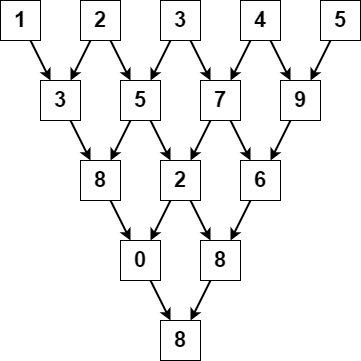

2221. Find Triangular Sum of an Array

You are given a **0-indexed** integer array `nums`, where `nums[i]` is a digit between `0` and `9` (**inclusive**).

The **triangular sum** of `nums` is the value of the only element present in nums after the following process terminates:

1. Let `nums` comprise of `n` elements. If `n == 1`, end the process. Otherwise, create a new **0-indexed** integer array newNums of length `n - 1`.
1. For each index `i`, where `0 <= i < n - 1`, **assign** the value of `newNums[i]` as `(nums[i] + nums[i+1]) % 10`, where `%` denotes modulo operator.
1. **Replace** the array nums with `newNums`.
1. **Repeat** the entire process starting from step 1.

Return the triangular sum of `nums`.

 

**Example 1:**


```
Input: nums = [1,2,3,4,5]
Output: 8
Explanation:
The above diagram depicts the process from which we obtain the triangular sum of the array.
```

**Example 2:**
```
Input: nums = [5]
Output: 5
Explanation:
Since there is only one element in nums, the triangular sum is the value of that element itself.
```

**Constraints:**

* `1 <= nums.length <= 1000`
* `0 <= nums[i] <= 9`

# Submissions
---
**Solution 1: (DP Bottom-Up)**
```
Runtime: 4503 ms
Memory Usage: 13.9 MB
```
```python
class Solution:
    def triangularSum(self, nums: List[int]) -> int:
        cur = len(nums)
        while cur > 1:
            for i in range(cur-1):
                nums[i] += nums[i+1]
                nums[i] %= 10
            cur -= 1
        return nums[0]
```

**Solution 2: (DP Bottom-Up)**
```
Runtime: 51 ms, Beats 85.15%
Memory: 22.13 MB, Beats 97.83%
```
```c++
class Solution {
public:
    int triangularSum(vector<int>& nums) {
        int n = nums.size(), i, k;
        for (k = n - 1; k > 0; k --) {
            for (i = 0; i < k; i ++) {
                nums[i] = (nums[i] + nums[i + 1]) % 10;
            }
        }
        return nums[0];
    }
};
```
