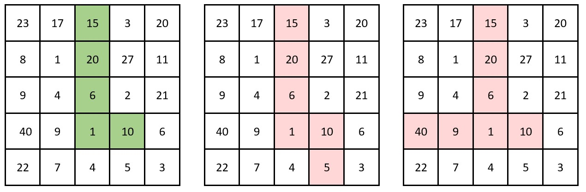
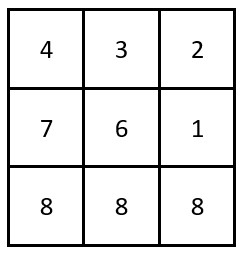

2245. Maximum Trailing Zeros in a Cornered Path

You are given a 2D integer array `grid` of size `m x n`, where each cell contains a positive integer.

A cornered path is defined as a set of adjacent cells with **at most** one turn. More specifically, the path should exclusively move either **horizontally** or **vertically** up to the turn (if there is one), without returning to a previously visited cell. After the turn, the path will then move exclusively in the **alternate** direction: move vertically if it moved horizontally, and vice versa, also without returning to a previously visited cell.

The **product** of a path is defined as the product of all the values in the path.

Return the **maximum** number of **trailing zeros** in the product of a cornered path found in grid.

**Note:**

* **Horizontal** movement means moving in either the left or right direction.
* **Vertical** movement means moving in either the up or down direction.
 

**Example 1:**


```
Input: grid = [[23,17,15,3,20],[8,1,20,27,11],[9,4,6,2,21],[40,9,1,10,6],[22,7,4,5,3]]
Output: 3
Explanation: The grid on the left shows a valid cornered path.
It has a product of 15 * 20 * 6 * 1 * 10 = 18000 which has 3 trailing zeros.
It can be shown that this is the maximum trailing zeros in the product of a cornered path.

The grid in the middle is not a cornered path as it has more than one turn.
The grid on the right is not a cornered path as it requires a return to a previously visited cell.
```

**Example 2:**


```
Input: grid = [[4,3,2],[7,6,1],[8,8,8]]
Output: 0
Explanation: The grid is shown in the figure above.
There are no cornered paths in the grid that result in a product with a trailing zero.
```

**Constraints:**

* `m == grid.length`
* `n == grid[i].length`
* `1 <= m, n <= 10^5`
* `1 <= m * n <= 10^5`
* `1 <= grid[i][j] <= 1000`

# Submissions
---
**Solution 1: (Prefix sum)**
```
Runtime: 5589 ms
Memory Usage: 73.6 MB
```
```python
class Solution:
    def maxTrailingZeros(self, grid: List[List[int]]) -> int:
        m, n = len(grid), len(grid[0])
        left = [[[0, 0] for _ in range(n)] for _ in range(m)]
        top = [[[0, 0] for _ in range(n)] for _ in range(m)]
        
        def helper(num):
            a, b = 0, 0
            while num % 2 == 0:
                num //= 2
                a += 1
            while num % 5 == 0:
                num //= 5
                b += 1
            return [a, b]

        def helper2(A):
            return min(A[0], A[1])
        
        for i in range(m):
            for j in range(n):
                if j == 0:
                    left[i][j] = helper(grid[i][j])
                else:
                    a, b = helper(grid[i][j])
                    left[i][j][0] = left[i][j - 1][0] + a
                    left[i][j][1] = left[i][j - 1][1] + b
        for j in range(n):
            for i in range(m):
                if i == 0:
                    top[i][j] = helper(grid[i][j])
                else:
                    a, b, = helper(grid[i][j])
                    top[i][j][0] = top[i - 1][j][0] + a               
                    top[i][j][1] = top[i - 1][j][1] + b


        ans = 0
        for i in range(m):
            for j in range(n):
                a, b = top[m - 1][j]
                d, e= left[i][n - 1]
                x, y = helper(grid[i][j])
                a1, b1 = top[i][j]
                a2, b2= left[i][j]
                tmp = [a1 + a2 - x, b1 + b2 - y]
                ans = max(ans, min(tmp))
                tmp = [d - a2 + a1, e - b2 + b1]
                ans = max(ans, min(tmp))             
                tmp = [a - a1 + a2, b - b1 + b2]
                ans = max(ans, min(tmp))
                tmp = [a + d - a1 - a2 + x, b + e - b1 - b2 + y]
                ans = max(ans, min(tmp))
                
        return ans
```

**Solution 2: (Prefix sum)**
```
Runtime: 583 ms
Memory Usage: 198.1 MB
```
```c++
#define ll long long int
class Solution {
public:
    int maxTrailingZeros(vector<vector<int>>& grid) {
        int n=grid.size();
        int m=grid[0].size();
        vector<vector<pair<ll,ll>>> v(n,vector<pair<ll,ll>>(m,{0,0})),ltr,utd,rtl,dtu;
        
        for(ll i=0;i<n;i++)
        {
            for(ll j=0;j<m;j++)
            {
                ll z=grid[i][j],c1=0,c2=0;
                while(z%2==0)
                {
                    z/=2;
                    c1++;
                }
                while(z%5==0)
                {
                    z/=5;
                    c2++;
                }
                v[i][j].first=c1;
                v[i][j].second=c2;
            }
        }
        ltr=utd=rtl=dtu=v;
        for(ll i=0;i<n;i++)
        {
            for(ll j=1;j<m;j++)
            {
                ltr[i][j].first+=ltr[i][j-1].first;
                ltr[i][j].second+=ltr[i][j-1].second;
            }
        }
        for(ll i=0;i<n;i++)
        {
            for(ll j=m-2;j>=0;j--)
            {
                rtl[i][j].first+=rtl[i][j+1].first;
                rtl[i][j].second+=rtl[i][j+1].second;
            }
        }
        for(ll j=0;j<m;j++)
        {
            for(ll i=1;i<n;i++)
            {
                utd[i][j].first+=utd[i-1][j].first;
                utd[i][j].second+=utd[i-1][j].second;
            }
        }
        for(ll j=0;j<m;j++)
        {
            for(ll i=n-2;i>=0;i--)
            {
                dtu[i][j].first+=dtu[i+1][j].first;
                dtu[i][j].second+=dtu[i+1][j].second;
            }
        }
        ll ans=0;
        for(ll i=0;i<n;i++)
        {
            for(ll j=0;j<m;j++)
            {
                ll c1,c2,c3,c4;
                ll x1,x2,x3,x4;
                ll a,b;
                a=v[i][j].first;
                b=v[i][j].second;       
                
                c1=ltr[i][j].first;
                c2=rtl[i][j].first;
                
                c3=utd[i][j].first;
                c4=dtu[i][j].first;
                
                x1=ltr[i][j].second;
                x2=rtl[i][j].second;
                
                x3=utd[i][j].second;
                x4=dtu[i][j].second;
                
                ans=max(ans,min(c3+c1-a,x3+x1-b));
                ans=max(ans,min(c3+c2-a,x3+x2-b));
                ans=max(ans,min(c4+c1-a,x4+x1-b));
                ans=max(ans,min(c4+c2-a,x4+x2-b));
            }
        }
        return ans;
    }
};
```
