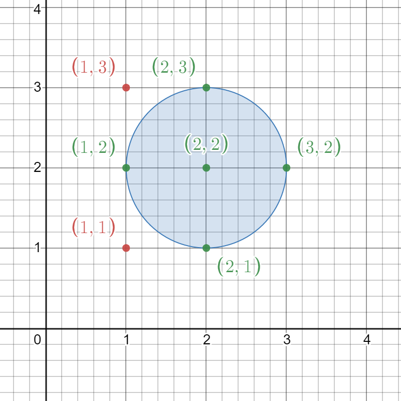
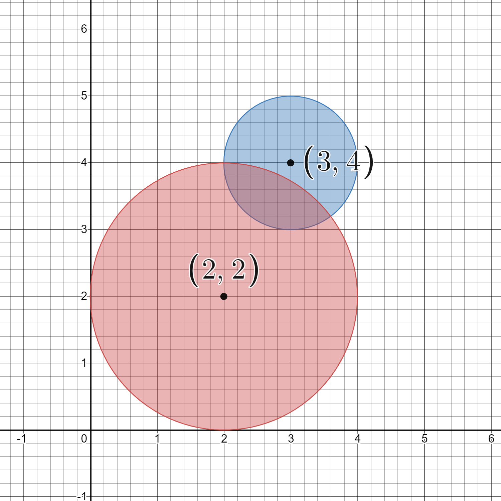

2249. Count Lattice Points Inside a Circle

Given a 2D integer array `circles` where `circles[i] = [xi, yi, ri]` represents the center `(xi, yi)` and radius `ri` of the i^th circle drawn on a grid, return the **number of lattice points** that are present inside **at least one circle**.

**Note:**

* A **lattice point** is a point with integer coordinates.
* Points that lie **on the circumference of a circle** are also considered to be inside it.
 

**Example 1:**


```
Input: circles = [[2,2,1]]
Output: 5
Explanation:
The figure above shows the given circle.
The lattice points present inside the circle are (1, 2), (2, 1), (2, 2), (2, 3), and (3, 2) and are shown in green.
Other points such as (1, 1) and (1, 3), which are shown in red, are not considered inside the circle.
Hence, the number of lattice points present inside at least one circle is 5.
```

**Example 2:**


```
Input: circles = [[2,2,2],[3,4,1]]
Output: 16
Explanation:
The figure above shows the given circles.
There are exactly 16 lattice points which are present inside at least one circle. 
Some of them are (0, 2), (2, 0), (2, 4), (3, 2), and (4, 4).
```

**Constraints:**

* `1 <= circles.length <= 200`
* `circles[i].length == 3`
* `1 <= xi, yi <= 100`
* `1 <= ri <= min(xi, yi)`

# Submissions
---
**Solution 1: (Set)**
```
Runtime: 2779 ms
Memory Usage: 18.7 MB
```
```python
class Solution:
    def countLatticePoints(self, circles: List[List[int]]) -> int:
        ans = set()
        for x,y,r in circles:
            for cx in range(x + 1, x + r + 1):
                for cy in range(y + 1, y + r + 1):
                    if math.sqrt((cx-x)**2 + (cy-y)**2) <= r:
                        ans.add((cx, cy))
                        ans.add((2*x-cx, cy))
                        ans.add((2*x-cx, 2*y-cy))
                        ans.add((cx, 2*y-cy))
            for cy in range(y-r,y+r+1): ans.add((x,cy))
            for cx in range(x-r,x+r+1): ans.add((cx,y))
        return len(ans)
```

**Solution 2: (Set)**
```
Runtime: 1574 ms
Memory Usage: 25 MB
```
```c++
\class Solution {
public:
    int countLatticePoints(vector<vector<int>>& circles) {
        int n = circles.size();
        set<pair<int,int>> s;
        for(int i=0;i<n;i++){
            int a=circles[i][0],b=circles[i][1],r=circles[i][2];
            for(int x=-r;x<=r;x++){
                for(int y=-r;y<=r;y++){
                    if((x*x)+(y*y)<=(r*r)){
                        s.insert({x+a,y+b});
                    }
                }
            }
        }
        int ans = s.size();
        return ans;
    }
};
```
