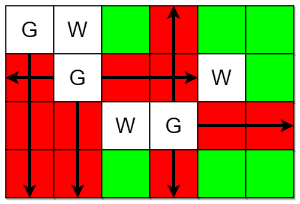
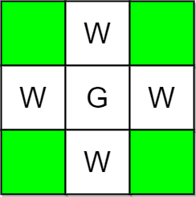

2257. Count Unguarded Cells in the Grid

You are given two integers `m` and `n` representing a **0-indexed** `m x n` grid. You are also given two 2D integer arrays `guards` and `walls` where `guards[i] = [rowi, coli]` and `walls[j] = [rowj, colj]` represent the positions of the `i`th guard and `j`th wall respectively.

A guard can see **every** cell in the four cardinal directions (north, east, south, or west) starting from their position unless **obstructed** by a wall or another guard. A cell is **guarded** if there is **at least** one guard that can see it.

Return the number of unoccupied cells that are **not guarded**.

 

**Example 1:**


```
Input: m = 4, n = 6, guards = [[0,0],[1,1],[2,3]], walls = [[0,1],[2,2],[1,4]]
Output: 7
Explanation: The guarded and unguarded cells are shown in red and green respectively in the above diagram.
There are a total of 7 unguarded cells, so we return 7.
```

**Example 2:**


```
Input: m = 3, n = 3, guards = [[1,1]], walls = [[0,1],[1,0],[2,1],[1,2]]
Output: 4
Explanation: The unguarded cells are shown in green in the above diagram.
There are a total of 4 unguarded cells, so we return 4.
```

**Constraints:**

* `1 <= m, n <= 10^5`
* `2 <= m * n <= 10^5`
* `1 <= guards.length, walls.length <= 5 * 10^4`
* `2 <= guards.length + walls.length <= m * n`
* `guards[i].length == walls[j].length == 2`
* `0 <= rowi, rowj < m`
* `0 <= coli, colj < n`
* All the positions in `guards` and `walls` are **unique**.

# Submissions
---
**Solution 1: (Graph)**
```
Runtime: 2940 ms
Memory Usage: 42.6 MB
```
```python
class Solution:
    def countUnguarded(self, m: int, n: int, guards: List[List[int]], walls: List[List[int]]) -> int:
        dp = [[0] * n for _ in range(m)]
        for x, y in guards+walls:
            dp[x][y] = 1
               
        directions = [(0, 1), (1, 0), (-1, 0), (0, -1)]
        
        for x, y in guards:
            for dx, dy in directions:
                curr_x = x
                curr_y = y
                
                while 0 <= curr_x+dx < m and 0 <= curr_y+dy < n and dp[curr_x+dx][curr_y+dy] != 1:
                    curr_x += dx
                    curr_y += dy
                    dp[curr_x][curr_y] = 2
                    
        return sum(1 for i in range(m) for j in range(n) if dp[i][j] == 0)  
```

**Solution 2: (Graph)**
```
Runtime: 539 ms
Memory Usage: 154 MB
```
```c++
class Solution {
public:
    int countUnguarded(int m, int n, vector<vector<int>>& guards, vector<vector<int>>& walls) {
        // m is no. of rows, n is no. of columns, g is guards vector and w is walls vector
        vector<vector<int>> v(m, vector<int> (n,0));
        int k = walls.size();
        for(int i=0;i<k;i++){
            int x = walls[i][0], y = walls[i][1];
            v[x][y] = -2;
        }
        k = guards.size();
        for(int i=0;i<k;i++){
            int x = guards[i][0], y = guards[i][1];
            v[x][y] = 2;
        }
        for(int j=0;j<k;j++){
            int x = guards[j][0], y = guards[j][1];
            for(int i=x-1;i>=0;i--){ // up
                if(v[i][y]==-2 || v[i][y]==2) break;
                v[i][y] = 1;
            }
            for(int i=x+1;i<m;i++){ // down
                if(v[i][y]==-2 || v[i][y]==2) break;
                v[i][y] = 1;
            }
            for(int i=y-1;i>=0;i--){ // left
                if(v[x][i]==-2 || v[x][i]==2) break;
                v[x][i] = 1;
            }
            for(int i=y+1;i<n;i++){ // right
                if(v[x][i]==-2 || v[x][i]==2) break;
                v[x][i] = 1;
            }
        }
        int ans = 0;
        for(int i=0;i<m;i++){
            for(int j=0;j<n;j++){
                if(!v[i][j]) ans++;
            }
        }
        return ans;
    }
};
```

**Solution 3: (Iterative Simulation, O(m n + g (m + n) + m n))**
```
Runtime: 51 ms
Memory: 172.23 MB
```
```c++
class Solution {
    const int UNGUARDED = 0;
    const int GUARDED = 1;
    const int GUARD = 2;
    const int WALL = 3;

    void markguarded(int row, int col, vector<vector<int>>& grid) {
        // Traverse upwards
        for (int r = row - 1; r >= 0; r--) {
            if (grid[r][col] == WALL || grid[r][col] == GUARD) break;
            grid[r][col] = GUARDED;
        }
        // Traverse downwards
        for (int r = row + 1; r < grid.size(); r++) {
            if (grid[r][col] == WALL || grid[r][col] == GUARD) break;
            grid[r][col] = GUARDED;
        }
        // Traverse leftwards
        for (int c = col - 1; c >= 0; c--) {
            if (grid[row][c] == WALL || grid[row][c] == GUARD) break;
            grid[row][c] = GUARDED;
        }
        // Traverse rightwards
        for (int c = col + 1; c < grid[row].size(); c++) {
            if (grid[row][c] == WALL || grid[row][c] == GUARD) break;
            grid[row][c] = GUARDED;
        }
    }
public:
    int countUnguarded(int m, int n, vector<vector<int>>& guards, vector<vector<int>>& walls) {
        vector<vector<int>> grid(m, vector<int>(n, UNGUARDED));

        // Mark guards' positions
        for (const auto& guard : guards) {
            grid[guard[0]][guard[1]] = GUARD;
        }

        // Mark walls' positions
        for (const auto& wall : walls) {
            grid[wall[0]][wall[1]] = WALL;
        }

        // Mark cells as guarded by traversing from each guard
        for (const auto& guard : guards) {
            markguarded(guard[0], guard[1], grid);
        }

        // Count unguarded cells
        int count = 0;
        for (const auto& row : grid) {
            for (const auto& cell : row) {
                if (cell == UNGUARDED) count++;
            }
        }
        return count;
    }
};
```

**Solution 4: (Recursive Way, O(m n + g (m + n) + m n))**
```
Runtime: 61 ms
Memory: 172.22 MB
```
```c++
class Solution {
    const int UNGUARDED = 0;
    const int GUARDED = 1;
    const int GUARD = 2;
    const int WALL = 3;

    void recurse(int row, int col, vector<vector<int>>& grid, char direction) {
        if (row < 0 || row >= grid.size() || col < 0 ||
            col >= grid[row].size() || grid[row][col] == GUARD ||
            grid[row][col] == WALL) {
            return;
        }
        grid[row][col] = GUARDED;  // Mark cell as guarded
        if (direction == 'U') recurse(row - 1, col, grid, 'U');  // Up
        if (direction == 'D') recurse(row + 1, col, grid, 'D');  // Down
        if (direction == 'L') recurse(row, col - 1, grid, 'L');  // Left
        if (direction == 'R') recurse(row, col + 1, grid, 'R');  // Right
    }
public:
    int countUnguarded(int m, int n, vector<vector<int>>& guards, vector<vector<int>>& walls) {
        vector<vector<int>> grid(m, vector<int>(n, UNGUARDED));

        // Mark guards' positions
        for (const auto& guard : guards) {
            grid[guard[0]][guard[1]] = GUARD;
        }

        // Mark walls' positions
        for (const auto& wall : walls) {
            grid[wall[0]][wall[1]] = WALL;
        }

        // Mark cells as guarded by traversing from each guard
        for (const auto& guard : guards) {
            recurse(guard[0] - 1, guard[1], grid, 'U');  // Up
            recurse(guard[0] + 1, guard[1], grid, 'D');  // Down
            recurse(guard[0], guard[1] - 1, grid, 'L');  // Left
            recurse(guard[0], guard[1] + 1, grid, 'R');  // Right
        }

        // Count unguarded cells
        int count = 0;
        for (const auto& row : grid) {
            for (const auto& cell : row) {
                if (cell == UNGUARDED) count++;
            }
        }
        return count;
    }
};
```

**Solution 5: (Optimized, line sweep, letf right, O(m n))**
```
Runtime: 88 ms
Memory: 172.22 MB
```
```c++
class Solution {
    const int UNGUARDED = 0;
    const int GUARDED = 1;
    const int GUARD = 2;
    const int WALL = 3;
public:
    int countUnguarded(int m, int n, vector<vector<int>>& guards, vector<vector<int>>& walls) {
        vector<vector<int>> grid(m, vector<int>(n, UNGUARDED));

        // Mark guards' positions
        for (const auto& guard : guards) {
            grid[guard[0]][guard[1]] = GUARD;
        }

        // Mark walls' positions
        for (const auto& wall : walls) {
            grid[wall[0]][wall[1]] = WALL;
        }

        // Helper lambda to update visibility
        auto updateCellVisibility = [&](int row, int col,
                                        bool isGuardLineActive) -> bool {
            if (grid[row][col] == GUARD) {
                return true;
            }
            if (grid[row][col] == WALL) {
                return false;
            }
            if (isGuardLineActive) {
                grid[row][col] = GUARDED;
            }
            return isGuardLineActive;
        };

        // Horizontal passes
        for (int row = 0; row < m; row++) {
            bool isGuardLineActive = grid[row][0] == GUARD;
            for (int col = 1; col < n; col++) {
                isGuardLineActive =
                    updateCellVisibility(row, col, isGuardLineActive);
            }

            isGuardLineActive = grid[row][n - 1] == GUARD;
            for (int col = n - 2; col >= 0; col--) {
                isGuardLineActive =
                    updateCellVisibility(row, col, isGuardLineActive);
            }
        }

        // Vertical passes
        for (int col = 0; col < n; col++) {
            bool isGuardLineActive = grid[0][col] == GUARD;
            for (int row = 1; row < m; row++) {
                isGuardLineActive =
                    updateCellVisibility(row, col, isGuardLineActive);
            }

            isGuardLineActive = grid[m - 1][col] == GUARD;
            for (int row = m - 2; row >= 0; row--) {
                isGuardLineActive =
                    updateCellVisibility(row, col, isGuardLineActive);
            }
        }

        // Count unguarded cells
        int count = 0;
        for (int row = 0; row < m; row++) {
            for (int col = 0; col < n; col++) {
                if (grid[row][col] == UNGUARDED) {
                    count++;
                }
            }
        }

        return count;
    }
};
```
