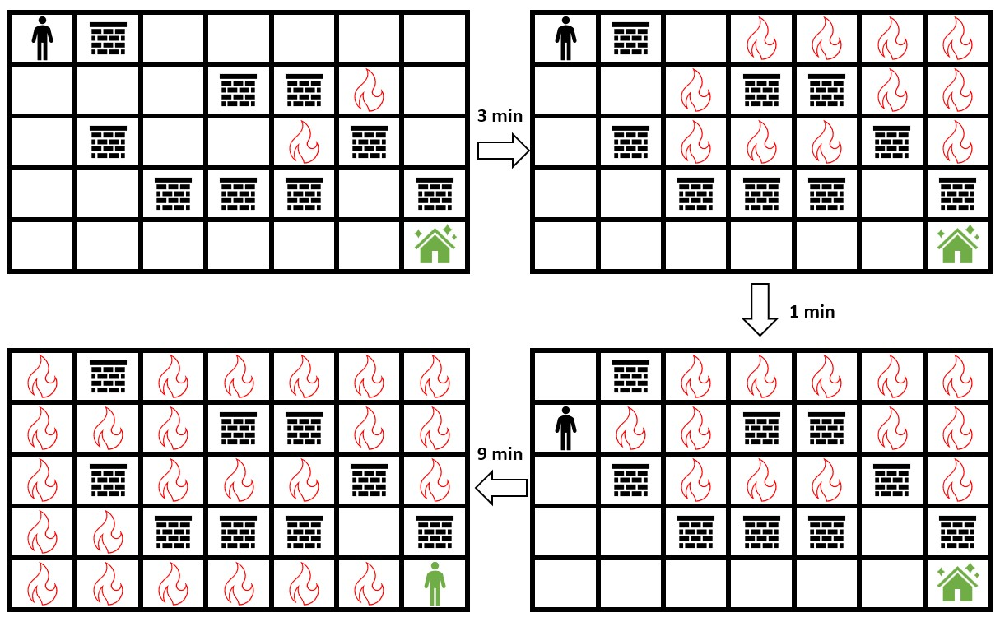
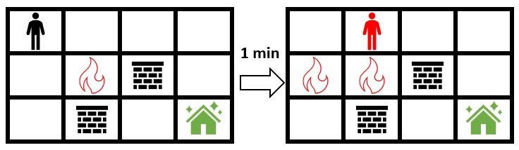
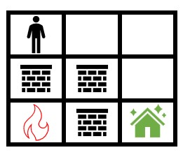

2258. Escape the Spreading Fire

You are given a **0-indexed** 2D integer array `grid` of size `m x n` which represents a field. Each cell has one of three values:

* `0` represents grass,
* `1` represents fire,
* `2` represents a wall that you and fire cannot pass through.

You are situated in the top-left cell, `(0, 0)`, and you want to travel to the safehouse at the bottom-right cell, `(m - 1, n - 1)`. Every minute, you may move to an **adjacent** grass cell. **After** your move, every fire cell will spread to all **adjacent** cells that are not walls.

Return the **maximum** number of minutes that you can stay in your initial position before moving while still safely reaching the safehouse. If this is impossible, return `-1`. If you can **always** reach the safehouse regardless of the minutes stayed, return 109.

Note that even if the fire spreads to the safehouse immediately after you have reached it, it will be counted as safely reaching the safehouse.

A cell is **adjacent** to another cell if the former is directly north, east, south, or west of the latter (i.e., their sides are touching).

 

**Example 1:**


```
Input: grid = [[0,2,0,0,0,0,0],[0,0,0,2,2,1,0],[0,2,0,0,1,2,0],[0,0,2,2,2,0,2],[0,0,0,0,0,0,0]]
Output: 3
Explanation: The figure above shows the scenario where you stay in the initial position for 3 minutes.
You will still be able to safely reach the safehouse.
Staying for more than 3 minutes will not allow you to safely reach the safehouse.
```

**Example 2:**


```
Input: grid = [[0,0,0,0],[0,1,2,0],[0,2,0,0]]
Output: -1
Explanation: The figure above shows the scenario where you immediately move towards the safehouse.
Fire will spread to any cell you move towards and it is impossible to safely reach the safehouse.
Thus, -1 is returned.
```

**Example 3:**


```
Input: grid = [[0,0,0],[2,2,0],[1,2,0]]
Output: 1000000000
Explanation: The figure above shows the initial grid.
Notice that the fire is contained by walls and you will always be able to safely reach the safehouse.
Thus, 109 is returned.
```

**Constraints:**

* `m == grid.length`
* `n == grid[i].length`
* `2 <= m, n <= 300`
* `4 <= m * n <= 2 * 10^4`
* `grid[i][j]` is either `0`, `1`, or `2`.
* `grid[0][0] == grid[m - 1][n - 1] == 0`

# Submissions
---
**Solution 1: (BFS, Binary Search)**
```
Runtime: 1405 ms
Memory Usage: 17.1 MB
```
```python
class Solution:
    def maximumMinutes(self, grid: List[List[int]]) -> int:
        m, n = len(grid), len(grid[0])
        inf = 10 ** 10
        d = [[0,1],[1,0],[0,-1],[-1,0]]
        fires = [[i, j, 0] for i in range(m) for j in range(n) if grid[i][j] == 1]
        A = [[inf if a < 2 else -1 for a in r] for r in grid]

        def bfs(queue, seen):
            for i, j, t in queue:
                if seen[i][j] < inf: continue
                seen[i][j] = t
                for di,dj in d:
                    x, y = i + di, j + dj
                    if 0 <= x < m and 0 <= y < n and seen[x][y] >= inf and t + 1 < A[x][y]:
                        queue.append([x, y, t + 1])
        
        def die(t):
            seen = [[inf + 10] * n for i in range(m)]
            bfs([[0, 0, t]], seen)
            return seen[-1][-1] > A[-1][-1]

        bfs(fires, A)
        A[-1][-1] += 1
        return bisect_left(range(10**9 + 1), True, key=die) - 1
```

**Solution 2: (BFS, Binary Search)**
```
Runtime: 102 ms
Memory Usage: 20.8 MB
```
```c++
class Solution {
    static constexpr int dir[5] = {-1, 0, 1, 0, -1};
    bool possible(int r, int c, int t, vector<vector<int>>& visited, vector<vector<int>>& fire) {
        if(r == fire.size()-1 && c == fire[0].size()-1)
            return true;
        if(fire[r][c] == t)
            return false;
        visited[r][c] = t;
        for(int i=0; i<4; ++i){
            int nr = r + dir[i],
                nc = c + dir[i+1];
            if(nr>=0 && nr<fire.size() && nc>=0 && nc<fire[0].size() && visited[nr][nc]>t+1 && fire[nr][nc]>=t+1 && possible(nr, nc, t+1, visited, fire))
                return true;
        }
        
        return false;
    }
public:
    int maximumMinutes(vector<vector<int>>& grid) {
        int R = grid.size(),
            C = grid[0].size();
        
        vector<vector<int>> fire(R, vector<int>(C, INT_MAX));
        queue<array<int, 3>> q;
        for(int r=0; r<R; ++r){
            for(int c=0; c<C; ++c){
                if(grid[r][c] == 1){
                    fire[r][c] = 0;
                    q.push({r, c, 0});
                }
                else if(grid[r][c] == 2)
                    fire[r][c] = -1;
            }
        }
        while(!q.empty()){
            auto [r, c, t] = q.front();
            q.pop();
            for(int i=0; i<4; ++i){
                int nr = r + dir[i],
                    nc = c + dir[i+1];
                if(nr>=0 && nr<R && nc>=0 && nc<C && fire[nr][nc]>t+1){
                    fire[nr][nc] = t+1;
                    q.push({nr, nc, t+1});
                }
            }
        }
        int l = 0,
            r = R*C + 1;
        vector<vector<int>> visited(R, vector<int>(C));
        while(l <= r){
            int mid = l + ((r-l)>>1);
            for(auto& row:visited)
                fill(row.begin(), row.end(), INT_MAX);
            if(possible(0, 0, mid, visited, fire))
                l = mid+1;
            else
                r = mid-1;
        }
        
        return r == R*C + 1 ? 1e9 : r;
    }
};
```
